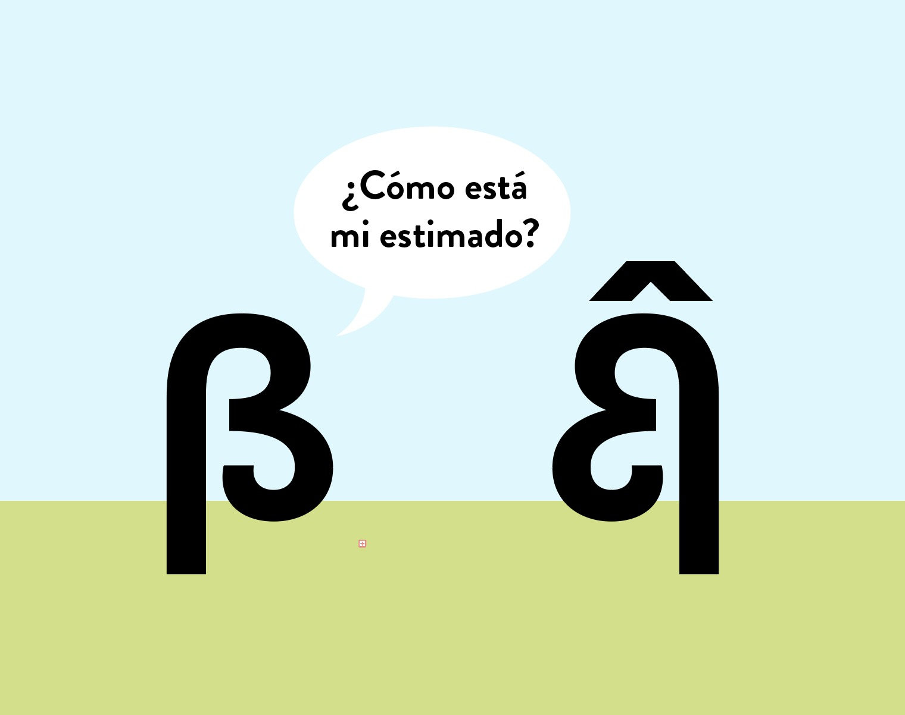

# Probabilidad e Inferencia Estadística (SOL114)

Este repositorio contiene el material del curso SOL114 Análisis de Datos II (Probabilidad e Inferencia Estadística), dictado el segundo semestre 2024 a estudiantes de pregrado del Departamento de Sociología de la Universidad Católica de Chile. Para mayores detalles ver el [`[programa]`](files/syllabus_sol114.pdf) y [`[calendario]`](#Calendario) del curso.

---

## Contenidos

### Nivelación Matemática

- El concepto de integral, "Calculus Made Easy", 1910: [`[calculus]`](files/calculus_easy.jpg)
- Tutorial: [`[tutorial]`](https://mebucca.github.io/ad2-sol114/files/tutorial#1) 

### Bibliografía mínima

- Muy bueno este libro (QSS): [`[libro]`](files/imai.pdf)

## Calendario

| Día  | Mes        | Contenido                                              | Material                                                                 | Capítulo QSS |
|------|------------|--------------------------------------------------------|-------------------------------------------------------------------------|--------------|
| 5    | Agosto     | Introducción                                           | [`[Pres]`](https://mebucca.github.io/ad2-sol114/slides/class_0/class_0#1) [`[Code]`](slides/class_0/class_0.Rmd) |              |
| 7    | Agosto     | Experimentos aleatorios, eventos, probabilidades       | [`[Pres]`](https://mebucca.github.io/ad2-sol114/slides/class_1/class_1#1) [`[Code]`](slides/class_1/class_1.Rmd) [`[Sim]`](slides/class_1/nb_1.Rmd)                                                                         |     6.1         |
| 12   | Agosto     | Probabilidad condicional, teorema de Bayes, Independencia | [`[Pres]`](https://mebucca.github.io/ad2-sol114/slides/class_2/class_2#1) [`[Code]`](slides/class_2/class_2.Rmd) [`[Sim]`](slides/class_2/nb_2.Rmd)                                                                     |    6.2          |
| 14   | Agosto     | Variables aleatorias y distribuciones de probabilidad  |   [`[Pres]`](https://mebucca.github.io/ad2-sol114/slides/class_3/class_3#1) [`[Code]`](slides/class_3/class_3.Rmd)                                                                      |     6.3.1         |
| 19   | Agosto     | Distribuciones discretas: Bernoulli y Binomial         |  [`[Pres]`](https://mebucca.github.io/ad2-sol114/slides/class_4/class_4#1) [`[Code]`](slides/class_4/class_4.Rmd) [`[Sim]`](slides/class_4/nb_4.Rmd)                                                                        |     6.3.2 & 6.3.3        |
| 21   | Agosto     | Distribuciones continuas: Uniforme y Normal            | [`[Pres]`](https://mebucca.github.io/ad2-sol114/slides/class_5/class_5#1) [`[Code]`](slides/class_5/class_5.Rmd)                                                                        |      6.3.4         |
| 26   | Agosto     | Momentos: valor esperado & varianza                    |   [`[Pres]`](https://mebucca.github.io/ad2-sol114/slides/class_6/class_6#1) [`[Code]`](slides/class_6/class_6.Rmd)                                                                       |      6.3.5        |
| 28   | Agosto     | Estandarización: puntaje Z                             |    [`[Pres]`](https://mebucca.github.io/ad2-sol114/slides/class_7/class_7#1) [`[Code]`](slides/class_7/class_7.Rmd)                                                                     |     6.3.4          |
| 2    | Septiembre | Distribución Normal Standard                           | [`[Pres]`](https://mebucca.github.io/ad2-sol114/slides/class_8/class_8#1) [`[Code]`](slides/class_8/class_8.Rmd)                                                                         |    6.3.4           |
| 4    | Septiembre | PRUEBA I  | [`[Problemset #1]`](https://mebucca.github.io/ad2-sol114/materials/problemset_1#1) [`[Prueba 1 2023]`](materials/prueba_1_2023.pdf)                                                                         |              |
| 9    | Septiembre | Ley de los grandes números                             |  [`[Pres]`](https://mebucca.github.io/ad2-sol114/slides/class_9/class_9#1) [`[Code]`](slides/class_9/class_9.Rmd)                                                                       |      6.4.1        |
| 11   | Septiembre | Teorema del límite central                             |   [`[Pres]`](https://mebucca.github.io/ad2-sol114/slides/class_10/class_10#1) [`[Code]`](slides/class_10/class_10.Rmd)[`[Sim]`](slides/class_10/nb_10.Rmd)                                                                        |      6.4.2         |
| 25   | Septiembre | Distribución muestral de un estimador                  |  [`[Pres]`](https://mebucca.github.io/ad2-sol114/slides/class_11/class_11#1) [`[Code]`](slides/class_11/class_11.Rmd)                                                               |    7.1.1 & 7.1.2          |
| 30   | Septiembre | Estimación de intervalos & intervalos de confianza     |  [`[Pres]`](https://mebucca.github.io/ad2-sol114/slides/class_12/class_12#1) [`[Code]`](slides/class_12/class_12.Rmd) [`[Sim]`](slides/class_12/shinyapp_ci.R)                                                                       |  7.1.3 & 7.1.4            |
| 7    | Octubre    | IC: ejemplos tradeoff entre precisión y confianza      |  [`[Pres]`](https://mebucca.github.io/ad2-sol114/slides/class_13/class_13#1) [`[Code]`](slides/class_13/class_13.Rmd)                                                                        |  7.1.3 & 7.1.4            |
| 9    | Octubre    | IC con varianza desconocida & margen de error          |  [`[Pres]`](https://mebucca.github.io/ad2-sol114/slides/class_14/class_14#1) [`[Code]`](slides/class_14/class_14.Rmd)                                                                       |   7.1.3 & 7.1.4           |
| 14   | Octubre    | Estimación de IC via método de Bootstrap         |  [`[Pres]`](https://mebucca.github.io/ad2-sol114/slides/class_15/class_15#1) [`[Code]`](slides/class_15/class_15.Rmd) [`[Bootstrap]`](https://mebucca.github.io/ad2-sol114/slides/class_15/nb_15#1)                                                                        |  7.1.3 & 7.1.4            |
| 16   | Octubre    |  Test de hipótesis: paradigma Fisher & Neyman-Pearson               |     [`[Pres]`](https://mebucca.github.io/ad2-sol114/slides/class_16/class_16#1) [`[Code]`](slides/class_16/class_16.Rmd)                                                                    |  7.2.2       |
| 21   | Octubre    | Test de hipótesis: paradigma Fisher & Neyman-Pearson   |   [`[Pres]`](https://mebucca.github.io/ad2-sol114/slides/class_17/class_17#1) [`[Code]`](slides/class_17/class_17.Rmd)                                                                       |  7.2.2            |
| 28   | Octubre    | Test de hipótesis: distribución t-student              |   [`[Pres]`](https://mebucca.github.io/ad2-sol114/slides/class_18/class_18#1) [`[Code]`](slides/class_18/class_18.Rmd)                                                                |   7.2.2   |
| 4   | Noviembre    | Test de media/proporción en dos muestras               |   [`[Pres]`](https://mebucca.github.io/ad2-sol114/slides/class_19/class_19#1) [`[Code]`](slides/class_19/class_19.Rmd)                                                                      |   7.2.3 & 7.2.4           |
| 6    | Noviembre  | Test de hipótesis via Test de Permutaciones   |  [`[Pres]`](https://mebucca.github.io/ad2-sol114/slides/class_20/class_20#1) [`[Code]`](slides/class_20/class_20.Rmd)                                                                     |              |
| 11   | Noviembre  | PRUEBA II                     |   [`[Problemset #2]`](https://mebucca.github.io/ad2-sol114/materials/problemset_2#1) [`[Problemset #3]`](https://mebucca.github.io/ad2-sol114/materials/problemset_3#1)  [`[Problemset #4]`](https://mebucca.github.io/ad2-sol114/materials/problemset_4#1) [`[Prueba 2 2023]`](materials/prueba_2_2023.pdf)                                                                     |              |
| 13   | Noviembre  | Asociación estadística y causalidad                       |  [`[Pres]`](https://mebucca.github.io/ad2-sol114/slides/class_21/class_21#1) [`[Code]`](slides/class_21/class_21.Rmd)                                                                        |              |
| 18   | Noviembre  | Asociación con datos categóricos                               |  [`[Pres]`](https://mebucca.github.io/ad2-sol114/slides/class_22/class_22#1) [`[Code]`](slides/class_22/class_22.Rmd)                                                                        |              |
| 20   | Noviembre  | Test de independencia $\chi^2$            | [`[Pres]`](https://mebucca.github.io/ad2-sol114/slides/class_23/class_23#1) [`[Code]`](slides/class_23/class_23.Rmd)                                                                        |              |
| 25   | Noviembre  | Covarianza & Correlación de Pearson           |  [`[Pres]`](https://mebucca.github.io/ad2-sol114/slides/class_24/class_24#1) [`[Code]`](slides/class_24/class_24.Rmd)                                                                        |              |
| 27   | Noviembre  | Repaso                                                 |                                                                         |              |

---

## Evaluaciones

| Evaluación     | Asignación    | Entrega      | Material                                                                                  |
|----------------|---------------|--------------|-------------------------------------------------------------------------------------------|
| Tarea corta 1  | 5 agosto      | 12 agosto    | [`[TC1 sols]`](https://mebucca.github.io/ad2-sol114/homework/tc_1_answers#1) [`[TC1.qmd sols]`](homework/tc_1_answers.qmd) |
| Tarea corta 2  | 12 agosto     | 19 agosto    | [`[TC2 sols]`](https://mebucca.github.io/ad2-sol114/homework/tc_2_answers#1) [`[TC2.qmd sols]`](homework/tc_2_answers.qmd) |
| Tarea corta 3  | 26 agosto     | 2 septiembre | [`[TC3 sols]`](https://mebucca.github.io/ad2-sol114/homework/tc_3_answers#1) [`[TC3.qmd sols]`](homework/tc_3_answers.qmd) |
| Prueba 1       |               | 4 septiembre | [`[P1 sols]`](exams/prueba_1_answers.pdf)  [`[P1.qmd sols]`](exams/prueba_1_answers.qmd) [`[Notas]`](https://mebucca.github.io/ad2-sol114/exams/notas_prueba1.html)                                                                                        |
| Tarea corta 4  | 30 septiembre | 7 octubre    | [`[TC4 sols]`](https://mebucca.github.io/ad2-sol114/homework/tc_4_answers#1) [`[TC4.qmd sols]`](homework/tc_4_answers.qmd)                                                                                          |
| Tarea corta 5  | 16 octubre     | 23 octubre   |   [`[TC5 sols]`](https://mebucca.github.io/ad2-sol114/homework/tc_5_answers#1) [`[TC5.qmd sols]`](homework/tc_5_answers.qmd)                                                                                                 |
| Prueba 2       |               | 6 noviembre  | [`[P2 sols]`](exams/prueba_2_answers.pdf)  [`[P2.qmd sols]`](exams/prueba_2_answers.qmd) [`[Notas]`](https://mebucca.github.io/ad2-sol114/exams/notas_prueba2.html)                                                                                           |
| Tarea corta 6  | 13 noviembre  | 20 noviembre |  [`[TC6 sols]`](https://mebucca.github.io/ad2-sol114/homework/tc_6_answers#1) [`[TC6.qmd sols]`](homework/tc_6_answers.qmd)                                                                                         |
| Tarea corta 7  | 20 noviembre  | 27 noviembre | [`[TC7 sols]`](https://mebucca.github.io/ad2-sol114/homework/tc_7_answers#1) [`[TC7.qmd sols]`](homework/tc_7_answers.qmd)                                                                                          |
| Prueba Bonus   |               | 2 diciembre  |  [`[Prueba Bonus 2023]`](materials/prueba_bonus_2023.pdf)                                                                                         |
| Examen final   |               | 9 diciembre  |  [`[Examen Final sols]`](exams/final_exam_answers.pdf)  [`[Examen Final.qmd sols]`](exams/final_exam_answers.qmd)                                                                                         |

---

## Ayudantías

| Fecha          | Contenido                                            | Ayudante   | Materiales | Capítulo QSS |
|----------------|------------------------------------------------------|------------|------------|--------------|
| 13 agosto      | R base & quarto                                       | Benjamín   | [`[A1]`](ta/ayudantia_1.pdf) [`[A1.Rmd]`](ta/ayudantia_1.Rmd)          | 1.3          |
| 27 agosto      | dplyr  & distribuciones en R                          | Elisa      |            |              |
| 3 septiembre   | Repaso contenidos clase (antes de la prueba)          | Benjamín   |            |              |
| 24 septiembre  | Distribución muestral (simulación) & cálculo de EE en R | Elisa      |            |              |
| 8 octubre      | Cálculo de IC en R                                    | Elisa      |            |              |
| 15 octubre     | IC de distinto tipo en R                              | Benjamín   |            |              |
| 29 octubre     | Test de hipótesis en R                                | Benjamín   |            |              |
| 5 noviembre    | Repaso contenidos clase (antes de la prueba)          | Elisa      |            |              |
| 19 noviembre   | Tablas de contingencia & Chi2 en R                    | Elisa      |            |              |
| 26 noviembre   | Scatterplots & correlaciones en R                     | Benjamín   |            |              |

---

## Horario de Consulta

- Reuniones individuales de aproximadamente 15 minutos cada día Miércoles entre 14:30 y 15:30pm. [`[Agendar]`](
https://calendar.app.google/U4mohxA18LCZmexr7)

---

## Recursos computacionales

  - En el repositorio de mi curso de *procesamiento avanzado de datos en `R`* puedes encontrar todo el material necesario para aprender `R` desde cero [`[aquí]`](https://mebucca.github.io/dar_soc4001/).
  - Acá pueden encontrar un template para escribir en `RMarkdown` ([`[PDF]`](files/template_rmarkdown.pdf) y [`[.Rmd]`](files/template_rmarkdown.Rmd) ). El uso de `RMarkdown` no es obligatorio, pero es altamente recomendado para escribir sus tareas y trabajos. Hoja de ayuda [`[aquí]`](https://rstudio-pubs-static.s3.amazonaws.com/330387_5a40ca72c3b14824acedceb7d34618d1.html).
 
---

