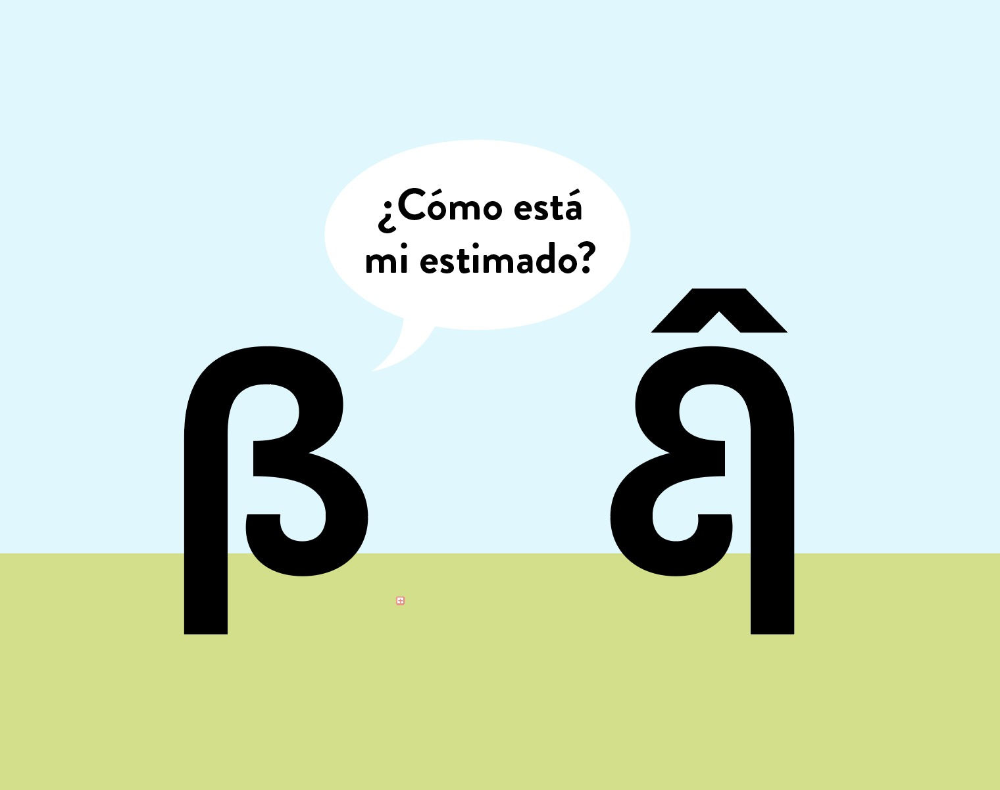

# Probabilidad e Inferencia Estadística (SOL114)

Este repositorio contiene el material del curso SOL114 Análisis de Datos II (Probabilidad e Inferencia Estadística), dictado el segundo semestre 2023 a estudiantes de pregrado del Departamento de Sociología de la Universidad Católica de Chile. Para mayores detalles ver el [`[programa]`](files/syllabus_sol114.pdf) y [`[calendario]`](#Calendario) del curso.

---

## Contenidos

### Nivelación Matemática

- El concepto de integral, "Calculus Made Easy", 1910: [`[calculus]`](files/calculus_easy.jpg)
- Tutorial: [`[tutorial]`](files/tutorial.pdf) 

### Bibliografía mínima

- Muy bueno este libro: [`[libro]`](files/imai.pdf)

## Calendario

Certainly, aligning a table helps in making it more readable. Below is your table with better alignment:

| Día | Mes | Contenido                                 | Presentación                                                                                                            | Cap. QSS   |
|-----|-----|-------------------------------------------|-------------------------------------------------------------------------------------------------------------------------|------------|
|  7  | Ago | Introducción                              | [`[Pres]`](https://mebucca.github.io/ad2-sol114/slides/class_0/class_0#1) [`[Code]`](slides/class_0/class_0.Rmd)        |            |
|  9  | Ago | Fundamento de probabilidades              | [`[Pres]`](https://mebucca.github.io/ad2-sol114/slides/class_1/class_1#1) [`[Code]`](slides/class_1/class_1.Rmd)        | 6.1        |
| 16  | Ago | Probabilidad condicional, teorema de Bayes | [`[Pres]`](https://mebucca.github.io/ad2-sol114/slides/class_2/class_2#1) [`[Code]`](slides/class_2/class_2.Rmd)       | 6.2        |
| 21  | Ago | Variables aleatorias y distrib. discretas  | [`[Pres]`](https://mebucca.github.io/ad2-sol114/slides/class_3/class_3#1) [`[Code]`](slides/class_3/class_3.Rmd)       | 6.3.1-6.3.3|
| 30  | Ago | Distribuciones continuas                   | [`[Pres]`](https://mebucca.github.io/ad2-sol114/slides/class_4/class_4#1) [`[Code]`](slides/class_4/class_4.Rmd)       | 6.3.4      |
| 30  | Ago | Momentos: valor esperado                   | [`[Pres]`](https://mebucca.github.io/ad2-sol114/slides/class_5/class_5#1) [`[Code]`](slides/class_5/class_5.Rmd)       | 6.3.5      |
|  4  | Sep | Momentos: varianza, Puntaje-Z              | [`[Pres]`](https://mebucca.github.io/ad2-sol114/slides/class_6/class_6#1) [`[Code]`](slides/class_6/class_6.Rmd)       | 6.3.5      |
|  6  | Sep | Distribución Normal Standard               | [`[Pres]`](https://mebucca.github.io/ad2-sol114/slides/class_7/class_7#1) [`[Code]`](slides/class_7/class_7.Rmd)       |            |
| 13  | Sep | Ley de los grandes números                 | [`[Pres]`](https://mebucca.github.io/ad2-sol114/slides/class_8/class_8#1) [`[Code]`](slides/class_8/class_8.Rmd)       | 6.4        |
| 20  | Sep | Teorema del Límite Central                 | [`[Pres]`](https://mebucca.github.io/ad2-sol114/slides/class_8/class_8#18) [`[Code]`](slides/class_8/class_8.Rmd)       | 6.4        |
| 25  | Sep | Estimación puntal                          | [`[Pres]`](https://mebucca.github.io/ad2-sol114/slides/class_9/class_9#1) [`[Code]`](slides/class_9/class_9.Rmd)       |            |
| 20  | Sep | Distribución muestral, sesgo y varianza    | [`[Pres]`](https://mebucca.github.io/ad2-sol114/slides/class_10/class_10#1) [`[Code]`](slides/class_10/class_10.Rmd)                                                                                                                       |            |
| 25  | Sep | Distribución muestral (again)              | [`[Pres]`](https://mebucca.github.io/ad2-sol114/slides/class_11/class_11#1) [`[Code]`](slides/class_11/class_11.Rmd)                                                                                                                       |            |
| 27  | Sep | Intervalos de Confianza                    | [`[Pres]`](https://mebucca.github.io/ad2-sol114/slides/class_12/class_12#1) [`[Code]`](slides/class_12/class_12.Rmd)                                                                                                            |            |
| 11  | Oct | Error tipo I y II                          |                                                                                                                        |            |
| 16  | Oct | Significación Estadística                  |                                                                                                                        |            |
| 18  | Oct | Distribución nula                          |                                                                                                                        |            |
| 23  | Oct | Valores p                                  |                                                                                                                        |            |
| 25  | Oct | Test de hipótesis                          |                                                                                                                        |            |
| 30  | Oct | Test de media/proporciones en 1 muestra    |                                                                                                                        |            |
|  6  | Nov | Test de media/proporciones en 2 muestras   |                                                                                                                        |            |
|  8  | Nov | Asociación variables continuas             |                                                                                                                        |            |
| 13  | Nov | Correlación de Pearson                     |                                                                                                                        |            |
| 15  | Nov | ANOVA                                      |                                                                                                                        |            |
| 20  | Nov | ANOVA                                      |                                                                                                                        |            |
| 22  | Nov | Tablas de contingencia                     |                                                                                                                        |            |
| 27  | Nov | Test de χ²                                 |                                                                                                                        |            |
| 29  | Nov | Repaso                                     |                                                                                                                        |            |

---

## Ayudantías

| Día | Fecha           | Contenido                                 | Material |
|-----|-----------------|-------------------------------------------|----------|
| 1   | 15 de agosto    | R                                         |          |
| 2   | 22 de agosto    | R                                         |          |
| 3   | 29 de agosto    |                                           |          |
| 4   | 5 de septiembre | variables aleatorias                      |          |
| 5   | 12 de septiembre| variables aleatorias                      |          |
| 6   | 19 de septiembre|                                           |          |
| 7   | 26 de septiembre| error estándar e intervalos de confianza  |          |
| 8   | 3 de octubre    | repaso                                    |          |
| 9   | 10 de octubre   |                                           |          |
| 10  | 17 de octubre   |                                           |          |
| 11  | 24 de octubre   | test de hipótesis                         |          |
| 12  | 31 de octubre   | repaso                                    |          |
| 13  | 7 de noviembre  |                                           |          |
| 14  | 14 de noviembre | gráficos ridge y ANOVA                    |          |
| 15  | 21 de noviembre | scatterplot y correlaciones               |          |
| 16  | 28 de noviembre | tablas de contingencia y Chi2             |          |

---

## Horario de Consulta

- Reuniones individuales de aproximadamente 15 minutos cada día Miércoles entre 15:00 y 16:00pm. [`[Agendar]`](
https://calendar.app.google/U4mohxA18LCZmexr7)

---

## Evaluaciones

| Asignación       | Entrega        | Devolución     | Material                                                                       |
|------------------|----------------|----------------|--------------------------------------------------------------------------------|
| Tarea corta 1    | 9 agosto       | 16 agosto      | [`[Soluciones TC1]`](homework/tc_1_answers.pdf) [`[Soluciones TC1.qmd]`](homework/tc_1_answers.qmd)                  |
| Tarea corta 2    | 16 agosto      | 23 agosto      | [`[Soluciones TC2]`](homework/tc_2_answers.pdf) [`[Soluciones TC2.qmd]`](homework/tc_2_answers.qmd)                  |
| Tarea corta 3    | 4 septiembre   | 11 septiembre  | [`[Soluciones TC3]`](homework/tc_3_answers.pdf) [`[Soluciones TC3.qmd]`](homework/tc_3_answers.qmd)                  |
| Prueba 1         | 11 octubre     |                | [`[Soluciones P1]`](homework/prueba_1.pdf) [`[Notas]`](https://mebucca.github.io/ad2-sol114/homework/notas_prueba1.html)                                                                                  |
| Tarea corta 4    | 25 septiembre  |                |                                                                                |
| Tarea corta 5    | 23 octubre     | 30 octubre     |                                                                                |
| Prueba 2         | 8 noviembre    |                |                                                                                |
| Tarea corta 6    | 20 noviembre   | 27 noviembre   |                                                                                |
| Examen final     | 13 diciembre   |                |                                                                                |

---

## Recursos estudio

- Problemas desde *Fundamento de probabilidades* hasta *Teoremas Asintóticos*: [`[Respuestas Problem-set 1]`](problemsets/ejercicios_1.pdf) 
- Problemas desde *Distribución Normal Standard* hasta *Distribución muestral, sesgo y varianza*: [`[Respuestas Problem-set 2]`](problemsets/ejercicios_2.pdf) 

---

## Recursos computación

### Para usuarios de `R`

  - En el repositorio de mi curso de *procesamiento avanzado de datos en `R`* puedes encontrar todo el material necesario para aprender `R` desde cero [`[aquí]`](https://mebucca.github.io/dar_soc4001/).
  - Acá pueden encontrar un template para escribir en `RMarkdown` ([`[PDF]`](files/template_rmarkdown.pdf) y [`[.Rmd]`](files/template_rmarkdown.Rmd) ). El uso de `RMarkdown` no es obligatorio, pero es altamente recomendado para escribir sus tareas y trabajos. Hoja de ayuda [`[aquí]`](https://rstudio-pubs-static.s3.amazonaws.com/330387_5a40ca72c3b14824acedceb7d34618d1.html).
  - [`[StalkOverflow]`](https://stackoverflow.com/) tiene las respuestas a casi todas las preguntas.
 
---

