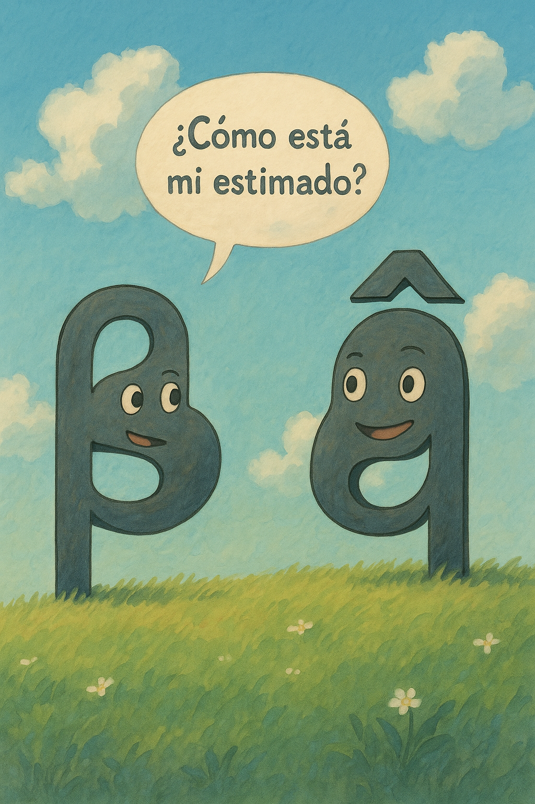

# Probabilidad e Inferencia Estadística (SOL114)

Este repositorio contiene el material del curso SOL114 Análisis de Datos II (Probabilidad e Inferencia Estadística), dictado el primer semestre 2026 a estudiantes de pregrado del Departamento de Sociología de la Universidad Católica de Chile. Para mayores detalles ver el [`[programa]`](files/syllabus_sol114.pdf) y [`[calendario]`](#Calendario) del curso.

---

## Contenidos

### Nivelación Matemática

- El concepto de integral, "Calculus Made Easy", 1910: [`[calculus]`](files/calculus_easy.jpg)
- Tutorial: [`[tutorial]`](https://mebucca.github.io/ad2-sol114/files/tutorial#1) 

### Bibliografía mínima

- Muy bueno este libro (QSS): [`[libro]`](files/imai.pdf)

## Calendario

| Día   | Mes   | Contenido                                                 | Material                                                                                                                                                                                                                                                            | Capítulo QSS  |
| ----- | ----- | --------------------------------------------------------- | ------------------------------------------------------------------------------------------------------------------------------------------------------------------------------------------------------------------------------------------------------------------- | ------------- |
| 4     | Marzo | Introducción                                              | [`[Pres]`](https://mebucca.github.io/ad2-sol114/slides/class_0/class_0#1) [`[Code]`](slides/class_0/class_0.Rmd)                                                                                                                                                    | —             |
| 9     | Marzo | Experimentos aleatorios, eventos, probabilidades          | [`[Pres]`](https://mebucca.github.io/ad2-sol114/slides/class_1/class_1#1) [`[Code]`](slides/class_1/class_1.Rmd)                                                                                                                                                    | 6.1           |
| 11    | Marzo | Tarea 1: nivelación matemática                            | —                                                                                                                                                                                                                                                                   | —             |
| 16    | Marzo | Probabilidad condicional, teorema de Bayes, Independencia | [`[Pres]`](https://mebucca.github.io/ad2-sol114/slides/class_2/class_2#1) [`[Code]`](slides/class_2/class_2.Rmd)                                                                                                                                                    | 6.2           |
| 18    | Marzo | Variables aleatorias y distribuciones de probabilidad     | [`[Pres]`](https://mebucca.github.io/ad2-sol114/slides/class_3/class_3#1) [`[Code]`](slides/class_3/class_3.Rmd)                                                                                                                                                    | 6.3.1         |
| 23    | Marzo | Distribuciones discretas: Bernoulli y Binomial            | [`[Pres]`](https://mebucca.github.io/ad2-sol114/slides/class_4/class_4#1) [`[Code]`](slides/class_4/class_4.Rmd)                                                                                                                                                    | 6.3.2 & 6.3.3 |
| 25    | Marzo | Distribuciones continuas: Uniforme y Normal               | [`[Pres]`](https://mebucca.github.io/ad2-sol114/slides/class_5/class_5#1) [`[Code]`](slides/class_5/class_5.Rmd)                                                                                                                                                    | 6.3.4         |
| 30    | Marzo | Momentos: valor esperado & varianza                       | [`[Pres]`](https://mebucca.github.io/ad2-sol114/slides/class_6/class_6#1) [`[Code]`](slides/class_6/class_6.Rmd)                                                                                                                                                    | 6.3.5         |
| 1     | Abril | Estandarización: puntaje Z                                | [`[Pres]`](https://mebucca.github.io/ad2-sol114/slides/class_7/class_7#1) [`[Code]`](slides/class_7/class_7.Rmd)                                                                                                                                                    | 6.3.4         |
| 6     | Abril | Distribución Normal Standard                              | [`[Pres]`](https://mebucca.github.io/ad2-sol114/slides/class_8/class_8#1) [`[Code]`](slides/class_8/class_8.Rmd)                                                                                                                                                    | 6.3.4         |
| 8     | Abril | **PRUEBA I**                                              | [`[Problemset #1]`](https://mebucca.github.io/ad2-sol114/materials/problemset_1#1)                                                                                                                                 | —             |
| 13    | Abril | Ley de los grandes números                                | [`[Pres]`](https://mebucca.github.io/ad2-sol114/slides/class_9/class_9#1) [`[Code]`](slides/class_9/class_9.Rmd)                                                                                                                                                    | 6.4.1         |
| 15    | Abril | Teorema del límite central                                | [`[Pres]`](https://mebucca.github.io/ad2-sol114/slides/class_10/class_10#1) [`[Code]`](slides/class_10/class_10.Rmd)                                                                                                                                                | 6.4.2         |
| 20    | Abril | Estimador y su distribución muestral                      | [`[Pres]`](https://mebucca.github.io/ad2-sol114/slides/class_11/class_11#1) [`[Code]`](slides/class_11/class_11.Rmd)                                                                                                                                                | 7.1.1 & 7.1.2 |
| 22    | Abril | Estimación de intervalos & intervalos de confianza        | [`[Pres]`](https://mebucca.github.io/ad2-sol114/slides/class_12/class_12#1) [`[Code]`](slides/class_12/class_12.Rmd) [`[Notebook]`](https://mebucca.github.io/ad2-sol114/slides/class_12/nb_12#1)                                                                   | 7.1.3 & 7.1.4 |
| 27    | Abril | IC para media y proporción muestral                       | [`[Pres]`](https://mebucca.github.io/ad2-sol114/slides/class_13/class_13#1) [`[Code]`](slides/class_13/class_13.Rmd)                                                                                                                                                | 7.1.3 & 7.1.4 |
| 29    | Abril | IC con varianza desconocida & margen de error             | [`[Pres]`](https://mebucca.github.io/ad2-sol114/slides/class_14/class_14#1) [`[Code]`](slides/class_14/class_14.Rmd)                                                                                                                                                | 7.1.3 & 7.1.4 |
| 4     | Mayo  | IC vía Bootstrap                                          | [`[Pres]`](https://mebucca.github.io/ad2-sol114/slides/class_15/class_15#1) [`[Code]`](slides/class_15/class_15.Rmd)                                                                                                                                                | 7.1.3 & 7.1.4 |
| 6     | Mayo  | Test de hipótesis: paradigma Fisher & Neyman–Pearson      | [`[Pres]`](https://mebucca.github.io/ad2-sol114/slides/class_16/class_16#1) [`[Code]`](slides/class_16/class_16.Rmd)                                                                                                                                                | 7.2.2         |
| 11    | Mayo  | Test de media/proporción en una muestra                   | [`[Pres]`](https://mebucca.github.io/ad2-sol114/slides/class_17/class_17#1) [`[Code]`](slides/class_17/class_17.Rmd)                                                                                                                                                | 7.2.2         |
| 13    | Mayo  | Distribución t-Student para test de hipótesis             | [`[Pres]`](https://mebucca.github.io/ad2-sol114/slides/class_18/class_18#1) [`[Code]`](slides/class_18/class_18.Rmd)                                                                                                                                                | 7.2.2         |
| 18–23 | Mayo  | RECESO                                                    | —                                                                                                                                                                                                                                                                   | —             |
| 25    | Mayo  | Test de media/proporción en dos muestras                  | [`[Pres]`](https://mebucca.github.io/ad2-sol114/slides/class_19/class_19#1) [`[Code]`](slides/class_19/class_19.Rmd)                                                                                                                                                | 7.2.3 & 7.2.4 |
| 27    | Mayo  | **PRUEBA II**                                             | [`[Problemset #2]`](https://mebucca.github.io/ad2-sol114/materials/problemset_2#1) [`[Problemset #3]`](https://mebucca.github.io/ad2-sol114/materials/problemset_3#1)  | —             |
| 1     | Junio | Asociación estadística y causalidad                       | [`[Pres]`](https://mebucca.github.io/ad2-sol114/slides/class_21/class_21#1) [`[Code]`](slides/class_21/class_21.Rmd)                                                                                                                                                | —             |
| 3     | Junio | Asociación con datos categóricos                          | [`[Pres]`](https://mebucca.github.io/ad2-sol114/slides/class_22/class_22#1) [`[Code]`](slides/class_22/class_22.Rmd)                                                                                                                                                | —             |
| 8     | Junio | Test de independencia χ²                                  | [`[Pres]`](https://mebucca.github.io/ad2-sol114/slides/class_23/class_23#1) [`[Code]`](slides/class_23/class_23.Rmd)                                                                                                                                                | —             |
| 10    | Junio | Asociación con datos continuos & covarianza               | [`[Pres]`](https://mebucca.github.io/ad2-sol114/slides/class_24/class_24#1) [`[Code]`](slides/class_24/class_24.Rmd)                                                                                                                                                | —             |
| 15    | Junio | Correlación de Pearson                                    | [`[Pres]`](https://mebucca.github.io/ad2-sol114/slides/class_25/class_25#33) [`[Code]`](slides/class_24/class_25.Rmd)                                                                                                                                               | —             |
| 17    | Junio | Repaso                                                    | —                                                                                                                                                                                                                                                                   | —             |

---

## Evaluaciones

| Evaluación    | Fecha    | Soluciones |
| ------------- | -------- | ---------- |
| Tarea 1       | 11 marzo | —          |
| Tarea 2       | 30 marzo | —          |
| Tarea 3       | 6 abril  | —          |
| Prueba 1      | 8 abril  | —          |
| Tarea 4       | 27 abril | —          |
| Tarea 5       | 11 mayo  | —          |
| Tarea 6       | 25 mayo  | —          |
| Prueba 2      | 27 mayo  | —          |
| Tarea 7       | 15 junio | —          |
| Prueba Bonus  | —        | —          |
| Examen final  | —        | —          |
| Notas Finales | —        | —          |

---

## Horario de Consulta

- Reuniones individuales de aproximadamente 15 minutos cada día Miércoles entre 14:30 y 15:30pm. [`[Agendar]`](
https://calendar.app.google/8rfTeNoxGiDJPbzEA)

