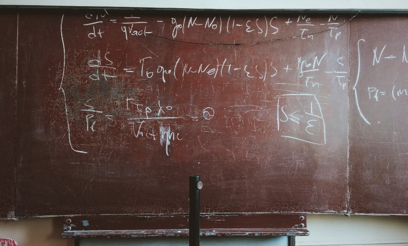

# SOL114 Análisis de Datos II (Probabilidad e Inferencia Estadística)

Este repositorio contiene el material del curso SOL114 Análisis de Datos II (Probabilidad e Inferencia Estadística)
, dictado el segundo semestre 2023 a estudiantes de pregrado del Departamento de Sociología de la Universidad Católica de Chile. Para mayores detalles ver el [`[programa]`](files/syllabus_soc3070.pdf) y [`[calendario]`](#Calendario) del curso.

## Contenidos

### Nivelación Matemática

- El concepto de integral, "Calculus Made Easy", 1910: [`[calculus]`](files/calculus_easy.jpg)
- Tutorial: [`[texto]`](files/tutorial.pdf).

---

## Calendario Clases

| Dia          | Mes  | Contenido                                             | Presentaciones | Entregas            | 
| ---:         | ---: | :---------------------------------------------------- | :------------- | :-------------      | 
| Lunes 8      | 8    | Presentación del curso                                | [`[Presentación]`](https://mebucca.github.io/ad2-sol114/slides/class_0/class_0#1) [`[Código]`](slides/class_0/class_0.Rmd)                 |                     |
| Lunes 8      | 8    | Basics teoría de la Probabilidad                      | [`[Presentación]`](https://mebucca.github.io/ad2-sol114/slides/class_1/class_1#1) [`[Código]`](slides/class_1/class_1.Rmd)                |                     |
| Martes 16     | 8    |             |                | Tarea corta 1 (6%)  |
| Lunes 22     | 8    | Probabilidad Condicional y Teorema Bayes              |   [`[Presentación]`](https://mebucca.github.io/ad2-sol114/slides/class_2/class_2#1) [`[Código]`](slides/class_2/class_2.Rmd)             | |
| Lunes 29     | 8    | Variables Aleatorias, Distribuciones Discretas y MLE  |    [`[Presentación]`](https://mebucca.github.io/ad2-sol114/slides/class_3/class_3#1) [`[Código]`](slides/class_3/class_3.Rmd)    [`[Bonus]`](https://mebucca.github.io/ad2-sol114/slides/class_4/class_4#1)        | Tarea corta 2 (6%)  |
| Lunes 5      | 9    | Tablas de contingencia                                |[`[Presentación]`](https://mebucca.github.io/ad2-sol114/slides/class_5/class_5#1) [`[Código]`](slides/class_5/class_5.Rmd)                | Tarea corta 3 (6%)  |                  
| Lunes 12     | 9    | Modelo Lineal de Probabilidad (LPM)                   | [`[Presentación]`](https://mebucca.github.io/ad2-sol114/slides/class_7/class_7#1) [`[Código]`](slides/class_7/class_7.Rmd)                 | Tarea corta 4 (6%)  |
| Lunes 26     | 9    | Regresión Logística: estructura teórica y MLE         | [`[Presentación]`](https://mebucca.github.io/ad2-sol114/slides/class_9/class_9#1) [`[Código]`](slides/class_9/class_9.Rmd)               |                     |
| Lunes 3      | 10   | Regresión Logística: interpretación de efectos        | [`[Presentación]`](https://mebucca.github.io/ad2-sol114/slides/class_10/class_10#1) [`[Código]`](slides/class_10/class_10.Rmd)               |                     |
| Lunes 17     | 10   | Regresión Logística: inferencia                       | [`[Presentación]`](https://mebucca.github.io/ad2-sol114/slides/class_11/class_11#1) [`[Código]`](slides/class_11/class_11.Rmd)               |  Trabajo 1 (20%)    |
| Lunes 24     | 10   | Regresión Logística: ajuste y predicción              | [`[Presentación]`](https://mebucca.github.io/ad2-sol114/slides/class_12/class_12#1) [`[Código]`](slides/class_12/class_12.Rmd)               |  Tarea corta 5 (6%) |
| Lunes 7      | 11   | Regresión Logística Multinomial                       | [`[Presentación]`](https://mebucca.github.io/ad2-sol114/slides/class_13/class_13#1) [`[Código]`](slides/class_13/class_13.Rmd)               |                     |
|              |      | Regresión Logística Ordenada                          | [`[Presentación]`](https://mebucca.github.io/ad2-sol114/slides/class_14/class_14#1) [`[Código]`](slides/class_14/class_14.Rmd)               |                     |
| Lunes 14     | 11   | Regresión Poisson                                     | [`[Presentación]`](https://mebucca.github.io/ad2-sol114/slides/class_15/class_15#1) [`[Código]`](slides/class_15/class_15.Rmd)               |                     |
| Lunes 21     | 11   | Consideraciones Finales                               | [`[Presentación]`](https://mebucca.github.io/ad2-sol114/slides/class_16/class_16#1) [`[Código]`](slides/class_16/class_16.Rmd)               |  Trabajo 2 (20%)    |
| Domingo 4    | 12   |                                                       |                | Trabajo Final (30%) |

## Ayudantías

---

## Evaluaciones

#### Tareas cortas

- Tarea 1: [`[TC1]`](homework/tc_1.pdf) [`[TC1.Rmd]`](homework/tc_1.Rmd) 

---

## Recursos computación

### Para usuarios de `R`

  - En el repositorio de mi curso de *procesamiento avanzado de datos en `R`* puedes encontrar todo el material necesario para aprender `R` desde cero [`[aquí]`](https://mebucca.github.io/dar_soc4001/).
  - Acá pueden encontrar un template para escribir en `RMarkdown` ([`[PDF]`](files/template_rmarkdown.pdf) y [`[.Rmd]`](files/template_rmarkdown.Rmd) ). El uso de `RMarkdown` no es obligatorio, pero es altamente recomendado para escribir sus tareas y trabajos. Hoja de ayuda [`[aquí]`](https://rstudio-pubs-static.s3.amazonaws.com/330387_5a40ca72c3b14824acedceb7d34618d1.html).
  - [`[StalkOverflow]`](https://stackoverflow.com/) tiene las respuestas a casi todas las preguntas.
 
---

