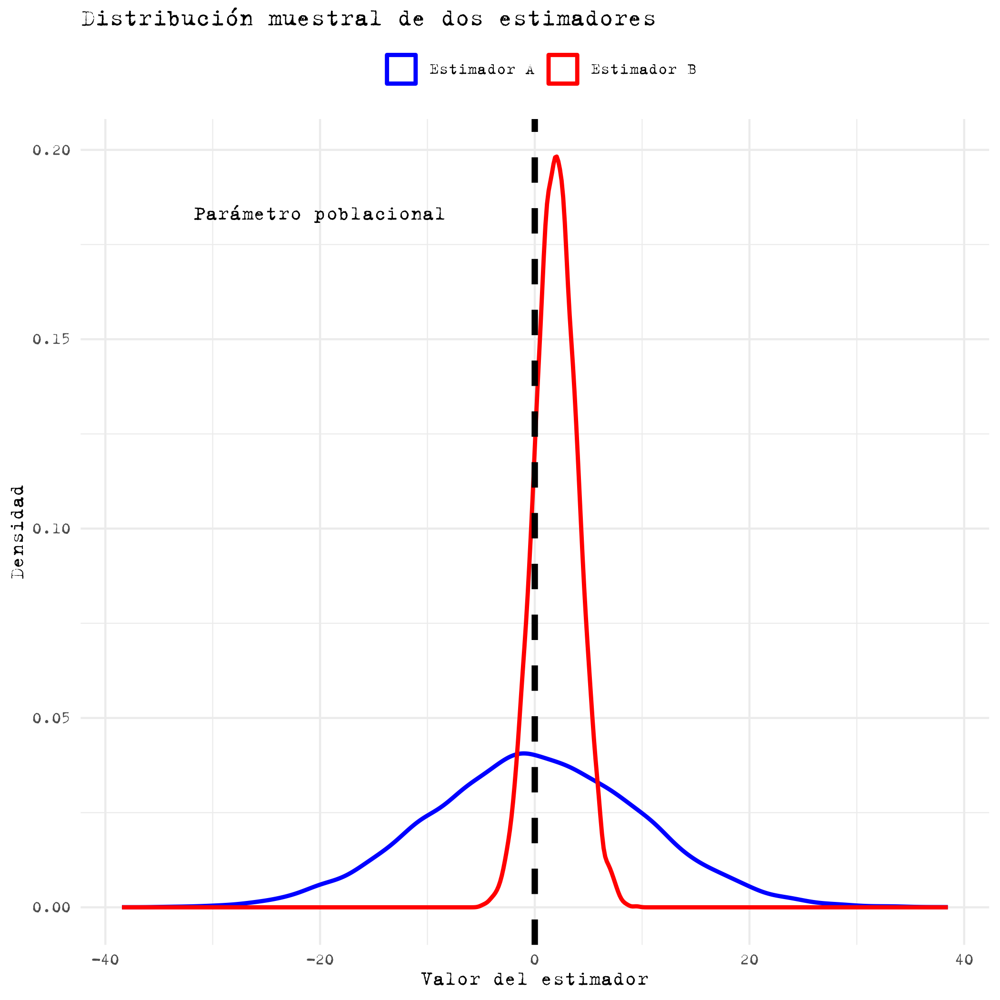

1.  Un país debe decidir si aprueba o no una nueva constitución. Cada ciudadano tiene la opción de votar "A favor" o "En contra". Si un individuo es seleccionado al azar, existe una probabilidad $p$ de que vote "A favor".

<!-- -->

i.  **(5%)** Si el voto de un individuo es un evento aleatorio, describe el espacio muestral.

El espacio muestral es el conjunto de todos los posibles resultados de un experimento. En este caso, el experimento es la elección individual de un ciudadano para votar "A favor" o "En contra" de la nueva constitución.

El espacio muestral $\Omega$ se define como: $$\Omega = \{ \text{"A favor"}, \text{"En contra"} \}$$

Es decir, el espacio muestral consta de dos posibles resultados: que un individuo vote "A favor" o que vote "En contra".

ii. **(5%)** Dado que $p$ es la probabilidad de que un individuo seleccionado al azar vote "A favor", expresa la probabilidad de que, al observar los votos de 5 individuos seleccionados al azar, el primero vote "A favor" y los otros cuatro "En contra".

Dado que los votos son eventos independientes, la probabilidad conjunta de eventos independientes es simplemente el producto de sus probabilidades individuales.

Probabilidad de que el primer individuo vote "A favor" = $p$

Probabilidad de que un individuo vote "En contra" = $1-p$ (ya que hay solo dos opciones y deben sumar 1). Por tanto, para cada uno de los cuatro individuos la probabilidad de votar "En contra" = $1-p$

Dado que estamos buscando la probabilidad de que todos estos eventos sucedan de manera conjunta, simplemente multiplicamos estas probabilidades:

$$P = p \times (1-p) \times (1-p) \times (1-p) \times (1-p) = p(1-p)^4$$

iii. **(5%)** Supón que el voto en el plebiscito es independiente del género y que en este país la población está equitativamente dividida entre hombres y mujeres. Determina: $P(\text{Hombre} | \text{"A favor"})$.

Si dos eventos, $A$ y $B$, son independientes, entonces $P(A | B)$ es simplemente $P(A)$. Es decir, saber que $B$ ha ocurrido no cambia la probabilidad de $A$.

Aplicando esto a la situación dada:

El evento $A$ es que la persona sea un hombre. El evento $B$ es que alguien vote "A favor".

Dado que $A$ y $B$ son independientes: $$P(\text{Hombre} | \text{"A favor"}) = P(\text{Hombre})$$

Sabemos que: $$P(\text{Hombre}) = 0.5$$

Por lo tanto: $$P(\text{Hombre} | \text{"A favor"}) = 0.5$$

En resumen, si sabemos que alguien votó "A favor", hay un 50% de probabilidad de que esa persona sea un hombre, porque el voto es independiente del género.

<!-- -->

2.  **(5%)** ¿Qué distribución de probabilidad describe el voto de un individuo de esta población? Considerando "A favor" como la categoría de éxito, descríbe la distribución matemáticamente y explica el significado de sus parámetros.

La distribución de probabilidad que describe el voto de un individuo de esta población es la **distribución Bernoulli**. La distribución Bernoulli describe un experimento aleatorio en el que solo hay dos posibles resultados, que se pueden considerar "éxito" o "fallo". En este contexto, "A favor" se considera un "éxito" y "En contra" un "fallo".

Matemáticamente, la función de masa de probabilidad (pmf) de una variable aleatoria $X$ que sigue una distribución Bernoulli con parámetro $p$ es:

$$P(X = k) = 
       \begin{cases} 
     p & \text{si } k = 1 \\
     1-p & \text{si } k = 0 
     \end{cases}$$

Donde:

-   $k$ puede tomar los valores de 0 o 1, donde 1 representa "éxito" ("A favor") y 0 representa "fallo" ("En contra").

El significado de los parámetros es:

-    $p$: Es la probabilidad de "éxito". En este contexto, es la probabilidad de que un individuo vote "A favor".

-    $1-p$: Es la probabilidad de "fallo". En este contexto, es la probabilidad de que un individuo vote "En contra".

3.  **(7%)** Supón que en esta población las personas no influyen en el voto de otras y que todos los votos siguen la misma distribución. ¿Qué distribución de probabilidad describe la cantidad de votos "A favor" en una muestra de tamaño $n$? Descríbelo matemáticamente y explica el significado de los parámetros de la distribución.

Dado que estamos considerando múltiples ensayos independientes (votos) donde cada ensayo tiene dos posibles resultados ("A favor" o "En contra") y todos los ensayos siguen la misma distribución (Bernoulli con parámetro $p$), la distribución de probabilidad que describe la cantidad de votos "A favor" en una muestra de tamaño $n$ es la **distribución binomial**.

La distribución binomial describe el número de éxitos en $n$ ensayos independientes de Bernoulli.

Matemáticamente, la función de masa de probabilidad (pmf) de una variable aleatoria $X$ que sigue una distribución binomial con parámetros $n$ y $p$ es:

$$P(X=k) = \binom{n}{k} p^k (1-p)^{n-k}$$

Donde:

-   $n$: Es el número total de ensayos (en este caso, el tamaño de la muestra de votantes).

-    $k$ es el número de éxitos (votos "A favor").

-    $\binom{n}{k}$ es el coeficiente binomial, que representa el número de maneras en que podemos obtener $k$ éxitos en $n$ ensayos. Es igual a: $$\binom{n}{k} = \frac{n!}{k!(n-k)!}$$

-   $p$: Es la probabilidad de éxito en un ensayo individual (la probabilidad de que un individuo vote "A favor").

-   $1-p$: Es la probabilidad de fracaso en un ensayo individual (la probabilidad de que un individuo vote "En contra").

4.  Las notas en la prueba 1 (variable $X_1$) del curso SOL114 siguen una distribución normal con media $\mu_1 = 4$ y varianza $\sigma^2 = 2$. Las notas de la prueba 2 (variable $X_2$) siguen una distribución normal con media $\mu_2 = 5$ y varianza $\sigma^2 = 2$.

    *Nota: Estos son los parámetros poblacionales. En este caso, la población son todos aquellos que han cursado o cursarán la clase en el futuro.*

<!-- -->

i.  **(10%)** ¿Cuál es la distribución de la variable $Y$ (el promedio de ambas pruebas, o "nota final")? ¿Qué valores tienen sus parámetros?

$$Y = \frac{1}{2}(X_1 + X_2)$$

La suma (o promedio) de dos variables aleatorias independientes que siguen una distribución normal también sigue una distribución normal. Dados que $X_1$ y $X_2$ son independientes y normales, $Y$ será normal.

La esperanza (media) de $Y$ es la media de las esperanzas de $X_1$ y $X_2$: $$E[Y] = E\left[\frac{1}{2}(X_1 + X_2)\right] = \frac{1}{2}(E[X_1] + E[X_2]) = \frac{1}{2}(4 + 5) = 4.5$$

La varianza de $Y$ es: $$Var(Y) = Var\left(\frac{1}{2}(X_1 + X_2)\right) = \frac{1}{4}(Var(X_1) + Var(X_2)) = \frac{1}{4}(2 + 2) = 1$$ (Esta fórmula se basa en las propiedades de la varianza)

Entonces, la distribución de $Y$ es normal con media $\mu_Y = 4.5$ y varianza $\sigma^2_Y = 1$, es decir, $Y \sim N(4.5, 1)$.

ii. **(7%)** Si para aprobar el curso SOL114 se requiere una "nota final" igual o superior a 4, y $f(y)$ denota la función de densidad de $Y$, expresa matemáticamente cómo determinar la probabilidad de aprobar el curso.

    *Nota: Hay una integral involucrada. No deben resolver la integral.*

La probabilidad de aprobar el curso es la probabilidad de que $Y$ sea igual o mayor a 4. Matemáticamente, esto se expresa como: $$P(Y \geq 4) = \int_{4}^{\infty} f(y) \, dy$$

iii. **(7%)** Calcula la probabilidad de aprobar el curso usando la función $\Phi$. Describe el procedimiento.

Para calcular $P(Y \geq 4)$ usando la función $\Phi$, primero estandarizamos $Y$ para obtener el valor de $Z$:

$$Z = \frac{Y - \mu_Y}{\sigma_Y}$$

Para $Y = 4$: $$Z = \frac{4 - 4.5}{1} = -0.5$$

La probabilidad de que $Y$ sea menor que 4 es igual a la probabilidad de que $Z$ sea menor que -0.5, es decir, $P(Z < -0.5)$. Esta probabilidad se encuentra directamente en la tabla de $\Phi$ para $Z = -0.5$ o utilizando herramientas computacionales.

La probabilidad de aprobar (es decir, de obtener una nota $Y$ igual o mayor a 4) se calcula como:

$$P(Y \geq 4) = 1 - P(Y < 4) = 1 - \Phi(-0.5)$$

Aquí, $\Phi(-0.5)$ es la probabilidad acumulada hasta $Z = -0.5$ en una distribución normal estándar. Al restarla de 1, obtenemos la probabilidad de que $Y$ sea igual o mayor a 4, es decir, la probabilidad de aprobar el curso.

Utilizando tablas de la distribución normal estándar podemos encontrar $\Phi(-0.5)$. Entonces, sustrayendo ese valor de 1 nos da la probabilidad deseada. De la tabla estándar de la distribución normal:

$$\Phi(-0.5) \approx 0.3085$$

Entonces, la probabilidad de aprobar (es decir, $Y \geq 4$) es:

$$P(Y \geq 4) = 1 - \Phi(-0.5)$$ $$P(Y \geq 4) = 1 - 0.3085$$ $$P(Y \geq 4) = 0.6915$$

iv. **(12%)** Los estudiantes en el decil más alto de notas en SOL114 son obligados a asistir a un programa intensivo de estadística avanzada en el verano. Por su parte, los estudiantes en el decil más bajo son obligados a cursar un intensivo de matemáticas básicas en el verano. Determina las notas mínima y máxima que un estudiante debe obtener para poder descansar durante el verano.

Para descansar en el verano, un estudiante debe tener una nota final $Y$ que no esté ni en el 10% más alto ni en el 10% más bajo de todas las notas. Es decir, su nota debe estar entre el percentil 10 y el percentil 90.

**1. Encontrar el valor de** $Y$ para el percentil 10 (la nota que es mayor que solo el 10% más bajo de las notas):

Usamos la función de distribución acumulativa inversa (también llamada función cuantil) para encontrar el valor de $Z$ correspondiente al 10% o 0.10. Para una distribución normal estándar:

$$Z_{0.10} \approx -1.28$$

Este valor se puede obtener de tablas estándar de la distribución normal o de herramientas computacionales.

Ahora, convertimos este $Z$ en un valor de $Y$ utilizando la relación: $$Y = \mu_Y + Z \times \sigma_Y$$ Donde $\mu_Y = 4.5$ y $\sigma_Y = 1$ (desviación estándar, que es la raíz cuadrada de la varianza).

$$Y_{0.10} = 4.5 + (-1.28 \times 1) = 4.5 - 1.28 = 3.22$$

**2. Encontrar el valor de** $Y$ para el percentil 90 (la nota que es mayor que el 90% de las notas):

Al igual que antes, usamos la función cuantil para obtener: $$Z_{0.90} \approx 1.28$$

Usando la misma relación para $Y$: $$Y_{0.90} = 4.5 + (1.28 \times 1) = 4.5 + 1.28 = 5.78$$

Por lo tanto, para descansar durante el verano, un estudiante debe tener una nota final $Y$ entre 3.22 y 5.78. Si su nota es inferior a 3.22, deberá asistir al programa intensivo de matemáticas básicas. Si su nota es superior a 5.78, deberá asistir al programa intensivo de estadística avanzada.

<!-- -->

5.  La siguiente tabla muestra las notas en la prueba 1, prueba 2 y nota final (promedio de ambas) en el curso SOL3212.

    A diferencia de las notas en SOL114, no conocemos la distribución de las notas en SOL3212, ni el valor de sus parámetros. Sin embargo, queremos estimar el promedio de la "nota final" en SOL3212 usando datos de un muestra de 100 estudiantes que cursaron la clase este año.

| Estudiante | Prueba 1 | Prueba 2 | Nota final |
|------------|----------|----------|------------|
| Juan       | 6.5      | 6.2      | 6.35       |
| María      | 5.8      | 5.5      | 5.65       |
| Carlos     | 6.7      | 5.9      | 6.3        |
| Ana        | 6.0      | 5.4      | 5.7        |
| Felipe     | 4.5      | 5.0      | 4.75       |
| Sofia      | 6.8      | 6.7      | 6.75       |
| Gabriel    | 5.2      | 5.9      | 5.55       |
| Valeria    | 6.3      | 6.5      | 6.4        |
| Roberto    | 5.0      | 5.3      | 5.15       |
| Laura      | 6.4      | 6.6      | 6.5        |
| $\dots$    | $\dots$  | $\dots$  | $\dots$    |
| $\dots$    | $\dots$  | $\dots$  | $\dots$    |
| $\dots$    | $\dots$  | $\dots$  | $\dots$    |
| **Suma**   | **403**  | **496**  | **449.5**  |

i.  **(5%)** Para estimar el valor esperado de la "nota final", se utilizará la fórmula:

$$\frac{1}{n}\sum_{i=1}^{n} \text{nota-final}_i$$

-   ¿Qué estimador es este?

-   Calcula el valor estimado con este estimador.

Este estimador es el promedio muestral, denotado usualmente como $\bar{X}$.

Usando la fórmula proporcionada:

$$\bar{Y} = \frac{1}{n} \sum_{i=1}^{n} \text{nota-final}_i = \frac{449.5}{100} = 4.495$$

Por lo tanto, el valor estimado del promedio de la "nota final" es 4.495.

ii. **(7%)** Usando la Ley de los Grandes Números, discute si podemos confiar en la estimación obtenida en i).

La Ley de los Grandes Números establece que, bajo ciertas condiciones, el promedio (o sumatoria) de observaciones independientes y aleatoriamente seleccionadas de una población converge al valor esperado (media) de esa población a medida que el número de observaciones se acerca al infinito.

Esto se relaciona con la idea de **consistencia** de un estimador: un estimador es consistente si converge al verdadero valor del parámetro a medida que el tamaño de la muestra se acerca al infinito. La Ley de los Grandes Números es en realidad una afirmación sobre la consistencia del promedio muestral. A medida que tomamos más y más datos de la población (es decir, a medida que el tamaño muestral $n$ se acerca al infinito), nuestro promedio muestral se acercará más y más al verdadero promedio de la población.

En este caso, aunque no conocemos la verdadera media de nota final en la población, debido a la LLN podemos estar razonablemente seguros de que nuestro estimado de 4.495 se acerca al verdadero promedio poblacional de la "nota final" para el curso SOL3212. La idea es que con una muestra de 100 estudiantes (suficientemente grande) nuestro estimado estará cerca del verdadero valor poblacional, validando nuestra confianza en el resultado.

Esto no significa que 4.495 sea exactamente la media poblacional, sino que es una estimación que, gracias a la LLN, se espera que esté cercana al verdadero valor. Un muestra distinta del mismo tamaño probablemente arroje una estimación distinta pero, por la LLN, también cercana al promedio de "nota final" en la población.

iii. **(7%)** Explica qué es la "distribución muestral" del promedio de la "nota final".

La **"distribución muestral del promedio"** describe la variabilidad o la distribución de los promedios de muestras cuando se toman repetidamente muestras de tamaño $n$ de una población y se calcula el promedio para cada una de esas muestras.

Para comprender esto con más claridad, imagina el siguiente escenario hipotético:

1.  Tienes acceso a todos los estudiantes que alguna vez han tomado el curso SOL3212 y a todas las notas finales.
2.  De esta población, tomas aleatoriamente una muestra de, digamos, 100 estudiantes y calculas el promedio de la nota final para esa muestra. Obtienes un valor, por ejemplo, 4.5.
3.  Luego, repites este proceso muchas veces, cada vez seleccionando una nueva muestra aleatoria de 100 estudiantes y calculando el promedio de la nota final para esa muestra.

Si graficaras la distribución de todos estos promedios muestrales, obtendrías la "distribución muestral del promedio" de la nota final para el curso SOL3212.

iv. **(7%)** Explica por qué es apropiado usar el Teorema del Límite Central para determinar la "distribución muestral" del promedio de la "nota final".

El Teorema del Límite Central establece que si tomamos una muestra grande de una población (independientemente de la forma de la distribución de esa población -- que en este caso no conocemos) y calculamos un promedio, la distribución de esos promedios tiende a ser normalmente distribuida. Por lo tanto, si el tamaño de la muestra es suficientemente grande (por lo general, $n > 30$ se considera grande), podemos usar el Teorema del Límite Central para aproximar la distribución muestral del promedio usando una distribución normal. En este caso, dado que nuestro tamaño de muestra es 100, que es lo suficientemente grande, es apropiado usar el Teorema del Límite Central.

v.  **(12%)** Usando el Teorema del Límite Central y asumiendo que la varianza de la "nota final" en SOL3212 es la misma que la varianza de la "nota final" en SOL114, determina a partir de qué valor el promedio muestral estaría en el 5% más alto de todas las estimaciones posibles del promedio.

El TLC establece que si $X_1, X_2, \ldots, X_n$ son variables aleatorias independientes e idénticamente distribuidas (i.i.d) con media $\mu$ y varianza $\sigma^2$ finitas, entonces, si $n$ es lo suficientemente grande, la variable aleatoria:

$$\bar{X} = \frac{X_1 + X_2 + \ldots + X_n}{n}$$

estará aproximadamente distribuida como una normal $N(\mu, \frac{\sigma^2}{n})$. Matemáticamente, cuando $n \to \infty$:

$$\frac{\bar{X} - \mu}{\sigma/\sqrt{n}} \xrightarrow{d} N(0,1)$$

donde $\xrightarrow{d}$ denota la convergencia en distribución.

Es importante señalar que la conclusión del TLC se mantiene independientemente de la forma de la distribución original de las $X_i$. En este caso, no conocemos la distribución original de la "nota final" en la población.

En el contexto de la pregunta, se nos pide encontrar a partir de qué valor el promedio muestral estaría en el 5% más alto de todas las estimaciones posibles del promedio de la nota final en el curso SOL3212.

De acuerdo con el TLC, el promedio de la nota final, $\bar{Y}$, seguirá una distribución aproximadamente normal con:

-   Media: $\mu_{\bar{Y}} = 4.495$ (ya calculado previamente).

-   Varianza: $\sigma^2_{\bar{Y}} = \frac{\sigma^2}{n}$. Usando la varianza dada del curso SOL114 (que es 1) y $n = 100$, obtenemos $\sigma^2_{\bar{Y}} = 0.01$.

Luego, la desviación estándar de $\bar{Y}$ será $\sigma_{\bar{Y}} = 0.1$.

Para determinar el valor de $\bar{Y}$ que corresponde al percentil 95, necesitamos encontrar el valor z correspondiente al percentil 95 en una distribución normal estándar. Las tablas estándar de la distribución normal nos indican que $Z_{0.95} \approx 1.645$.

Finalmente, debemos transformar el valor z en un valor de $\bar{Y}$. Para ello des-estandarizamos la variable:

$$\bar{Y}_{0.95} = \mu_{\bar{Y}} + Z_{0.95} \times \sigma_{\bar{Y}}$$ $$\bar{Y}_{0.95} = 4.495 + 1.645 \times 0.1 = 4.6595$$

Por lo tanto, un promedio muestral de 4.6595 o superior se encuentra en el 5% más alto de todas las estimaciones posibles del promedio de la nota final.

<!-- -->

6.  (Bonus) Discute la bondad y las principales características de los estimadores mostrados en el gráfico a continuación.

Nota: Responder la pregunta *bonus* NO es un requisito necesario para obtener puntaje completo. Responder incorrectamente la pregunta *bonus* NO afectará negativamente la nota obtenida, pero responderla correctamente mejorará la nota obtenida en un máximo de 0.5 puntos (o en la cantidad necesaria para obtener nota máxima si la nota original fuera superior a 6.5)



**Estimador A:** Es insesgado, lo que significa que, en promedio, acierta el valor verdadero. Sin embargo, tiene alta varianza, así que sus estimaciones varían mucho entre diferentes muestras.

**Estimador B:** Tiene un poco de sesgo hacia arriba, por lo que suele sobreestimar un poco. Pero, tiene baja varianza, lo que significa que sus estimaciones son más consistentes entre muestras.

**Trade-off:** Existe una compensación entre sesgo y varianza. A veces, un poco de sesgo puede ser aceptable si conseguimos una varianza mucho menor, ya que las estimaciones serán más consistentes y confiables. La elección entre A y B depende de lo que valoremos más en el contexto de la investigación: precisión (sin sesgo) o confiabilidad (baja varianza).

\newpage

## Probabilidad acumulada en distribución Normal Standard (mitad positiva)

```{r echo=FALSE}
library(pacman)
p_load(knitr,xtable)
# Create a vector of values from -3 to 3 with intervals of 0.1
x <- seq(0, 3, by = 0.01)

# Calculate the CDF values for the standard normal distribution
cdf_values <- pnorm(x)

# Create a data frame to store the values
cdf_table <- data.frame(z = x, phi= cdf_values)

# Create an xtable object
knitr::kable(cdf_table, digits = 5,
                             col.names=c("Z=z","$\\Phi(z)$"), align="ccc")
```
