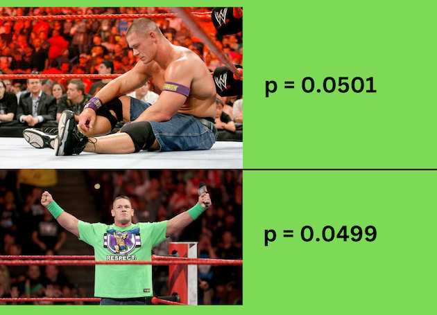

```{r xaringan-themer, include=FALSE, warning=FALSE}
library(xaringanthemer)
style_duo_accent(primary_color = "#972D15", secondary_color = "#1f2026",
                 background_color = "#f8f7f3",
                 header_font_google = google_font("Archivo"),
                 text_font_google   = google_font("Inconsolata"), 
                 link_color="#7ed694"

)


```


---
class: inverse, center, middle

# Probabilidad & Estadística

---
## Probabilidad & Estadística


--

.center[]


---
## Probabilidad & Estadística

--
.center[]


---
class: inverse, center, middle


#Equipo de trabajo


---

## Profesor

<br>

  - Mauricio Bucca, Profesor Asistente - Sociología UC
  
  - PhD en Sociología & PhD Minor en Estadística, Cornell University

--

  - .bold[Investigación:] movilidad social intergeneracional,  desigualdades en el mercado laboral, creencias sobre las desigualdades, métodos cuantitativos
  

  - .bold[Métodos]: modelación estadística, inferencia causal, métodos experimentales y computacionales

---
## Ayudantes


<br>

.pull-left[
.bold[Elisa Tagle]

- Estudiante de magister en Sociólogía UC

]

.figure-right[

]

---
## Ayudantes

<br>

.pull-left[
.bold[Vicente Muhlenbrock]

- Estudiante de magister en Sociólogía UC

]

.pull-right[

]

---
class: inverse, center, middle

# Filosofía de enseñanza

---
### 1. Los "atajos" estadísticos dificultan el aprendizaje

--

.center[


]

---
### 2. La sola intuición no es suficiente

--

.pull-left[
.bold[Muchas cosas parecen más difíciles de lo que son]
.huge[$$\int xf(x)dx := \mu $$]
]

--

.pull-right[
.bold[Otras parecen más simples de lo que son]
.huge[ $$X   \text{ es una variable}$$]

]

--
<br>

- Vacíos de conocimiento, notación, poca exposición a las matemáticas.

- Este curso nivela estos vacíos activamente. No hay carta bajo la manga.

---

### 3. Menos es más

--

.pull-left[.bold[Muchos métodos]

]

--

.pull-right[.bold[Fundamentos sólidos]
]


---
class: inverse, center, middle

# Recursos

---

## Repositorio Github

Todo el material del curso será almacenado y actualizado regularmente en repositorio `Github`:

<br>
.center[


.bold[https://github.com/mebucca/ad2-sol114]

]

---
## Horario de consulta y ayudantías


.center[]


---
## Investigación


.pull-left[


]


.pull-right[


]

---
class: inverse, center, middle


##Hasta la próxima clase. Gracias!

<br>
Mauricio Bucca <br>
https://mebucca.github.io/ <br>
github.com/mebucca


