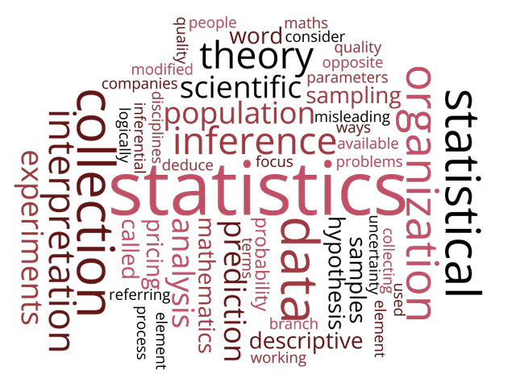
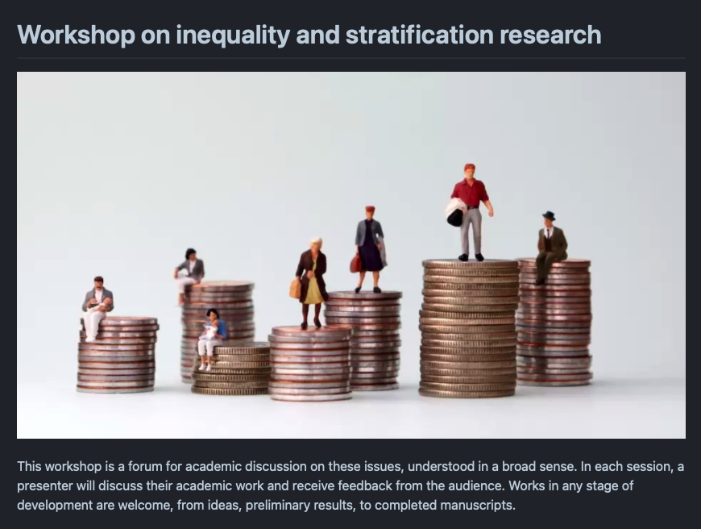
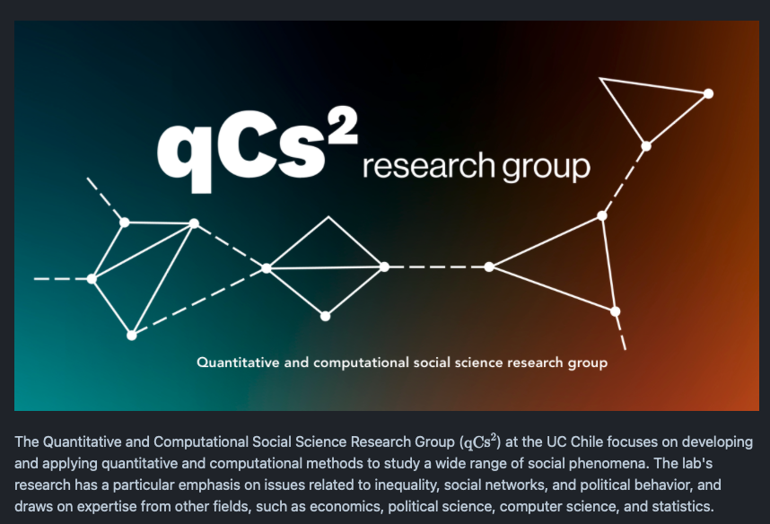

# Probabilidad & Estadística {background-color="#1f2026" .inverse .center .middle}

## Probabilidad & Estadística

. . .

::: {.center}

:::

## Probabilidad & Estadística

. . .

::: {.center}

:::

## Equipo de trabajo {background-color="#1f2026" .inverse .center .middle .section-title}

## Profesor

 

  - Mauricio Bucca, Profesor Asistente - Sociología UC
  
  - PhD en Sociología & PhD Minor en Estadística, Cornell University

. . .

  - [Investigación:]{.bold} movilidad social intergeneracional,  desigualdades en el mercado laboral, creencias sobre las desigualdades, métodos cuantitativos
  

  - [Métodos]{.bold}: modelación estadística, inferencia causal, métodos experimentales y computacionales

## Ayudantes

 

::: {.pull-left}
[Vicente Muhlenbrock]{.bold}

- Estudiante de magister en Sociólogía UC
:::

::: {.pull-right}

:::

## Ayudantes

 

::: {.pull-left}
[Tomás Leva]{.bold}

- Estudiante de pregrado en Sociólogía UC
:::

::: {.pull-right}

:::

## Filosofía de enseñanza {background-color="#1f2026" .inverse .center .middle .section-title}

---

### 1. Los "atajos" estadísticos dificultan el aprendizaje

. . .

::: {.center}

:::

---

### 2. La sola intuición no es suficiente

. . .

::: {.pull-left}
[Muchas cosas parecen más difíciles de lo que son]{.bold}

::: {.huge}
$$\int xf(x)dx := \mu $$
:::
:::

. . .

::: {.pull-right}
[Otras parecen más simples de lo que son]{.bold}

::: {.huge}
$$X   \text{ es una variable}$$
:::
:::

. . .

 

- Vacíos de conocimiento, notación, poca exposición a las matemáticas.

- Este curso nivela estos vacíos activamente. No hay carta bajo la manga.

---

### 3. Menos es más

. . .

::: {.pull-left}
[Muchos métodos]{.bold}

:::

. . .

::: {.pull-right}
[Fundamentos sólidos]{.bold}

:::

## Recursos {background-color="#1f2026" .inverse .center .middle .section-title}

## Repositorio Github

Todo el material del curso será almacenado y actualizado regularmente en repositorio `Github`:

 

::: {.center}

[https://github.com/mebucca/ad2-sol114]{.bold}
:::

## Horario de consulta y ayudantías

::: {.center}

:::

## Investigación

::: {.pull-left}

:::

::: {.pull-right}

:::

## Hasta la próxima clase. Gracias! {background-color="#1f2026" .inverse .center .middle}

 
Mauricio Bucca  
https://mebucca.github.io/  
github.com/mebucca
