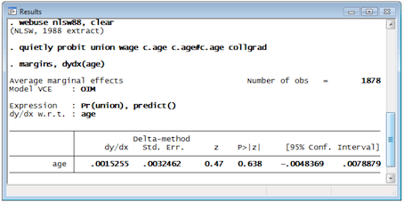
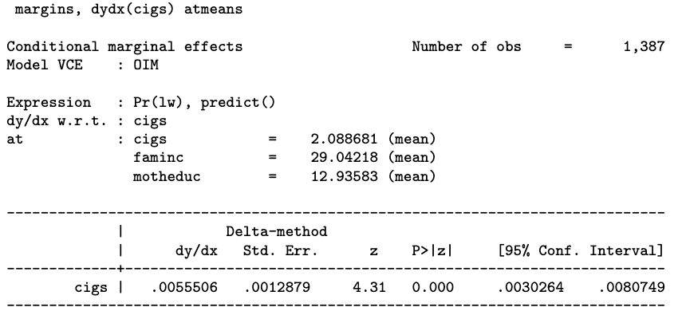

class: inverse, center, middle

#Regresión Logística, interpretación

---
##Configuración

--

<br>

- Tenemos $y_{1}, \dots y_{n}$ son $n$ variables independientes con distribución $\text{Bernoulli}(p_{i})$


--

- $\mathbb{E}(y_{i} \mid x_{i1}, \dots,x_{ik}) = \mathbb{P}(y_{i}=1 \mid x_{i1}, \dots,x_{ik}) = p_{i}$ 

<br>
--

donde, 


$$\ln \frac{p_{i}}{1 - p_{i}} = \beta_{0} + \beta_{1} x_{i1} + \dots + \beta_{k} x_{ik}$$

---
##Configuración

<br>

- Tenemos $y_{1}, \dots y_{n}$ son $n$ variables independientes con distribución $\text{Bernoulli}(p_{i})$


- $\mathbb{E}(y_{i} \mid x_{i1}, \dots,x_{ik}) = \mathbb{P}(y_{i}=1 \mid x_{i1}, \dots,x_{ik}) = p_{i}$ 

<br>

donde, 

$$\underbrace{\ln \frac{p_{i}}{1 - p_{i}}}_{\text{Link logit}(p_{i})} = \beta_{0} + \beta_{1} x_{i1} + \dots + \beta_{k} x_{ik}$$
---
##Configuración


<br>

- Tenemos $y_{1}, \dots y_{n}$ son $n$ variables independientes con distribución $\text{Bernoulli}(p_{i})$


- $\mathbb{E}(y_{i} \mid x_{i1}, \dots,x_{ik}) = \mathbb{P}(y_{i}=1 \mid x_{i1}, \dots,x_{ik}) = p_{i}$ 

<br>

donde, 

$$\ln \frac{p_{i}}{1 - p_{i}} = \underbrace{\beta_{0} + \beta_{1} x_{i1} + \dots + \beta_{k} x_{ik}}_{\text{Predictor lineal  } \eta_{i}}$$
<br>
--

- Interpretación: ¿cuál es el significado de $\beta_{0},\beta_{1}, \dots, \beta_{k}$?

---
## Un ejemplo empírico

```{r,  include=TRUE, echo=FALSE, warning=FALSE, message=FALSE}
# load data on extra-marital affairs from package "Ecdat"
library("Ecdat")
library("viridis")
library("tidyverse")
library("modelr")
library("cowplot")
library("Statamarkdown")
library("margins")


theme_set(theme_cowplot())

data(Fair)
affairsdata <- Fair %>% as_tibble()

# create a binary variable indicating wether persons has ever had an affair
affairsdata <- affairsdata %>% 
  mutate(everaffair = case_when(nbaffairs == 0 ~ "Never", nbaffairs > 0 ~ "At least once") ) %>%
  # map into 0/1 code
  mutate(everaffair_d = case_when(nbaffairs == 0 ~ 0, nbaffairs > 0 ~ 1))
```

.pull-left[
Continuando con los datos de infidelidad, ajustaremos el siguiente modelo:

<br>
$$\underbrace{\log \frac{p_{i}}{ 1 - p_{i}}}_{\text{logit}(p_{i})}    = \beta_{0} + \beta_{1}\text{male}_{i} + \beta_{2}\text{ym}_{i}$$
<br>

donde:

- $p_{i} =\mathbb{P}(\text{everaffair}_{i}=1)$

- $\text{logit}(p_{i})$ es el .bold[log odds] de tener un affair

- $p_{i}$ y $\text{logit}(p_{i})$ son una función género (male) y años de matrimonio (ym).

]

--
.pull-right[
```{r}
logit_affairs_sex_ym <- 
  glm(everaffair_d ~ factor(sex) + ym, 
      family=binomial(link="logit"), 
      data=affairsdata)
summary(logit_affairs_sex_ym)
```
]

---
class: inverse, center, middle

## Efectos marginales sobre el logit 

---
## Efectos marginales sobre el logit 

Dado el siguiente modelo de regresión logística: 

$$\text{logit}(p_{i}) = \ln \frac{p_{i}}{1 - p_{i}} = \beta_{0} + \beta_{1} x_{i1} + \dots + \beta_{k} x_{ik}$$
--

- El intercepto $\beta_{0}$ corresponde al logit de la probabilidad de éxito cuando $x_{1} = \dots = x_{k} = 0$

--

- El efecto marginal de $\beta_{k}$ sobre el logit de la probabilidad de éxito está dado por:


.pull-left[
.content-box-blue[
$$\frac{\partial\text{logit}(p_{i})}{\partial x_{k}} = \beta_{k}$$
]
]
.pull-right[
.content-box-yellow[
"Un cambio en $\Delta$ unidades de $x_{k}$ se traduce en un cambio en $\Delta$ $\beta_{k}$ unidades en el logit de p"
] 
]

--

¿Por qué?
--
 Asumamos que sólo la variable $x_{1}$ cambia en una unidad, de $x_{1}=c$ a $x_{1}=c+1$. Entonces:


\begin{align}
  \frac{\Delta\text{logit}(p_{i}) }{\Delta x_{1}} &= (\beta_{0} + \beta_{1}(c+1) +  \dots + \beta_{l}x_{k}) - (\beta_{0} + \beta_{1}c  \dots + \beta_{l}x_{k})  \\ 
  &=  \beta_{1}(c+1) - \beta_{1}c = \beta_{1}
\end{align}


---
## Efectos marginales sobre el logit 

En nuestro ejemplo: $\log \frac{p_{i}}{1 -p_{i}} = \beta_{0} + \beta_{1}*\text{male}_{i} + \beta_{2}*\text{ym}_{i}$

<br>

.pull-left[
```{r, echo=FALSE}
summary(logit_affairs_sex_ym)$coefficients[,c(1,2)]
```
]
.pull-right[
```{r, echo=FALSE, fig.width=6, fig.height=5}

# plot the result

grid <- affairsdata  %>% data_grid(sex,ym=seq(0,90),.model=logit_affairs_sex_ym)
predictions <- cbind(grid,logit_hat = predict(logit_affairs_sex_ym, newdata = grid)) 

predictions %>% ggplot(aes(x=ym, y=logit_hat, group=sex, colour=sex)) +  
  geom_line(size=2, alpha = 1) +
  scale_color_viridis_d() +  scale_fill_viridis_d() +
  guides(fill=FALSE, color=FALSE) +
  theme(axis.text.y = element_text(size = 22), axis.text.x = element_text(size = 22),
  axis.title.y = element_text(size = 24), axis.title.x = element_text(size = 24), 
  legend.text = element_text(size = 18), legend.position="bottom") +
  labs(x="years of marriage", y="logit(p)") +
  annotate('text', x = 37, y = -1, label = "beta[ym]==0.0584", parse = TRUE, size=8) 
```
]

---
## Efectos marginales sobre el logit 


.pull-left[
```{r, echo=FALSE}
summary(logit_affairs_sex_ym)$coefficients[,c(1,2)]
```
]
.pull-right[
Si `male=1` y `ym=10`, entonces `logit(p)`=
```{r}
-1.714 + 0.222*1 + 0.05843*10
```

Si `male=1` y `ym=11`, entonces `logit(p)`=
```{r}
-1.714 + 0.222*1 + 0.05843*11
```

]

--

Por tanto, $\beta_{ym}$=
```{r}
((-1.714 + 0.222*1 + 0.05843*11)-(-1.714 + 0.222*1 + 0.05843*10))/(11 - 10)
```

---
class: inverse, center, middle

## Efectos marginales sobre la probabilidad de éxito 


---
## Efectos marginales sobre la probabilidad de éxito

Dado el siguiente modelo de regresión logística: 

$$\ln \frac{p_{i}}{1 - p_{i}} = \beta_{0} + \beta_{1} x_{i1} + \dots + \beta_{k} x_{ik}$$

<br>
--
Queremos saber el .bold[efecto marginal] de los predictores sobre la bold[probabilidad] de éxito. Formalmente
--
$$\frac{\partial p_{i}}{\partial x_{k}} = ?$$
Paso a paso...


<br>
--

- .bold[Paso 1]: reexpresar la ecuación de regresión como

<br>

$$\log(p_{i}) - \log(1-p_{i}) = \beta_{0} + \beta_{1} x_{i1} + \dots + \beta_{k} x_{ik}$$


---
## Efectos marginales sobre la probabilidad de éxito


- .bold[Paso 1]: reexpresar la ecuación de regresión como


$$\log(p_{i}) - \log(1-p_{i}) = \beta_{0} + \beta_{1} x_{i1} + \dots + \beta_{k} x_{ik}$$

<br>
--

- .bold[Paso 2]: usando diferenciación implícita y tomando derivada con respecto a $x_{k}$ en ambos lados, obtenemos:

$$\frac{\partial p_{i} }{\partial x_{k}} \frac{1}{p_{i}} + \frac{\partial p_{i} }{\partial x_{k}} \frac{1}{(1 - p_{i})} = \beta_{k}$$
<br>
--

- .bold[Paso 3]: re-agrupando:

$$\frac{\partial p_{i} }{\partial x_{k}} \frac{1}{p_{i}(1 - p_{i})}= \beta_{k}$$

---
## Efectos marginales sobre la probabilidad de éxito


- .bold[Paso 3]: re-agrupando:

$$\frac{\partial p_{i} }{\partial x_{k}} \frac{1}{p_{i}(1 - p_{i})}= \beta_{k}$$

<br>
--

- .bold[Paso 4]: re-ordebando los términos obtenemos el efecto marginal que buscamos:

.content-box-blue[
$$\frac{\partial p_{i}}{\partial x_{k}}= \beta_{k} \cdot p_{i}(1 - p_{i})$$
]

--

recordar que ...
  $$p_{i} = \frac{1}{1 + e^{-(\beta_{0} + \beta_{1} x_{i1} + \dots + \beta_{k} x_{ik})}}$$

---
## Efectos marginales sobre la probabilidad de éxito

- .bold[Paso 5]: reemplazando,

$$\frac{\partial p_{i}}{\partial x_{k}}= \beta_{k} \cdot \Bigg(\frac{1}{1 + e^{-(\beta_{0} + \beta_{1} x_{i1} + \dots + \beta_{k} x_{ik}})}\Bigg) \Bigg(1 - \frac{1}{1 + e^{-(\beta_{0} + \beta_{1} x_{i1} + \dots + \beta_{k} x_{ik})}}\Bigg)$$

<br>
--

Corolario:

--

- Dado que $p_{i}(1-p_{i})$ es estrictamente positivo,
 - $\beta_{k}>0$ indica que variable $x_{k}$ tienen un efecto positivo sobre la probabilidad de éxito
 - $\beta_{k}<0$ indica que $x_{k}$ tiene un efecto negativo.

<br>
--

- El .bold[efecto marginal] de $x_{k}$ no depende sólo de $\beta_{k}$ sino varía dependiendo del valor de $x_{k}$ y del valor de todas las otras covariables.


---
## Efectos marginales sobre la probabilidad de éxito

$$\frac{\partial p_{i}}{\partial x_{k}}= \beta_{k} \cdot \Bigg(\frac{1}{1 + e^{-(\beta_{0} + \beta_{1} x_{i1} + \dots + \beta_{k} x_{ik}})}\Bigg) \Bigg(1 - \frac{1}{1 + e^{-(\beta_{0} + \beta_{1} x_{i1} + \dots + \beta_{k} x_{ik})}}\Bigg)$$

<br>
--

Corolario:

--

- A medida que la $p_{i}$ se aproxima a 0, $\frac{\partial p_{i}}{\partial x_{k}}$ tiende a 0.

- A medida que la $p_{i}$ se aproxima a 1, $\frac{\partial p_{i}}{\partial x_{k}}$ tiende a 0.

- A medida que la $p_{i}$ se acerca a 0.5, $\frac{\partial p_{i}}{\partial x_{k}}$ tiende a $\beta_{k}/4$.


---
## Efectos marginales sobre la probabilidad de éxito

En nuestro ejemplo: $\log \frac{p_{i}}{1 -p_{i}} = \beta_{0} + \beta_{1}*\text{male}_{i} + \beta_{2}*\text{ym}_{i}$, por tanto:
$$p_{i} = \frac{1}{1 + e^{-(\beta_{0} + \beta_{1}*\text{male}_{i} + \beta_{2}*\text{ym}_{i})} }$$

.pull-left[
```{r, echo=FALSE}
summary(logit_affairs_sex_ym)$coefficients[,c(1,2)]
```
]
.pull-right[
```{r, echo=FALSE, fig.width=6, fig.height=5}

# plot the result

grid <- affairsdata  %>% data_grid(sex,ym=seq(0,90),.model=logit_affairs_sex_ym)
predictions <- cbind(grid,logit_hat = predict(logit_affairs_sex_ym, newdata = grid)) %>%
                mutate(p_hat = 1/(1 + exp(-logit_hat)))

predictions %>% ggplot(aes(x=ym, y=p_hat, group=sex, colour=sex)) +  
  geom_line(size=2, alpha = 1) +
  scale_color_viridis_d() +  scale_fill_viridis_d() +
  guides(fill=FALSE, color=FALSE) +
  theme(axis.text.y = element_text(size = 22), axis.text.x = element_text(size = 22),
  axis.title.y = element_text(size = 24), axis.title.x = element_text(size = 24), 
  legend.text = element_text(size = 18), legend.position="bottom") +
  labs(x="years of marriage", y="p") +
  annotate('text', x = 60, y = 0.3, label = "slope==0.0584*p*(1-p)", parse = TRUE, size=8) 
```
]

---
## Efectos marginales sobre la probabilidad de éxito

.pull-left[
$$p_{i} = \frac{1}{1 + e^{-(\beta_{0} + \beta_{1}*\text{male}_{i} + \beta_{2}*\text{ym}_{i})}}$$

```{r, echo=FALSE, fig.width=6, fig.height=5}

# plot the result

grid <- affairsdata  %>% data_grid(sex,ym=seq(0,90),.model=logit_affairs_sex_ym)
predictions <- cbind(grid,logit_hat = predict(logit_affairs_sex_ym, newdata = grid)) %>%
                mutate(p_hat = 1/(1 + exp(-logit_hat)))

predictions %>% ggplot(aes(x=ym, y=p_hat, group=sex, colour=sex)) +  
  geom_line(size=2, alpha = 1) +
  scale_color_viridis_d() +  scale_fill_viridis_d() +
  guides(fill=FALSE, color=FALSE) +
  theme(axis.text.y = element_text(size = 22), axis.text.x = element_text(size = 22),
  axis.title.y = element_text(size = 24), axis.title.x = element_text(size = 24), 
  legend.text = element_text(size = 18), legend.position="bottom") +
  labs(x="years of marriage", y="p") 
```
]

--

.pull-right[
$$\frac{\partial p_{i}}{\partial \text{ym} }= \beta_{\text{ym}} \cdot p_{i}(1 - p_{i})$$

```{r, echo=FALSE, fig.width=6, fig.height=5}

beta_ym = logit_affairs_sex_ym$coefficients[3]

grid <- affairsdata  %>% data_grid(sex,ym=seq(0,90),.model=logit_affairs_sex_ym)
predictions <- cbind(grid,logit_hat = predict(logit_affairs_sex_ym, newdata = grid)) %>%
                mutate(p_hat = 1/(1 + exp(-logit_hat))) %>%
                mutate(me = beta_ym*(p_hat)*(1-p_hat))

predictions %>% ggplot(aes(x=ym, y=me, group=sex, colour=sex)) +  
  geom_line(size=2, alpha = 1) +
  scale_color_viridis_d() +  scale_fill_viridis_d() +
  guides(fill=FALSE, color=FALSE) +
  theme(axis.text.y = element_text(size = 22), axis.text.x = element_text(size = 22),
  axis.title.y = element_text(size = 24), axis.title.x = element_text(size = 24), 
  legend.text = element_text(size = 18), legend.position="bottom") +
  labs(x="years of marriage", y="efecto 'marginal' years of marriage") 
```
]
---
## Efectos marginales sobre la probabilidad de éxito

- Efectos marginales son _esencialmente_ heterogeneos. No hay un efecto sino muchos. 

--

- Heterogeneidad crece con la complejidad del modelo: número de predictores, interacciones, etc. 

--

- En la práctica, muchas veces queremos UN número que resuma el efecto marginal. 

<br>
--
.pull-left[

]

--

Cantidades de interes:
.pull-right[

* Average Marginal Effects (AME)

* Marginal Effects at the Mean (MEM)

* Marginal Effects at Representative Values (MER)

]

---
## Efectos marginales sobre la probabilidad de éxito: Average Marginal Effects

.bold[AME]: Efecto marginal promedio (en muestra)

.pull-left[
En `Stata`

]

--

.pull-right[
En `R`
```{r}
library("margins")
summary(
  margins(logit_affairs_sex_ym, 
          vce="bootstrap"))
```
]

<br>
--

¿Cómo lo calculamos?

---
## Efectos marginales sobre la probabilidad de éxito: Average Marginal Effects

```{r}
summary(margins(logit_affairs_sex_ym, vce="bootstrap"))
```


<br>
--

¿Cómo se calcula el AME de "years of marriage"?

--

```{r}
beta_ym = logit_affairs_sex_ym$coefficients[3] # coeficiente ym 
p_hat <- predict(logit_affairs_sex_ym, type="response") # prob predichas cada obs.
me_ym = beta_ym*p_hat*(1-p_hat) # efector marginal para cada obs.
```

--

.pull-left[
```{r, echo=FALSE, fig.width=3, fig.height=2.5}
me_ym %>% as_tibble() %>% 
  ggplot(aes(x=value)) +
  geom_density(size=1.5) +
  scale_color_viridis_d() +
  labs(x="efecto marginal ym")
```
]

.pull-left[
```{r}
ame = mean(me_ym)
print(paste0("AME Years of Marriage: ", ame))
```
]
---
## Efectos marginales sobre la probabilidad de éxito: Average Marginal Effects

¿Y si no conocemos la expresión analítica?
--
 .bold[Aproximación numérica]:
--

$$\frac{\partial p_{i}}{\partial x_{k}} \approx  \frac{p_{i}(x_{1}, \dots ,x_{k} = c + \delta) - p_{i}(x_{1}, \dots ,x_{k} = c )}{\delta}$$
<br>
--

```{r}
beta_ym = logit_affairs_sex_ym$coefficients[3] # coeficiente ym 
p_hat <- predict(logit_affairs_sex_ym, type="response") # prob predichas cada obs.

delta = 0.01 # cantidad cambio
affairsdata_delta <- affairsdata %>% mutate(ym = ym + delta) # cambio marginal en ym
# probabilidad predicha con ym aumentado marginalmente
p_hat_delta <- predict(logit_affairs_sex_ym, newdata=affairsdata_delta ,type="response") 

me_ym_approx <- (p_hat_delta - p_hat)/delta # approx. numerica marginal effect.

# average marginal effect
mean(me_ym_approx)
```

---
## Efectos marginales sobre la probabilidad de éxito: Marginal Effect at the Mean

.bold[MEM]: Efecto marginal al valor promedio (en muestra)

.pull-left[
En `Stata`

]

--

.pull-right[

]
---
## Efectos marginales sobre la probabilidad de éxito: Marginal Effect at the Mean

En `R`
```{r}
library("margins")

affairsdata <- affairsdata %>% mutate(male = 1*(sex=="male"))
logit_affairs_sex_ym2 <- glm(everaffair_d ~ male + ym, family=binomial(link="logit"), data=affairsdata)
summary(
  margins(logit_affairs_sex_ym2, at=list(male=mean(affairsdata$male), ym=mean(affairsdata$ym)),
          vce="bootstrap"))
```

<br>
--

¿Cómo lo calculamos?


---
## Efectos marginales sobre el logit 

En nuestro ejemplo: $\text{everaffair}_{i} = \beta_{0} + \beta_{1}*\text{male}_{i} + \beta_{2}*\text{ym}_{i}$

.pull-left[

]
.pull-right[
```{r, echo=FALSE, fig.height=6}

# plot the result

grid <- affairsdata  %>%data_grid(sex,ym=seq(0,90),.model=logit_affairs_sex_ym)
predictions <- cbind(grid,logit_hat = predict(logit_affairs_sex_ym, newdata = grid)) %>%
                mutate(odds = exp(logit_hat))

predictions %>% ggplot(aes(x=ym, y=odds, group=sex, colour=sex)) +  
  geom_line(size=2, alpha = 1) +
  scale_color_viridis_d() +  scale_fill_viridis_d() +
  guides(fill=FALSE, color=FALSE) +
  theme(axis.text.y = element_text(size = 22), axis.text.x = element_text(size = 22),
  axis.title.y = element_text(size = 24), axis.title.x = element_text(size = 24), 
  legend.text = element_text(size = 18), legend.position="bottom") +
  labs(x="years of marriage", y="logit(Affair)") +
  annotate('text', x = 50, y = 1, label = "beta[ym]==0.0584", parse = TRUE, size=8) 
```
]

---
class: inverse, center, middle

.huge[
**Hasta la próxima clase. Gracias!**
]

<br>
Mauricio Bucca <br>
https://mebucca.github.io/ <br>
github.com/mebucca


