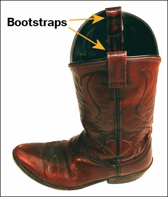

```{r xaringan-themer, include=FALSE, warning=FALSE}
library(tidyverse)
library(xaringanthemer)
style_duo_accent(primary_color = "#744B22", secondary_color = "#3B4082",
                 background_color = "#f8f7f3", 
                 header_font_google = google_font("Archivo"),
                 text_font_google   = google_font("Inconsolata"), 
                 link_color= "#D8BFD8"

)
```

```{r setup, include=FALSE}
knitr::opts_chunk$set(eval = T, echo = T)
```


## Ejemplo empírico: Promedio de ingreso mujeres

.pull-left[

```{r, echo=F}
library("tidyverse")
url <- "https://raw.githubusercontent.com/mebucca/dar_soc4001/master/data/sample_casen2017.csv"

casen2017_mujeres <- read.csv(url) %>% as_tibble() %>%
  mutate(ingreso = yautcor) %>%    
  select(region,sexo,edad,educ,ingreso) %>% filter(sexo==2) %>%
  mutate(univ = case_when(educ==11 | educ==12 & edad > 27 ~ 1, educ < 11 & edad > 27 ~ 0))
```

.center[
```{r, echo=F}
  print(casen2017_mujeres, n=15)
```
]

]

.pull-right[
```{r, echo=F}
#i. Calcula media muestral 
mu_muestra <- mean(casen2017_mujeres$ingreso, na.rm=T) #<<
cat("Media muestral:", mu_muestra)
```


]

---
## Métodos de simulación para inferencia estadística

<br>
--

- Inferencia estadística tradicional se basa en resultados teóricos sobre la distribución muestral de los estimadores (ej. TLC).

--

- Sin embargo, Iincluso para estimadores simples puede ser difícil (o imposible) determinar la distribución muestral (ej. mediana).

--

- Los métodos de simulación cuando no se dispone de soluciones analíticas (una formula conocida).

--

- Estos métodos son computacionalmente intensivos, lo que los hacía inviables en el pasado pero no actualmente.

--

 - "Bootstrapping" es uno de los métodos computacional más ampliamente usados para realizar inferencia estadística.
 
 
---
##Método Bootstrap

<br>

####Queremos hacer inferencia pero no conocemos la distribución muestral de nuestro estimador ...


.pull-left[


]

--

.pull-right[

]


---
##Método Bootstrap

<br>
.bold[Intuición:]

<br>
--

- Aplicamos un estimador a una muestra y queremos hacer inferencia sobre del estimado obtenido.

--


- No conocemos la distribución de nuestro estimador a través de infinitas muestras porque sólo tenemos una muestra. 

--

- Tampoco tenemos conocimiento teórico sobre la distribución de nuestro estimador (ej. TLC).

--

- Podemos tomar muestras de nuestra muestra, preservando cualquier distribución desconocida subyacente en los datos.

--

- Podemos observar y estudiar el comportamiento de nuestro estimador en estas muestras tomadas a partir de la muestra.

---
##Método Bootstrap

.bold[Muestrando desde la muestra:]

¿Cuántas muestras podemos tomar (con reemplazo) a partir de nuestra muestra?
--
 .bold[Respuesta]: $n^n$

<br>
--

$$\text{muestra} : \left[\begin{array}{@{}c@{}}
    1 \\
    2 \\
    3 
    \end{array} \right]$$

<br>
--

$$\text{posibles muestras de la muesta:} \left[\begin{array}{@{}c@{}} 
    1 \\
    1 \\
    1 
    \end{array} \right] 
    \text{ o}  \left[\begin{array}{@{}c@{}} 
    1 \\
    1 \\
    2 
    \end{array} \right] 
    \text{ o}  \left[\begin{array}{@{}c@{}} 
    1 \\
    3 \\
    2 
    \end{array} \right] 
    \text{ o}  \left[\begin{array}{@{}c@{}} 
    3 \\
    1 \\
    2 
    \end{array} \right] 
    \text{ o}  \left[\begin{array}{@{}c@{}} 
    3 \\
    3 \\
    3 
    \end{array} \right]  ...$$

---
## Bootstrap Method

.bold[Esquema del algoritmo]:

--

1. A partir de la muestra obtenén una muestra aleatoria del mismo tamaño que la muestra original (N), con reemplazo:  $(X_{b})$

--

2. Aplica el estimador $\theta(X_{b})$ a la muestra $(X_{b})$ pera obtener el estimado $\hat{\theta}_{b}$ 

--

3. Repite los pasos 1 y 2 un gran número de veces B.

--

4. El conjunto de B resultados obtenidos corresponde a la "Bootstrap distribution" del estimado.

--

5. Evalúa la distribución del estimado (SE,CI, etc) o de cualquier cantidad derivada de éste.

---
## Método Bootstrap, aplicación


.bold[Calculemos un IC al 99% para la `media` muestral del ingreso de las mujeres]

--

```{r}

# Escribir una función que ejecute re-sampling y la estimación
bs_mu  <- function(x) {
  data_b  <- sample_n(casen2017_mujeres, size=nrow(casen2017_mujeres), replace=TRUE)
  mu_muestra_b    <- mean(data_b$ingreso, na.rm=T)
  return(mu_muestra_b)
}

# Iterar función y almacenar resultados 

set.seed(77623)
distmuestral_boot <- replicate(5000, bs_mu()) %>% as_tibble()
glimpse(distmuestral_boot)

```

---
## Método Bootstrap, aplicación

.pull-left[
```{r}
ee_bs <- sd(distmuestral_boot$value)
ee_bs

ci99_bs <- 
  quantile(distmuestral_boot$value, 
           p=c(0.005,0.995))
ci99_bs 
```
]


.pull-right[
```{r, echo=FALSE, fig.width=7, fig.height=6, message=F, warning=F}
library(ggplot2)

# Color definitions
primary_color   <- "#228B22"
secondary_color <- "#3B4082"
third_color     <- "#D8BFD8" 


# Create the ggplot
dismuestral_bs_plot <- ggplot(data=distmuestral_boot) +
  geom_histogram(aes(x=value, y = ..density..), fill = secondary_color, bins = 100, color=secondary_color, alpha=0.4) +
    # Add vertical segments at the borders of the central area
  geom_vline(xintercept= ci99_bs[1], color = primary_color) +
  geom_vline(xintercept= ci99_bs[2], color = primary_color) +
  labs(title="Distribución Bootstrap media muestral",
       x = expression(bar(X)[b]),
       y = "Densidad") +
  theme_minimal() +
  theme(
    plot.title = element_text(face = "bold", size = 20),
    axis.text.y = element_text(size = 22),
    axis.text.x = element_text(size = 22),
    axis.title.y = element_text(size = 24),
    axis.title.x = element_text(size = 24),
    panel.border = element_rect(color = "black", fill = NA, linewidth = 1)
  )

# Display the plot
print(dismuestral_bs_plot )

```
]


---
## Método Bootstrap, aplicación


.bold[Calculemos un IC al 99% para la `mediana` muestral del ingreso de las mujeres]


.pull-left[
¿Cual es la distribución muestral de la mediana? 
<br>

]

--

<br>
.pull-right[
No importa, tenemos Bootstrap!
<br>

]


```{css, echo=FALSE}
.pull-right ~ * { clear: unset; }
.pull-right + * { clear: both; }
```

---
## Método Bootstrap, aplicación


.bold[Calculemos un IC al 99% para la `mediana` muestral del ingreso de las mujeres]

--

```{r}
# Escribir una función que ejecute re-sampling y la estimación
bs_median  <- function(x) {
  data_b  <- sample_n(casen2017_mujeres, size=nrow(casen2017_mujeres), replace=TRUE)
  median_muestra_b    <- median(data_b$ingreso, na.rm=T)
  return(median_muestra_b)
}

# Iterar función y almacenar resultados 

set.seed(77623)
distmuestral_boot <- replicate(5000, bs_median()) %>% as_tibble()
glimpse(distmuestral_boot)

```
---
## Método Bootstrap, aplicación

.pull-left[
```{r}
ee_bs <- sd(distmuestral_boot$value)
ee_bs

ci99_bs <- 
  quantile(distmuestral_boot$value, 
           p=c(0.005,0.995))
ci99_bs 
```
]


.pull-right[
```{r, echo=FALSE, fig.width=7, fig.height=6, message=F, warning=F}
library(ggplot2)

# Color definitions
primary_color   <- "#228B22"
secondary_color <- "#3B4082"
third_color     <- "#D8BFD8" 


# Create the ggplot
dismuestral_bs_plot <- ggplot(data=distmuestral_boot) +
  geom_histogram(aes(x=value, y = ..density..), fill = secondary_color, bins = 100, color=secondary_color, alpha=0.4) +
    # Add vertical segments at the borders of the central area
  geom_vline(xintercept= ci99_bs[1], color = primary_color) +
  geom_vline(xintercept= ci99_bs[2], color = primary_color) +
  labs(title="Distribución Bootstrap mediana muestral",
       x = expression(bar(X)[b]),
       y = "Densidad") +
  theme_minimal() +
  theme(
    plot.title = element_text(face = "bold", size = 20),
    axis.text.y = element_text(size = 22),
    axis.text.x = element_text(size = 22),
    axis.title.y = element_text(size = 24),
    axis.title.x = element_text(size = 24),
    panel.border = element_rect(color = "black", fill = NA, linewidth = 1)
  )

# Display the plot
print(dismuestral_bs_plot )

```
]


---
class: inverse, center, middle


##Hasta la próxima clase. Gracias!

<br>
Mauricio Bucca <br>
https://mebucca.github.io/ <br>
github.com/mebucca


