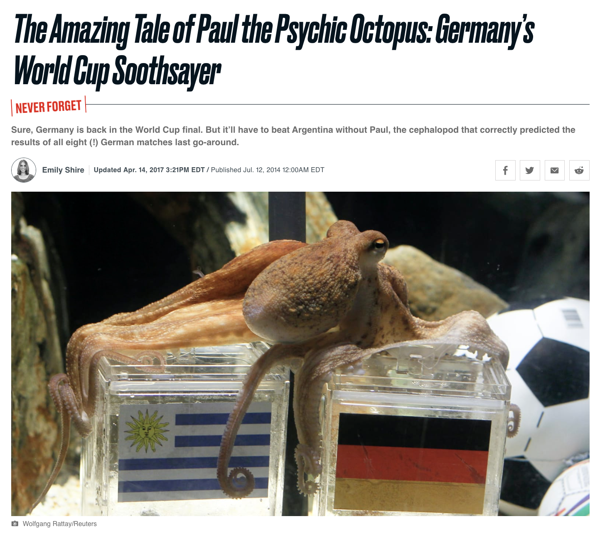

## ¿Puede un pulpo predecir los resultados del futbol?


.center[]


---
## ¿Puede un pulpo predecir los resultados del futbol?

| Torneo                  | Partido                 | Predicción | Resultado |
|-------------------------|-------------------------|------------|---------------------|
| Euro 2008               | Alemania vs Polonia     | Alemania   | Correcto            |
| Euro 2008               | Alemania vs Croacia     | Alemania   | Incorrecto          |
| Euro 2008               | Alemania vs Austria     | Alemania   | Correcto            |
| Euro 2008               | Alemania vs Portugal    | Alemania   | Correcto            |
| Euro 2008               | Alemania vs Turquía     | Alemania   | Correcto            |
| Euro 2008               | Alemania vs España      | Alemania   | Incorrecto          |
| Mundial 2010            | Alemania vs Australia   | Alemania   | Correcto            |
| Mundial 2010            | Alemania vs Serbia      | Serbia     | Correcto            |
| Mundial 2010            | Ghana vs Alemania       | Alemania   | Correcto            |
| Mundial 2010            | Alemania vs Inglaterra  | Alemania   | Correcto            |
| Mundial 2010            | Argentina vs Alemania   | Alemania   | Correcto            |
| Mundial 2010            | Alemania vs España      | España     | Correcto            |
| Mundial 2010            | Uruguay vs Alemania     | Alemania   | Correcto            |
| Mundial 2010            | Países Bajos vs España  | España     | Correcto            |


---
## ¿Puede un pulpo predecir los resultados del futbol?

¿Paul tiene habilidades especiales o tuvo suerte?

--

Esta es una pregunta empírica y la podemos testear.

--

.pull-left[

]

<br>

.bold[Paso #1: Expresar pregunta en términos de Hipótesis Nula e Hipótesis Alternativa]

<br>
--

.bold[Hipótesis Nula]: "Paul no tiene ningún talento especial, sus predicciones son como tirar una moneda al aire".

- $H_0: \mathbb{P}(\text{Acierto}) = \mathbb{P}(\text{Fallo}) = 0.5$

<br>
--

.bold[Hipótesis Alternativa]: "Paul tiene un talento, acierta más de lo que falla", o quizás 
"Paul es un mal adivino, falla más de lo que acierta".

- $H_a: \mathbb{P}(\text{Acierto}) \neq \mathbb{P}(\text{Fallo})$

---
## ¿Puede un pulpo predecir los resultados del futbol?

--

.bold[Paso #2: Elegir y calcular un estadístico] 

<br>
--

- Los datos nos muestran que Paul acertó en 12 de 14 partidos.

--

- Estadístico relevante: proporción de aciertos, $\hat{p}$.

<br>

$$\text{Proporción de Aciertos}: \hat{p} = \frac{12}{14} = 0.857$$

---
## ¿Puede un pulpo predecir los resultados del futbol?

.bold[Paso #3: Determinar la Distribución Nula]

--

- Es decir, la distribución muestral de nuestro estadístico bajo el supuesto de que la $H_0$ es verdadera -- Paul no tiene habilidad especial y por tanto $\mathbb{P}(\text{Acierto}) = \mathbb{P}(\text{Fallo}) = 0.5$.

--

  - Por el TLC sabemos que:  $\hat{p} \sim \text{Normal}\bigg(p, \frac{\sqrt{p(1-p)} }{\sqrt{n}}\bigg)$
 
--

  - Por tanto,  $\hat{p} \mid H_{0} \sim \text{Normal}\bigg(0.5, \frac{\sqrt{0.5(1-0.5)} }{\sqrt{n}}\bigg)$

<br>
--

- Estandarizando podemos  derivar un .bold[test-z]:

  - Si $Z_{\hat{p}} = \frac{\hat{p} - p}{\frac{\sqrt{p(1-p)} }{\sqrt{n}}}$ entonces: $Z_{\hat{p}} \mid H_0   \sim \text{Normal}\big(0, 1\big)$

--

  - Nuestro estadístico $\hat{p}$ se transforma el .bold[test-z], el valor estandarizado de del estadístico bajo $H_0$:

$$\hat{z} = \frac{\hat{p} - p}{\frac{\sqrt{p(1-p)} }{\sqrt{n}}} = \frac{0.857 - 0.5}{\frac{\sqrt{0.5(1-0.5)} }{\sqrt{14}}} = 2.6726$$

---
## ¿Puede un pulpo predecir los resultados del futbol?


.bold[Paso #4: Elegir un nivel de significación] $\alpha$ 

<br>

Selecciona un .bold[nivel de significación] $\alpha$, tal que consideraremos como "demasiado alto"/"demasiado bajo" aquellos valores que corresponden al $\alpha$% de valores más extremos en la distribución nula.


<br>

$$\alpha = \mathbb{P}(\text{Rechazar } H_{0} \mid H_{0} \text{ es verdadera})$$

<br>
--


- Mientras menor es $\alpha$ más dificl es rechazar la hipótesis nula.


- Dado que no confiamos en pulpos adivinos, vamos trabajar a un nivel alto de significación, $\alpha=0.01$.


---
## ¿Puede un pulpo predecir los resultados del futbol?


.bold[Paso #5: Calcular el valor-p] 

Si la hipótesis nula fuera verdadera, ¿es nuestro estadístico un valor esperable o un valor extremo?

--

En nuestro caso estamos testeando

.pull-left[

$\text{valor-p} = \mathbb{P}( \bar{X} > |\hat{p}| \mid H_{0} \text{ es verdadera})$

equivalentemente:

$\text{valor-p} = \mathbb{P}( Z > \big| \frac{\hat{\mu} - \mu}{\sigma/\sqrt{n}} \big| )$


```{r, echo=TRUE, message=FALSE, warning=FALSE}

n <- 14
p_hat <- 12/14

z_hat <- (p_hat - 0.5)/(sqrt(0.5*0.5) /sqrt(n))

pvalue =  2*(1 - pnorm(z_hat))

cat("z_hat=",round(z_hat,2), " valor-p=", pvalue, sep="")
```
]


.pull-right[
```{r, echo=FALSE, fig.height=4.5, fig.width=5,  message=FALSE, warning=FALSE}

# Load necessary libraries
library(ggplot2)
library(dplyr)

primary_color <- "#008C45"
secondary_color <- "#3949AB"
link_color <- "#FFD100"

# Set the mean and standard deviation
mu <- 0
sigma <- 1

# Significance level (α)
alpha <- 0.01

# Create the normal distribution data
x_values <- seq(-4, 4, by = 0.1)
y_values <- dnorm(x_values, mean = mu, sd = sigma)
normal_data <- data.frame(x = x_values, y = y_values)

# Calculate the cutoff points for the tails
cutoff_left <- qnorm(alpha / 2, mean = mu, sd = sigma)
cutoff_right <- qnorm(1 - alpha / 2, mean = mu, sd = sigma)

# Calculate the p-value corresponding to z-hat
pvalue <- 2 * (1 - pnorm(abs(z_hat), mean = mu, sd = sigma))

# Create the ggplot
normal_distribution_plot <- ggplot(normal_data, aes(x = x, y = y)) +
  geom_line(size = 1, color = primary_color) +

  # Add a vertical line for z-hat with the new color
  geom_vline(xintercept = c(-z_hat,z_hat), color = primary_color, size = 1) +
  
  # Add text label for z-hat
  annotate("text", x = z_hat + 0.9, y = max(normal_data$y) * 0.9, 
           label = paste("z-hat ="), 
           color = primary_color, size = 5) +
  
    annotate("text", x = z_hat + 0.8, y = max(normal_data$y) * 0.85, 
           label = paste(round(z_hat, 2)), 
           color = primary_color, size = 5) +
  
  # Add ribbon for the p-value corresponding to z-hat
  geom_ribbon(data = normal_data %>% filter(x >= z_hat),
              aes(x = x, ymin = 0, ymax = y),
              fill = primary_color, alpha = 0.5) +
  
    # Add ribbon for the p-value corresponding to z-hat
  geom_ribbon(data = normal_data %>% filter(x <= -z_hat),
              aes(x = x, ymin = 0, ymax = y),
              fill = primary_color, alpha = 0.5)  +
  
  # Add labels and theme
  labs(x = "Z", y = "Density") +
  theme_minimal() +
  theme(
    plot.title = element_text(face = "bold", size = 20),
    axis.text.y = element_text(size = 22),
    axis.text.x = element_text(size = 22),
    axis.title.y = element_text(size = 24),
    axis.title.x = element_text(size = 24),
    panel.border = element_rect(fill = NA, linewidth = 1)
  )

# Display the plot
print(normal_distribution_plot)


```
]

---
## ¿Puede un pulpo predecir los resultados del futbol?

--

.bold[Paso #6: Mantener o Rechazar la Hipótesis Nula]

--

- Comparamos -- bajo el supuesto de que $H_0$ es verdaadera --  la probabilidad de obtener el resultados que obtuvimos ( valor-p ) vs. el criterio seleccionado para clasificar resultados como "extremos" ( $\alpha$ ).

--

.bold[Decisión:]

 - Si $\text{valor-p} < \alpha$ entonces rechazamos $H_{0}$

 - Si $\text{valor-p} > \alpha$ no podemos rechazar $H_{0}$


<br>
--

En este caso:

```{r, echo=F, message=FALSE, warning=FALSE}

cat("𝛼=",0.01, "; valor-p=",pvalue, sep="")
```

.bold[Conclusión:]

Una tasa de acierto de 85.7% se encuentra por encima de la proporción esperada bajo el supuesto de que la hipótesis nula -- que Paul acierta con una probabilidad de 0.5. Por tanto con un nivel de significación del 1% (o 99% de confianza) podemos rechazar la hipótesis nula.

--

Sigue en pie la posibilidad de que Paul tenga habilidades especiales!

---
class: inverse, center, middle

.center[ 

]


---
class: inverse, center, middle


##Hasta la próxima clase. Gracias!

<br>
Mauricio Bucca <br>
https://mebucca.github.io/ <br>
github.com/mebucca


