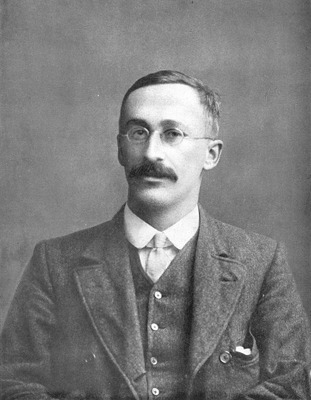

### William Sealy Gosset (1876-1937)

.pull-left[  
  
]  
.pull-right[ 

<br>

- William Gosset trabajaba como estadístico en la cervecería **Guinness** en Dublín. .

- Testear calidad de las diferentes partidas de cerveza. Misma receta pero variación en calidad de los ingredientes (contenido de proteínas en la cebada).

- Dos problemas: 
  
  - Muestras pequeñas: la empeza no quería desperdiciar cerveza en experimentos.
  
  - No conocía la varianza poblacional $\sigma^2$ de los ingredientes.
  

- Ambas limitaciones dificultaban el uso de herramientas estadísticas como el *TLC*.  

]

---

## Problemas: tamaño Muestral y varianza desconocida

<br> <br>

- .bold[Tamaño Muestral]: Cuando se trabaja con muestras pequeñas ( $\approx n < 30$ ), los resultados estadísticos tienden a ser menos precisos.

<br>

- .bold[Varianza Desconocida]: Cuando no conocemos la **varianza poblacional** ( $\sigma^2$ ). debemos estimarla a partir de los dotos: $s^2$. Esto introduce una fuente adicional de incertidumbre, ya que $s^2$ es una estimación basada en datos limitados.

<br>
- Relación entre .bold[tamaño muestral] y .bold[varianza desconocida]: cuando usamos la **varianza muestral** en lugar de la varianza poblacional, perdemos un **grado de libertad**. 

  - Para estimar la varianza muestral debemos primero estimar la media, lo que limita la capacidad de los datos de variar libremente. 

---
## Grados de Libertad (df)

- Los **grados de libertad** (df) son el número de valores que pueden variar de forma independiente en un cálculo estadístico.


--
<br>

.bold[Ejemplo:]

Tenemos 3 valores y conocemos la media:

$$ X_1, X_2, X_3 \quad \text{con} \quad \bar{X} = 10 $$

- Si ya conocemos $X_1$ y $X_2$, $X_3$ no puede variar libremente, porque está restringido por el valor de la media. Por tanto, solo hay **2 grados de libertad**.


--
<br>

- En el contexto de la **varianza muestral**, uno de los valores (la media muestral) ya ha sido utilizado para el cálculo, por lo que se pierde un grado de libertad. 


- Luego, cuando calculamos la varianza en una muestra de tamaño $n$, solo quedan $n-1$ grados de libertad.

---
## La Solución: distribución $t$-Student

.center[

]
---
### ¿Por qué usar la Distribución t?


<br>

Cuando la varianza poblacional es desconocida y trabajamos con muestras pequeñas esto introduce una mayor incertidumbre, que debe reflejarse en la forma de la distribución de probabilidad.

<br>

--

- La **distribución $t$ de Student** ajusta esta incertidumbre asignando mayor probabilidad de observar valores extremos.

- Probabilidad asignada a valores extremos es mayor mienstras más pequeña es la muestra.

- La distribución $t$ es, por tanto, más conservadora


---
### Distribución $t$ Stándard

.pull-left[  

Bajo las circunstancias mencionadas (varianza desconocida y muestra chica), al realizar el proceso de estandarización obtenemos:

<br>

$$t = \frac{\bar{X} - \mu}{\frac{s}{\sqrt{n}}} \sim t_{v}$$


]

.pull-right[ 
<br><br><br><br><br><br><br><br><br><br>
donde:

- $\bar{X}$ es la media muestral,

- $\mu$ es la media poblacional bajo $H_0$,

- $s$ es la desviación estándar muestral,

- $n$ es el tamaño de la muestra,

- $k$ es el número de parámetros estimados

- $v = n - k$ son los **grados de libertad**

]


---
### Distribución $t$ Stándard

.pull-left[  

Bajo las circunstancias mencionadas (varianza desconocida y muestra chica), al realizar el proceso de estandarización obtenemos:

<br>

$$t = \frac{\bar{X} - \mu}{\frac{s}{\sqrt{n}}} \sim t_{v}$$


]


.pull-right[  

<br><br><br><br><br><br>

.bold[Características]:

- La distribución $t$ tiene **colas más gruesas** que la normal estándar ( $\text{Normal}(0,1)$ ), reflejando mayor probabilidad de obtener valores extremos en muestras pequeñas.

- **Parámetro clave**: La forma de la distribución $t$ depende de los **grados de libertad** $v$. 

- **Simetría**: La distribución $t$-standard es simétrica alrededor de 0.
  
- **Varianza**: La varianza de la distribución $t$-standard es ligeramente mayor que 1 para muestras pequeñas, y se aproxima a 1 a medida que $n$ aumenta.

]


---
## Convergencia entre la Distribución $t$ y la Normal

<br>

La **distribución t de Student** se aproxima a la $\text{Normal}(0,1)$ cuando el tamaño muestral tiende a infinito: $n \to \infty$.

<br>

--

  - A medida que el número de grados de libertad aumenta, las colas  de la distribución $t$ se vuelven menos pronunciadas.

  - En el límite (cuando $df \to \infty$ ), la distribución $t$ se convierte en la distribución normal estándar.

<br>
--


Formalmente, si $T_n$ es un estadístico $t$ con $n-1$ grados de libertad, entonces:

<br>

$$T_n \xrightarrow{d} \mathcal{N}(0,1) \quad \text{cuando} \quad n \to \infty $$


---
## Aplicación al Test de Hipótesis

<br>

.bold[Paso a Paso deñ test de hipótesis]

Cuando usamos la **distribución t** en un test de hipótesis, el proceso sigue estos pasos:

--

1). Definir $H_1$ y $H_0$.


--

2). Calcular el estadístico de interés (ej., media muestral)

--

3). Transformar el estadístico a valor $t$ (análogo a $z$ pero usando varianza muestral):

$$t = \frac{\bar{X} - \mu_0}{\frac{s}{\sqrt{n}}}$$
--

4). Calcular valor- $p$ en base a la distribución $t$-standard con grados de libertad $n-k$.

--

5). Comparar con nivel de significación y tomar una decisión.


---
## En resumen:


La **distribución t de Student** se utiliza principalmente bajo las siguientes condiciones:

1. Varianza poblacional es desconocida
  
2. El tamaño de la muestra es pequeño (generalmente $n < 30$).

<br>
--


Entonces, ¿cuándo se usa la distribución $t$?

<br>
--

- Varianza desconocida + muestra pequeña: Usamos distribución $t$.

- Varianza desconocida + muestra grande: *Podemos* usar distribución normal

- Varianza conocida (sin importar el tamaño muestral): Usamos distribución normal (este siempre es el caso cuando estimamos proporciones!).

---
class: inverse, center, middle


##Ejemplo: Calorías en bebidas de Starbucks 

---
## Ejemplo: calorías en bebidas de Starbucks 

.center[


]


```{r, echo=FALSE, message=FALSE, warning=FALSE}

starbucks_menu <- read_csv("/Users/mauricio/Library/Mobile Documents/com~apple~CloudDocs/Teaching/ISUC/2024_2_data_analysis2/repo/slides/class_18/starbucks.csv")

colnames(starbucks_menu)[1] <- "Drink"

starbucks_menu <- starbucks_menu %>% select(Drink,Calories) %>% 
  filter(Calories != "-") %>% mutate(Calories = as.numeric(Calories))
```

---
## Ejemplo: Calorías en bebidas de Starbucks 

-  Un estudiante quiere saber cual es el promedio de calorías de los bebestibles de Starbucks.

- Decide comprar 12 bebestibles aleatoriamente y medir su contenido calórico. Los datos se ven así:

<br>

.center[


```{r, echo=FALSE, message=FALSE, warning=FALSE}

starbucks_muestra <- starbucks_menu %>% sample_n(size=12, replace=FALSE)
print(starbucks_muestra, n=12)

```
]

---
## Ejemplo: Calorías en bebidas de Starbucks 


### Paso #1: Elaborar Hipótesis Nula y Alternativa

Hipótesis de trabajo: *"En promedio, un bebestible de Starbuck tiene más de 100 calorías"*

<br>

- $H_0: \mathbb{E}(X) = 100 \text{ kcal}$ 


- $H_1: \mathbb{E}(X) > 100 \text{ kcal}$

---
## Ejemplo: Calorías en bebidas de Starbucks 

### Paso #2: Calcular un Estadístico


```{r, message=FALSE, warning=FALSE}

mu_hat <- starbucks_muestra %>% summarise(mu_hat = mean(Calories)) %>% pull()
cat("media muestral: ",mu_hat)

```

--
Estandarizando nuestro estadístico obtenemos:

  $$\hat{t} = \frac{\hat{\mu} - \mu}{\frac{\sigma}{\sqrt{n}}} = \frac{144.17 - 100}{\frac{\sigma}{\sqrt{12}}}$$

--

- Como no conocemos $\sigma$ debemos estimarlo a partir de la muesta ($s$).

```{r, message=FALSE, warning=FALSE}
s <- starbucks_muestra %>% summarise(s = sd(Calories)) %>% pull()
cat("desviación estándard muestral: ", s)
```

Luego:

$\hat{t} = \frac{\hat{\mu} - \mu}{\frac{s}{\sqrt{n}}} = \frac{144.17 - 100}{\frac{91.4}{\sqrt{12}}} =$ `r (mu_hat - 100)/(s/sqrt(12))`


---
## Ejemplo: Calorías en bebidas de Starbucks 


###Paso #3: Determinar la Distribución Nula

<br>

En nuestro caso: $\hat{t} \mid H_0 \text{ es verdadera} \sim t_{v=11}$


<br>
--


.center[
```{r, echo=FALSE, fig.height=4.5, fig.width=5,  message=FALSE, warning=FALSE}
# Load necessary libraries
library(ggplot2)
library(dplyr)

# Set the mean and standard deviation
mu <- 100
sigma <- s  # Replace 's' with your actual sigma value

# Create the normal distribution data with the new mean and standard deviation
x_values <- seq(-5, 5, by = 0.1)
y_values <- dt(x_values, df = 12 - 1)
t_data <- data.frame(x = x_values, y = y_values)

# Define the alpha level (e.g., 0.05 for 95% confidence)
alpha <- 0.05

# Define colors
primary_color <- "#D6523C"
secondary_color <- "#34B334"
background_color <- "#f8f7f3"
link_color <- "#0070C0"

# Create the ggplot
t_distribution_plot <- ggplot(t_data, aes(x = x, y = y)) +
  geom_line(color = primary_color, size = 1) +
  
  # Add a vertical line for mu_hat
  #geom_vline(xintercept = 368.070, color = link_color, size = 1) +

  # Add a text label for mu_hat
  #annotate("text", x = 408.070, y = max(t_data$y) * 0.9, label = expression(hat(mu) == 368.070), color = link_color, size = 6) +
  
  # Add annotations "LI" and "LS" next to the vertical segments
  labs(
    x = expression(bar(X)),
    y = "Density"
  ) +

  theme_minimal() +
  theme(
    plot.title = element_text(face = "bold", size = 20),
    axis.text.y = element_text(size = 22),
    axis.text.x = element_text(size = 22),
    axis.title.y = element_text(size = 24),
    axis.title.x = element_text(size = 24),
    panel.border = element_rect(fill = NA, linewidth = 1)
    )

# Display the plot
print(t_distribution_plot)

```
]

###Paso #4: Decidir el Nivel de Significación

- Trabajaremos a un nivel de significación estadística $\alpha=0.05$ 

- Dado que $H_1: \mathbb{E}(X) > 100 \text{ kcal}$, tiene sentido testear si nuesto estadístico se encuestra en el$\alpha$% más alto de la distribución nula.

---
## Ejemplo: Calorías en bebidas de Starbucks 

###Paso #5: Calcular el Valor-p

.pull-left[
En nuesto caso: 

$\text{valor-p}: \mathbb{P}( \bar{X} > \hat{\mu} \mid H_{0} \text{ es verdadera})$

equivalente a:

$\text{valor-p} = \mathbb{P}( t_{v=11} > \hat{t})$

```{r, echo=TRUE, message=FALSE, warning=FALSE}

t_hat = (mu_hat - 100)/(s/sqrt(12))
pvalue = 1 - pt(t_hat, df=11)
cat(" t_hat=",round(t_hat,2), 
    "\n valor crítico=", qt(0.95,df=11), 
    "\n valor-p=", pvalue, 
    sep="")
```
]


.pull-right[
```{r, echo=FALSE, fig.height=4.5, fig.width=5,  message=FALSE, warning=FALSE}
# Load necessary libraries
library(ggplot2)
library(dplyr)

# Set the mean and standard deviation
mu <- 100
sigma <- s  # Replace 's' with your actual sigma value

# Create the normal distribution data with the new mean and standard deviation
x_values <- seq(-5, 5, by = 0.1)
y_values <- dt(x_values, df = 12 - 1)
t_data <- data.frame(x = x_values, y = y_values)

# Define the alpha level (e.g., 0.05 for 95% confidence)
alpha <- 0.05

# Define colors
primary_color <- "#D6523C"
secondary_color <- "#34B334"
background_color <- "#f8f7f3"
link_color <- "#0070C0"

# Create the ggplot
t_distribution_plot <- ggplot(t_data, aes(x = x, y = y)) +
  geom_line(color = primary_color, size = 1) +
  
  # Add a vertical line for mu_hat
  geom_vline(xintercept = t_hat, color = link_color, size = 1) +

    # Shade the area under the curve for the p-values
  geom_ribbon(data = t_data %>% filter(x >= t_hat),
              aes(x = x, ymin = 0, ymax = y),
              fill = link_color, alpha = 0.5) +
  
  # Add a text label for t_hat
  annotate("text", x = t_hat + 1.4, y = max(t_data$y) * 0.9, label = expression(hat(t) == 1.67), color = link_color, size = 6) +
  
  # Add annotations "LI" and "LS" next to the vertical segments
  labs(
    x = expression(t),
    y = "Density"
  ) +

  theme_minimal() +
  theme(
    plot.title = element_text(face = "bold", size = 20),
    axis.text.y = element_text(size = 22),
    axis.text.x = element_text(size = 22),
    axis.title.y = element_text(size = 24),
    axis.title.x = element_text(size = 24),
    panel.border = element_rect(fill = NA, linewidth = 1)
    )

# Display the plot
print(t_distribution_plot)
```
]

---
## Ejemplo: Calorías en bebidas de Starbucks 

###Paso #6: Mantener o Rechazar la Hipótesis Nula


Finalmente, debemos decidir si rechazar o no la hipótesis nula


.pull-left[
.bold[Decisión:]

 - Si $\text{valor-p} < \alpha$ entonces rechazamos $H_{0}$

 - Si $\text{valor-p} > \alpha$ no podemos rechazar $H_{0}$

]

--

.pull-right[

- En este caso, al 5% de significación estadística, no podemos rechazar la hipótesis nula

- No tenemos evidencia para rechazar la hipótesis de que los bebestibles de Starbucks tienen, en promedio, 100 calorías (ni menos).

]
---
class: inverse, center, middle


##Hasta la próxima clase. Gracias!

<br>
Mauricio Bucca <br>
https://mebucca.github.io/ <br>
github.com/mebucca


