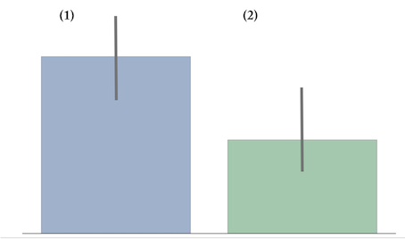

## Brechas de ingresos entre hombres y mujeres


.pull-left[

]
.pull-right[


]

---
## Brechas de ingresos entre hombres y mujeres

--

- .bold[¿Existe una brecha de ingresos entre hombres y mujeres?]


--

- En otras palabras, ¿existe asociación entre ingresos y género?

--

```{r, echo=F}
library("tidyverse")
url <- "https://raw.githubusercontent.com/mebucca/dar_soc4001/master/data/sample_casen2017.csv"

casen2017 <- read.csv(url) %>% as_tibble() %>%
  mutate(ingreso = yautcor) %>%    
  select(region,sexo,edad,educ,ingreso) %>%
  mutate(univ = case_when(educ==11 | educ==12 & edad > 27 ~ 1, educ < 11 & edad > 27 ~ 0),
         genero = case_when(sexo==1 ~ "Hombre", sexo==2 ~ "Mujer"))
```

<br>
--

.pull-left[

```{r, echo=T}
results <- casen2017 %>% group_by(genero) %>% 
  summarise(promedio_ingresos = 
              mean(ingreso, na.rm = T),
            n = sum(!is.na(ingreso)) ); results 
```
]


.pull-right[
  
]

---
## Brechas de ingresos entre hombres y mujeres


.bold[Paso #1: Expresar pregunta en términos de Hipótesis Nula e Hipótesis Alternativa]

<br>
--

.bold[Hipótesis Nula]: "La media de ingreso de las mujeres es igual a la de los hombres".

- $H_0: \underbrace{\mathbb{E}(X \mid \text{Hombre})}_{\mu_H} = \underbrace{\mathbb{E}(X \mid \text{Mujer})}_{\mu_M} \implies  \mathbb{E}(X \mid \text{Hombre}) - \mathbb{E}(X \mid \text{Mujer}) = 0$

<br>
--

.bold[Hipótesis Alternativa]: "La media de ingreso de las mujeres es distinta de la de los hombres".

- $H_a: \underbrace{\mathbb{E}(X \mid \text{Hombre})}_{\mu_H} \neq \underbrace{\mathbb{E}(X \mid \text{Mujer})}_{\mu_M} \implies  \mathbb{E}(X \mid \text{Hombre}) - \mathbb{E}(X \mid \text{Mujer}) \neq 0$


<br>
--

.bold[Paso #2: Elegir y calcular un estadístico] 

El estadístico natural es la diferencia entre ambas medias muestrales:

--

.pull-left[
- $\bar{X}_{H} = \hat{\mu}_{H}=$ `r round(results$promedio_ingresos[1])`

- $\bar{X}_{M} = \hat{\mu}_{M}=$ `r round(results$promedio_ingresos[2])`

]

--

.pull-right[
- $(\bar{X}_{H} - \bar{X}_{M}) = (\hat{\mu}_{H} - \hat{\mu}_{M})=$ `r round(results$promedio_ingresos[1] - results$promedio_ingresos[2])`
]


---
## Brechas de ingresos entre hombres y mujeres


.bold[Paso #3: Determinar la Distribución Nula]


  - Por el TLC sabemos que: 
    
    - $\bar{X}_{H}  \sim \text{Normal}\big(\mu_H, \frac{\sigma_H}{\sqrt{n_H}}\big)$
    
    - $\bar{X}_{W}  \sim \text{Normal}\big(\mu_W, \frac{\sigma_W}{\sqrt{n_W}}\big)$

<br>
--

Por tanto, 

.pull-left[
$(\bar{X}_{H} - \bar{X}_{W}) \sim \dots$ 
]

--


.pull-right[


]


---
## Brechas de ingresos entre hombres y mujeres


.bold[Paso #3: Determinar la Distribución Nula]


  - Por el TLC sabemos que: 
    
    - $\bar{X}_{H}  \sim \text{Normal}\big(\mu_H, \frac{\sigma_H}{\sqrt{n_H}}\big)$
    
    - $\bar{X}_{W}  \sim \text{Normal}\big(\mu_W, \frac{\sigma_W}{\sqrt{n_W}}\big)$

<br>


Por tanto, 

.pull-left[
$(\bar{X}_{H} - \bar{X}_{W}) \sim \dots$ 
]


.pull-right[


]

---
## Brechas de ingresos entre hombres y mujeres

.pull-left[
$(\bar{X}_{H} - \bar{X}_{W}) \sim \dots$ 
]

--

.pull-right[
.content-box-secondary[

Recordar, si $W$ e $Y$ son normales independientes:

- $W \pm Y \sim \text{Normal}$

- $\mathbb{E}(W \pm Y) = \mathbb{E}(W) \pm \mathbb{E}(Y)$ 

- $\mathbb{Var}(W \pm Y) = \mathbb{Var}(W) + \mathbb{Var}(Y)$ 

]
]

<br>
--

Por tanto, $(\bar{X}_{H} - \bar{X}_{W}) =  \text{Normal}\big(\mu_H, \frac{\sigma_H}{\sqrt{n_H}}\big) -  \text{Normal}\big(\mu_W, \frac{\sigma_W}{\sqrt{n_W}}\big) \sim  \text{Normal}\Bigg(\mu_H - \mu_W, \sqrt{\frac{\sigma^{2}_H}{n_H} + \frac{\sigma^{2}_M}{n_M}} \quad \Bigg)$ 

<br>
--

Luego, si $H_0$ es verdadera (la media de ingreso de las mujeres es igual a la de los hombres):

$$(\bar{X}_{H} - \bar{X}_{W}) \mid H_0 \sim \text{Normal}\Bigg(0, \sqrt{\frac{\sigma^{2}_H}{n_H} + \frac{\sigma^{2}_M}{n_M}} \quad \Bigg)$$
---
## Brechas de ingresos entre hombres y mujeres

$$(\bar{X}_{H} - \bar{X}_{W}) \mid H_0 \sim \text{Normal}\Bigg(0, \sqrt{\frac{\sigma^{2}_H}{n_H} + \frac{\sigma^{2}_M}{n_M}} \quad \Bigg)$$
--

Estandarizando, $Z_{H-W} \mid H_0 \sim \text{Normal}\big(0,1)$

--

- $\hat{z} \mid H_0 = \frac{(\hat{\mu}_{H} - \hat{\mu}_{W}) - 0 }{\sqrt{\frac{\sigma^{2}_H}{n_H} + \frac{\sigma^{2}_M}{n_M}}}$

--

No conocemos las varianzas poblacionales, por tanto debemos estimarlas ( $s^{2}_H$ y $s^{2}_W$ )


.pull-left[
```{r, echo=T}
stats <- casen2017 %>% group_by(genero) %>% 
  summarise(mu_hat = mean(ingreso, na.rm = T),
            s2 = var(ingreso, na.rm = T),
            n = sum(!is.na(ingreso)) ) 
```

```{r, echo=F}
print(stats)
```
]

--

.pull-right[
```{r, echo=T}

numerador <- stats %>%
  with(mu_hat[1] - mu_hat[2])

denominador <- stats %>% 
  with( sqrt(s2[1]/n[1] + s2[2]/n[2]) )

z_hat <- numerador/denominador
print(z_hat)


```
]

---
## Brechas de ingresos entre hombres y mujeres

<br>
--

.bold[Paso #4: Elegir un nivel de significación] $\alpha$ 

- Vamos trabajar a un nivel de significación de 5%, $\alpha=0.05$.

<br>
--

.bold[Paso #5: Calcular el valor-p] 


- $\text{valor-p} = \mathbb{P}( \bar{X}_{H} - \bar{X}_{W} > | \hat{\mu}_{H} - \hat{\mu}_{W} | \mid H_{0)}$


- equivalentemente: $\text{valor-p} = \mathbb{P}\Bigg( Z >   \Bigg| \frac{(\hat{\mu}_{H} - \hat{\mu}_{W}) - 0}{\sqrt{\frac{\sigma^{2}_H}{n_H} + \frac{\sigma^{2}_M}{n_M}}} \Bigg|  \Bigg)$


--
En nuestro caso:

```{r, echo=TRUE, message=FALSE, warning=FALSE}
pvalue =  2*(1 - pnorm(z_hat))

cat("z_hat=",round(z_hat,2), " valor-p=", pvalue, sep="")
```

---
## Brechas de ingresos entre hombres y mujeres


--

.bold[Paso #6: Mantener o Rechazar la Hipótesis Nula]

--

- Comparamos -- bajo el supuesto de que $H_0$ es verdadera --  la probabilidad de obtener el resultado que obtuvimos o uno más extremo (valor-p) vs. el criterio seleccionado para clasificar resultados como "extremos" ( $\alpha$ ).

--

.bold[Decisión:]

 - Si $\text{valor-p} < \alpha$ entonces rechazamos $H_{0}$

 - Si $\text{valor-p} > \alpha$ no podemos rechazar $H_{0}$


<br>
--

En este caso:

```{r, echo=F, message=FALSE, warning=FALSE}

cat("𝛼=",0.05, "; valor-p=",pvalue, sep="")
```

.bold[Conclusión:]

Con un nivel de significación del 5% (o 99% de confianza) podemos rechazar la hipótesis nula de que el salario promedio de hombres y mujeres es el mismo. Nuestro resultado sugiere que el salario promedio de los hombres es significativamente mayor que el de las mujeres.

---
class: inverse, center, middle


## Sobreposición de intervalos de confianza


---
### Inferencia para diferencia en medias/proporciones


- Un método alternativo para testear si hay diferencias estadísticamente significativas entre dos medias o dos proporciones es buscar


* No del todo cierto, pero tiene un punto importante

---
### Inferencia para Diferencia de proporciones (Nota)

.tiny[*asumamos mismo tamaño muestral $n$ por simpleza]. Queremos saber si $\mu_{1}$ es significativamente .bold[mayor] que $\mu_{2}$.


.pull-left[
.bold[Intervalos de confianza sobrepuesto]




$(\mu_{1} - c \cdot \sigma_{1}/\sqrt{n}) - (\mu_{2} + c \cdot \sigma_{2}/\sqrt{n}) > 0 \quad ?$ 

es decir, 

$(\mu_{1}  - \mu_{2}) -  c \cdot (\sigma_{1}/\sqrt{n} + \sigma_{2}/\sqrt{n}) > 0 \quad ?$
]

.pull-right[
.bold[Intervalos de confianza de differencia]

$(\mu_{1}  - \mu_{2}) -  c \cdot \sqrt{(\sigma^{2}_{1}/n + \sigma^{2}_{2}/n)} > 0 \quad ?$

]


---
class: inverse, center, middle


##Hasta la próxima clase. Gracias!

<br>
Mauricio Bucca <br>
https://mebucca.github.io/ <br>
github.com/mebucca


