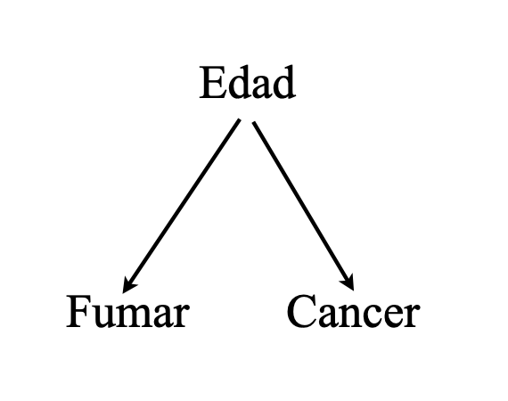

## Causas y efectos

 

Las ciencias, en un sentido amplio, están motivadas por preguntas *aparentemente* sencillas, del tipo:

 

  - ¿Cuán eficaz es un determinado tratamiento  para prevenir una enfermedad?

  - ¿Las ventas aumentaron debido a la nueva ley o a la campaña publicitaria?

  - Al momento de contratar, ¿discriminan los empleadores en base al género de los/las postulantes?

- etc.

 
--

Factor común: relaciones .bold[causa-efecto].

---

## Causas y efecto: mundos paralelos

.pull-left[

]
.pull-right[

 
 

.bold[Hipótesis causal:]  

_"Fumar causa cáncer"_

 

.bold[Pregunta contrafactual:] 
    
  -  "Si fumo, ¿desarrollaré cáncer?" y 
  
  -  "Si no fumo, ¿evitaré el cáncer?"

  
]

---

## Causas y efecto: mundos paralelos

.pull-left[

]
.pull-right[

 
 
 
 

|                |      **Si Fumara**               |     **Si No Fumara**              |
|----------------|:---------------------------:|:----------------------------:|
| Pedro        | Desarrolla cáncer           | Desarrolla cáncer       |

]

---

## Causas y efecto: mundos paralelos

.pull-left[

]
.pull-right[

Problema: no tenemos acceso al "multiverso"!

Ejemplo: "Pedro fuma"

|                |      **si Fumara**               |     **si No Fumara**              |
|----------------|:---------------------------:|:----------------------------:|
| Pedro          |  Desarrolla cáncer             |        |

]

---

## Asociación estadística: el mundo observado

.pull-left[

]
.pull-right[

 
 
 
 

Concomitacia de eventos:

|                | **Fumador** | **Cáncer** |
|----------------|:-----------:|:----------:|
| Pedro          | Sí          | Sí         |
| Juan           | No          | No         |
| Diego          | Sí          | Sí         |
| Fulano         | Sí          | No         |
| Menguano       | No          | No         |

- 2 de 3 fumadores desarrolla cancer
- 0 de 2 no fumadores desarrolla cancer
]

---

## Asociación estadística: el mundo observado

.pull-left[

]
.pull-right[

 
 
 
 

Otra forma de verlo:

|                |      **si Fumara**         |     **si No Fumara**      |
|----------------|:--------------------------:|:--------------------------:|
| Pedro          | Desarrolla cáncer          |                           |
| Juan           |                            | No desarrolla cáncer       |
| Diego          | Desarrolla cáncer          |                           |
| Fulano         | No desarrolla cáncer       |                          |
| Menguano       |                            | No desarrolla cáncer       |

]

---

## De Asociación a causalidad

.pull-left[

]
.pull-right[

 
 
 
 

Para pasar de asociación a causalidad necesitariamos tener acceso a los mundos paralelos que no vemos:

|                |      **si Fumara**         |     **si No Fumara**      |
|----------------|:--------------------------:|:--------------------------:|
| Pedro          | Desarrolla cáncer          |     .bold[(Desarrolla cáncer)]                      |
| Juan           |  .bold[(No desarrolla cáncer)]                           | No desarrolla cáncer       |
| Diego          | Desarrolla cáncer          |    .bold[(Desarrolla cáncer)]                        |
| Fulano         | No desarrolla cáncer       |    .bold[(No desarrolla cáncer)]                      |
| Menguano       | .bold[(No desarrolla cáncer)]                           | No desarrolla cáncer       |

]

---
## Asociación $\neq$ Causalidad

.pull-left[

**Mundo observado:**

|                |      **si Fumara**         |     **si No Fumara**      |
|----------------|:--------------------------:|:--------------------------:|
| Pedro          | Desarrolla cáncer          |                         |
| Juan           |                             | No desarrolla cáncer       |
| Diego          | Desarrolla cáncer          |                          |
| Fulano         | No desarrolla cáncer       |                      |
| Menguano       |                          | No desarrolla cáncer       |

$$\mathbb{P}(\text{cancer} \mid \text{fumar} ) = 2/3 > \mathbb{P}(\text{cancer} \mid \text{no fumar} = 0) $$
 

Conclusión #1: .bold["Fumar y desarrollar cancer están asociados estadísticamente"]
]

--

.pull-right[

**Mundos paralelos:**

|                |      **si Fumara**         |     **si No Fumara**      |
|----------------|:--------------------------:|:--------------------------:|
| Pedro          | Desarrolla cáncer          |     .bold[(Desarrolla cáncer)]                      |
| Juan           |  .bold[(No desarrolla cáncer)]                           | No desarrolla cáncer       |
| Diego          | Desarrolla cáncer          |    .bold[(Desarrolla cáncer)]                        |
| Fulano         | No desarrolla cáncer       |    .bold[(No desarrolla cáncer)]                      |
| Menguano       | .bold[(No desarrolla cáncer)]                           | No desarrolla cáncer       |

$\mathbb{P}(\text{cancer} \mid \text{do(fumar)} ) =  \mathbb{P}(\text{cancer} \mid \text{do(no fumar)} = 2/5$

 

Conclusión #2: .bold["Fumar no causa el desarrollo de cancer"]

]

---
## Asociación $\neq$ Causalidad: ¿Why?

- Hay varias razones por las cuales puede pasar que asociación y causalidad no coincidas.

- Un caso paradigmático es cuando existe asociación espúria

.pull-left[

Edad actúa como un .bold["confounder"]
]

--

.pull-right[

 

Mundos paralelos:

| Nombre   | Edad | **si Fumara**            | **si No Fumara**          |
|----------|:------:|:--------------------------:|:----------------------------:|
| Pedro    | Viejo   | Desarrolla cáncer        | .bold[Desarrolla cáncer]      |
| Juan     | Jóven   | .bold[No desarrolla cáncer] | No desarrolla cáncer       |
| Diego    | Viejo   | Desarrolla cáncer        | .bold[Desarrolla cáncer]      |
| Fulano   | Jóven   | No desarrolla cáncer     | .bold[No desarrolla cáncer]   |
| Menguano | Jóven   | .bold[No desarrolla cáncer] | No desarrolla cáncer       |

]

---
## Asociación $\neq$ Causalidad: ¿Why?

- Hay varias razones por las cuales puede pasar que asociación y causalidad no coincidas.

- Un caso paradigmático es cuando existe asociación espúria

.pull-left[

Edad actúa como un .bold["confounder"]
]

.pull-right[

 

Mundos observados:

| Nombre   | Edad | **Fumador** | **Cáncer** |
|----------|------|:-----------:|:----------:|
| Pedro    | Viejo   | Sí          | Sí         |
| Juan     | Jóven   | No          | No         |
| Diego    | Viejo   | Sí          | Sí         |
| Fulano   | Joven   | No          | No         |
| Menguano | Joven   | No          | No         |

]

---
## Asociación $\neq$ Causalidad: ¿Why?

Aquí tienes una versión mejorada del texto:

---
## Asociación $\neq$ Causalidad: ¿Por qué?

La diferencia entre asociación y causalidad es fundamental y va más allá de los métodos estadísticos utilizados. Consideraciones clave:

 

- .bold[NO es un problema de estimación]: no se resuelve con técnicas estadísticas más complejas.

- .bold[NO es un problema de incertidumbre estadística]: no se soluciona con muestras más grandes.

- .bold[ES un desafío inherente a la forma en que la realidad se manifiesta], y solo puede abordarse adecuadamente mediante un _diseño de investigación apropiado_, como:

  - Experimentos de laboratorio, experimentos naturales, estrategias de inferencia causal, entre otros.

---
## Asociación $\neq$ Causalidad: ¿Por qué?

Ejemplo de diseño de investigación: experimentos naturales y "regresión discontinua"

.center[

]
---
class: inverse, center, middle

##Hasta la próxima clase. Gracias!

 
Mauricio Bucca  
https://mebucca.github.io/  
github.com/mebucca

