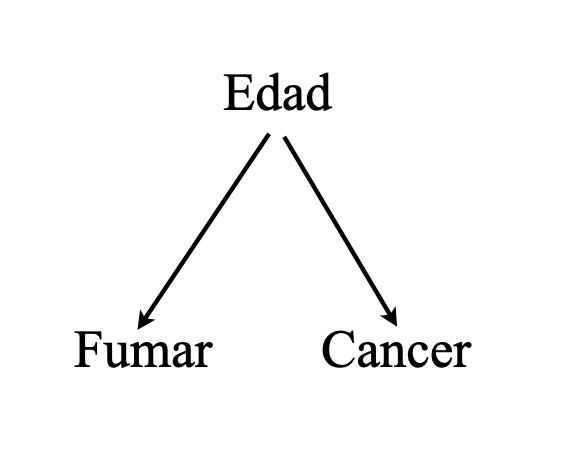

# Causalidad {background-color="#000000" .inverse .center .middle}

```{r setup, include=FALSE}
options(scipen=999)
knitr::opts_chunk$set(eval = T, echo = T)
```

## Causas y efectos

<br>

Las ciencias, en un sentido amplio, están motivadas por preguntas *aparentemente* sencillas, del tipo:

<br>

  - ¿Cuán eficaz es un determinado tratamiento  para prevenir una enfermedad?

  - ¿Las ventas aumentaron debido a la nueva ley o a la campaña publicitaria?

  - Al momento de contratar, ¿discriminan los empleadores en base al género de los/las postulantes?

- etc.

<br>

. . .

Factor común: relaciones [causa-efecto]{.bold}.

## Causas y efecto: mundos paralelos

::: {.pull-left}

:::

::: {.pull-right}
<br>
<br>

[Hipótesis causal:]{.bold}  

_"Fumar causa cáncer"_

<br>

[Pregunta contrafactual:]{.bold} 
    
  -  "Si fumo, ¿desarrollaré cáncer?" y 
  
  -  "Si no fumo, ¿evitaré el cáncer?"
:::

## Causas y efecto: mundos paralelos

::: {.pull-left}

:::

::: {.pull-right}
<br>
<br>
<br>
<br>

|                |      **Si Fumara**               |     **Si No Fumara**              |
|----------------|:---------------------------:|:----------------------------:|
| Pedro        | Desarrolla cáncer           | Desarrolla cáncer       |
:::

## Causas y efecto: mundos paralelos

::: {.pull-left}

:::

::: {.pull-right}
Problema: no tenemos acceso al "multiverso"!


Ejemplo: "Pedro fuma"

|                |      **si Fumara**               |     **si No Fumara**              |
|----------------|:---------------------------:|:----------------------------:|
| Pedro          |  Desarrolla cáncer             |        |
:::

## Asociación estadística: el mundo observado

::: {.pull-left}

:::

::: {.pull-right}
<br>
<br>
<br>
<br>

Concomitancia de eventos:

|                | **Fumador** | **Cáncer** |
|----------------|:-----------:|:----------:|
| Pedro          | Sí          | Sí         |
| Juan           | No          | No         |
| Diego          | Sí          | Sí         |
| Fulano         | Sí          | No         |
| Menguano       | No          | No         |

- 2 de 3 fumadores desarrolla cancer
- 0 de 2 no fumadores desarrolla cancer
:::

## Asociación estadística: el mundo observado

::: {.pull-left}

:::

::: {.pull-right}
<br>
<br>
<br>
<br>

Otra forma de verlo:

|                |      **si Fumara**         |     **si No Fumara**      |
|----------------|:--------------------------:|:--------------------------:|
| Pedro          | Desarrolla cáncer          |                           |
| Juan           |                            | No desarrolla cáncer       |
| Diego          | Desarrolla cáncer          |                           |
| Fulano         | No desarrolla cáncer       |                          |
| Menguano       |                            | No desarrolla cáncer       |
:::

## De Asociación a causalidad

::: {.pull-left}

:::

::: {.pull-right}
<br>
<br>
<br>
<br>

Para pasar de asociación a causalidad necesitariamos tener acceso a los mundos paralelos que no vemos:

|                |      **si Fumara**         |     **si No Fumara**      |
|----------------|:--------------------------:|:--------------------------:|
| Pedro          | Desarrolla cáncer          |     [(Desarrolla cáncer)]{.bold}                      |
| Juan           |  [(No desarrolla cáncer)]{.bold}                           | No desarrolla cáncer       |
| Diego          | Desarrolla cáncer          |    [(Desarrolla cáncer)]{.bold}                        |
| Fulano         | No desarrolla cáncer       |    [(No desarrolla cáncer)]{.bold}                      |
| Menguano       | [(No desarrolla cáncer)]{.bold}                           | No desarrolla cáncer       |
:::

## Asociación $\neq$ Causalidad

::: {.pull-left}
**Mundo observado:**

|                |      **si Fumara**         |     **si No Fumara**      |
|----------------|:--------------------------:|:--------------------------:|
| Pedro          | Desarrolla cáncer          |                         |
| Juan           |                             | No desarrolla cáncer       |
| Diego          | Desarrolla cáncer          |                          |
| Fulano         | No desarrolla cáncer       |                      |
| Menguano       |                          | No desarrolla cáncer       |

$$\mathbb{P}(\text{cancer} \mid \text{fumar} ) = 2/3 > \mathbb{P}(\text{cancer} \mid \text{no fumar}) = 0 $$
<br>

Conclusión #1: ["Fumar y desarrollar cancer están asociados estadísticamente"]{.bold}
:::

. . .

::: {.pull-right}
**Mundos paralelos:**

|                |      **si Fumara**         |     **si No Fumara**      |
|----------------|:--------------------------:|:--------------------------:|
| Pedro          | Desarrolla cáncer          |     [(Desarrolla cáncer)]{.bold}                      |
| Juan           |  [(No desarrolla cáncer)]{.bold}                           | No desarrolla cáncer       |
| Diego          | Desarrolla cáncer          |    [(Desarrolla cáncer)]{.bold}                        |
| Fulano         | No desarrolla cáncer       |    [(No desarrolla cáncer)]{.bold}                      |
| Menguano       | [(No desarrolla cáncer)]{.bold}                           | No desarrolla cáncer       |

$\mathbb{P}(\text{cancer} \mid \text{do(fumar)} ) =  \mathbb{P}(\text{cancer} \mid \text{do(no fumar)}) = 2/5$

<br>

Conclusión #2: ["Fumar no causa el desarrollo de cancer"]{.bold}
:::

## Asociación $\neq$ Causalidad: ¿Why?

- Hay varias razones por las cuales puede pasar que asociación y causalidad no coincidan.

- Un caso paradigmático es cuando existe asociación espúria

::: {.pull-left}

Edad actúa como un ["confounder"]{.bold}
:::

. . .

::: {.pull-right}
<br>

Mundos paralelos:

| Nombre   | Edad | **si Fumara**            | **si No Fumara**          |
|----------|:------:|:--------------------------:|:----------------------------:|
| Pedro    | Viejo   | Desarrolla cáncer        | [Desarrolla cáncer]{.bold}      |
| Juan     | Jóven   | [No desarrolla cáncer]{.bold} | No desarrolla cáncer       |
| Diego    | Viejo   | Desarrolla cáncer        | [Desarrolla cáncer]{.bold}      |
| Fulano   | Jóven   | No desarrolla cáncer     | [No desarrolla cáncer]{.bold}   |
| Menguano | Jóven   | [No desarrolla cáncer]{.bold} | No desarrolla cáncer       |
:::

## Asociación $\neq$ Causalidad: ¿Why?

- Hay varias razones por las cuales puede pasar que asociación y causalidad no coincidan.

- Un caso paradigmático es cuando existe asociación espúria

::: {.pull-left}

Edad actúa como un ["confounder"]{.bold}
:::

::: {.pull-right}
<br>

Mundos observados:

| Nombre   | Edad | **Fumador** | **Cáncer** |
|----------|------|:-----------:|:----------:|
| Pedro    | Viejo   | Sí          | Sí         |
| Juan     | Jóven   | No          | No         |
| Diego    | Viejo   | Sí          | Sí         |
| Fulano   | Joven   | No          | No         |
| Menguano | Joven   | No          | No         |
:::

## Asociación $\neq$ Causalidad: ¿Por qué?

La diferencia entre asociación y causalidad es fundamental y va más allá de los métodos estadísticos utilizados. Consideraciones clave:

<br>

- [NO es un problema de estimación]{.bold}: no se resuelve con técnicas estadísticas más complejas.

- [NO es un problema de incertidumbre estadística]{.bold}: no se soluciona con muestras más grandes.

- [ES un desafío inherente a la forma en que la realidad se manifiesta]{.bold}, y solo puede abordarse adecuadamente mediante un _diseño de investigación apropiado_, como:

  - Experimentos de laboratorio, experimentos naturales, estrategias de inferencia causal, entre otros.

## Asociación $\neq$ Causalidad: ¿Por qué?

Ejemplo de diseño de investigación: experimentos naturales y "regresión discontinua"

::: {.center}

:::

## Hasta la próxima clase. Gracias! {background-color="#000000" .inverse .center .middle}

<br>
Mauricio Bucca <br>
https://mebucca.github.io/ <br>
github.com/mebucca
