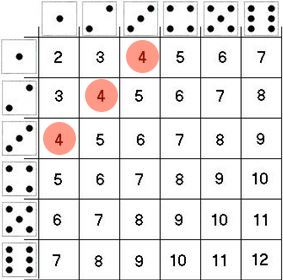

### Variables Aleatorias

Una .bold[variable aleatoria] es una variable cuyos valores son el resultado de un experimento aleatorio.

--

Si $\Omega$ es el espacio muestral de un experimento, una variable aleatoria es una función que _mapea_ el espacio muestral a los números reales: $\Omega \to \mathbb{R}$.


--

Ejemplo:

- Experimento: tirar 2 dados "justos" simultáneamente


--

- Espacio muestral $\Omega$: $\{(1;1),(1;2), \dots, (5;6),(6;6)\}$


<br>
--

$X$ es la variable aleatoria que resulta de sumar el resultado de ambos dados, 

$$X: \{2,3,4,5,6,7,8,9,10,11,12 \}$$


---

### Variables Aleatorias

Cada valor posible de una variable aleatoria tiene una probabilidad conocida de ocurrencia, denotada como $\mathbb{P}(X=x)$.

--

.bold[Ejercicio rápido:] Si $X$ es la variable que resulta de sumar los dos dados (justos) obtenidos ...

<br>
--

.pull-left[

]

.pull-right[
¿Cuál es la probabilidad de que la variable $X$ tome valor 4?

$$\mathbb{P}(X=4) =  \frac{3}{36} = \frac{1}{12}$$
]


---
### Distribución de una variable aleatoria

El conjunto de las probabilidades asociadas a cada posible resultado de una variable aleatoria se denomina la .bold[distribución] de la variable.

--

Continuando con nuestro ejemplo, podemos caracterizar la distribución de X con una función:

.pull-left[
\begin{align}
  f(x) =
  \begin{cases}
    \frac{1}{36}  & \quad \text{si } x=2 \text{ o } x=12\\
    \frac{2}{36}  & \quad \text{si } x=3 \text{ o } x=11\\
    \frac{3}{36}  & \quad \text{si } x=4 \text{ o } x=10\\
    \frac{4}{36}  & \quad \text{si } x=5 \text{ o } x=9\\
    \frac{5}{36}  & \quad \text{si } x=6 \text{ o } x=8\\
    \frac{6}{36}  & \quad \text{si } x=7 \\
    0             & \quad \text{otherwise}
  \end{cases}
\end{align}
]

--

.pull-right[
```{r, echo=FALSE,message=FALSE, warning=FALSE}
library("tidyverse", "knitr")

d1 = 1:6
d2 = 1:6

X = NULL
for (i in d1) {
  for (j in d2) {
    sum_ij = i + j
    X <- c(X,sum_ij)
  }
}

ditrib_X <- table(X) %>% as_tibble() %>% mutate(p=round(n/sum(n),2)) %>% select(-n)
names(ditrib_X) <- c("y","P(X=x)") 
knitr::kable(ditrib_X, format = "markdown", align = 'lc')
```
]


---
### Distribución de una variable aleatoria

.pull-left[

Podemos caracterizar la distribución de X con una función:

<br>

\begin{align}
  f(x) =
  \begin{cases}
    \frac{1}{36}  & \quad \text{si } x=2 \text{ o } x=12\\
    \frac{2}{36}  & \quad \text{si } x=3 \text{ o } x=11\\
    \frac{3}{36}  & \quad \text{si } x=4 \text{ o } x=10\\
    \frac{4}{36}  & \quad \text{si } x=5 \text{ o } x=9\\
    \frac{5}{36}  & \quad \text{si } x=6 \text{ o } x=8\\
    \frac{6}{36}  & \quad \text{si } x=7 \\
    0             & \quad \text{otherwise}
  \end{cases}
\end{align}

]

.pull-right[

<br>

```{r, echo=FALSE,message=FALSE, warning=FALSE, fig.width=6, fig.height=5}
library(tidyverse,knitr)
library(RColorBrewer)

d1 = 1:6
d2 = 1:6

X = NULL
for (i in d1) {
  for (j in d2) {
    sum_ij = i + j
    X <- c(X,sum_ij)
  }
}


table(X) %>% 
  as_tibble() %>% 
  mutate(p=round(n/sum(n),2)) %>% 
  select(-n) %>%
  ggplot(aes(x=factor(as.numeric(X)), y=p, fill="hola", color="black")) +
  geom_bar(stat= "identity", width=1, alpha=0.8) +
  labs(x="X", y="P(X=x)") +
  scale_color_manual(values = "black") +
  scale_fill_manual(values = "#c3aef2") +
  theme_minimal() +
  theme(legend.position="none",
        panel.border = element_rect(color = "black", fill = NA, size = 1)) # This line adds the inner box

```

<br>

.bold[Importante:] $\sum_{i=2}^{12} \mathbb{P}(X=i) = 1$

]


---
class: inverse, center, middle

#Distribuciones de Probabilidad


---
### Tipos de variables aleatorias


<br>
--

- .bold[Variables discretas:] variables que solo pueden tomar un número contable de valores distintos y separados, sin valores intermedios posibles entre ellos. Usualmente medidas con números enteros. 

Ejemplo: cara/sello, número de accidentes de tránsito, etc.

<br>
--

- .bold[Variables continuas:] variables que pueden tomar cualquier valor dentro de un rango especificado. Estas variables tienen un número infinito de posibles resultados y no están limitadas a valores aislados. 

Ejemplo: Los ingresos de una persona pueden tomar cualquier valor entre 0 y $\infty$+.


---
### Distribución de una variable aleatoria

El conjunto de las probabilidades asociadas a cada posible resultado de una variable aleatoria se denomina la .bold[distribución] de la variable.

<br> <br>
--

La distribución de una variable se puede caracterizar de manera .bold[única] de (al menos) dos maneras:

- .bold[Función de masa/densidad de probabilidad] (PMF/PDF): $f(x)$

   - En el caso de variables discretas $f(x) = \mathbb{P}(X=x)$. 
   
   - Ejemplo, evaluando $f(5)$ obtenemos la probabilidad de que $X$ tome valor 5.

<br>
--

- .bold[Función de distribución acumulada] (CDF): $F(x) = \mathbb{P}(X \leq x)$

  - Ejemplo, evaluando $F(5)$ obtenemos la probabilidad de que $X$ tome un valor igual o menor a 5.


   - En el caso de variables discretas $f(x) = \mathbb{P}(X=x)$. 
   
   - Ejemplo, evaluando $f(5)$ obtenemos la probabilidad de que $X$ tome valor 5.


---
class: inverse, center, middle

#f(x)


---
### Función de masa/densidad de probabilidad (pmf/pdf)

.bold[pmf: función de masa de probabilidad]

   - En el caso de variables discretas $f(x) = \mathbb{P}(X=x)$. 
   
   - Es decir, si $X$ es una variable aletoria discreta con **pmf:** $f(x)$, entonces evaluando $f(a)$ obtenemos la probabilidad de que $X$ tome valor a.

<br>   
--

.bold[Ejemplo:] si $X$ es la variable que resulta de sumar los dos dados justos, entonces su *función de de masa de probabilidad* está dada por:


\begin{align}
  f(x) =
  \begin{cases}
    \frac{1}{36}  & \quad \text{si } x=2 \text{ o } x=12\\
    \frac{2}{36}  & \quad \text{si } x=3 \text{ o } x=11\\
    \frac{3}{36}  & \quad \text{si } x=4 \text{ o } x=10\\
    \frac{4}{36}  & \quad \text{si } x=5 \text{ o } x=9\\
    \frac{5}{36}  & \quad \text{si } x=6 \text{ o } x=8\\
    \frac{6}{36}  & \quad \text{si } x=7 \\
    0             & \quad \text{otherwise}
  \end{cases}
\end{align}


---
### Función de masa/densidad de probabilidad (pmf/pdf)

.bold[pdf: función de densidad de probabilidad]

- En el caso de variables continuas, la **función de densidad de probabilidad** (pdf) $f(x)$ no representa directamente la probabilidad de que $X$ tome un valor específico $x$. En cambio, $f(x)$ describe la densidad de probabilidad en torno a $x$ (proporcional a la probabilidad).

<br>
--

- Es decir, si $X$ es una variable aleatoria continua con **pdf:** $f(x)$, entonces la probabilidad de que $X$ caiga en un intervalo $[a, b]$ está dada por:

$$\mathbb{P}(a \leq X \leq b) = \int_{a}^{b} f(x) \, dx$$


<br>   
--

- La probabilidad de que $X$ tome un valor exacto -- e.g., $X = 3$. Cuando $X$ hay infinitos posibles valores que $X$ puede tomar, por lo que la probabilidad se "reparte" entre todos esos valores.


---
class: inverse, center, middle

#F(x)


---
### Función de densidad acumulada (CDF)

- Otra forma de caracterizar una distribución de probabilidad es a través de su **función de densidad acumulada** (CDF)

- La **función de densidad acumulada**, denotada como $F(x)$, describe la probabilidad acumulada de que una variable aleatoria $X$ tome un valor menor o igual a $x$. Formalmente:

$$F(x) = \mathbb{P}(X \leq x)$$


<br>
--

- **Para variables continuas:** La CDF se obtiene integrando la función de densidad de probabilidad (pdf) $f(x)$. 

$$F(x) = \int_{-\infty}^{x} f(t) \, dt$$

--

- **Para variables discretas:** La CDF se calcula sumando las probabilidades de todos los valores $x_i$ que $X$ puede tomar hasta $x$.

$$F(x) = \sum_{x_i \leq x} \mathbb{P}(X = x_i)$$

---
### Función de densidad acumulada (CDF)


.pull-left[
| $x$ | $f(x):$ pmf  | $F(x)$: cdf |
|---------|-------------------|-----------------|
| 2       | $\frac{1}{36}$  | $\frac{1}{36}$  |
| 3       | $\frac{2}{36}$  | $\frac{3}{36}$  |
| 4       | $\frac{3}{36}$  | $\frac{6}{36}$  |
| 5       | $\frac{4}{36}$  | $\frac{10}{36}$ |
| 6       | $\frac{5}{36}$  | $\frac{15}{36}$ |
| 7       | $\frac{6}{36}$  | $\frac{21}{36}$ |
| 8       | $\frac{5}{36}$  | $\frac{26}{36}$ |
| 9       | $\frac{4}{36}$  | $\frac{30}{36}$ |
| 10      | $\frac{3}{36}$  | $\frac{33}{36}$ |
| 11      | $\frac{2}{36}$  | $\frac{35}{36}$ |
| 12      | $\frac{1}{36}$  | $\frac{36}{36}$ |

]


.pull-right[

<br>

```{r, echo=FALSE,message=FALSE, warning=FALSE, fig.width=6, fig.height=5}
library(tidyverse)
library(RColorBrewer)

# Define the possible outcomes for two dice
d1 <- 1:6
d2 <- 1:6

# Calculate the sums of all possible combinations of two dice
X <- NULL
for (i in d1) {
  for (j in d2) {
    sum_ij <- i + j
    X <- c(X, sum_ij)
  }
}

# Create a table of probabilities and calculate the CDF
cdf_data <- table(X) %>%
  as_tibble() %>%
  mutate(p = n / sum(n)) %>%
  arrange(as.numeric(X)) %>%
  mutate(cdf = cumsum(p)) %>%
  select(-n, -p)

# Plot the CDF
cdf_data %>%
  ggplot(aes(x = factor(as.numeric(X)), y = cdf, group = 1)) +
  geom_step(aes(color = "black"), size = 1) +
  geom_point(aes(color = "black"), size = 2) +
  labs(title = "CDF de suma de dos dados justos", x = "X", y = "F(X ≤ x)") +
  scale_color_manual(values = "#c3aef2") +
  scale_fill_manual(values = "#c3aef2") +
  theme_minimal() +
  theme(legend.position = "none",
        panel.border = element_rect(color = "black", fill = NA, size = 1)) # This line adds the inner box

```


]

---
class: inverse, center, middle

.huge[
**Hasta la próxima clase. Gracias!**
]

<br>
Mauricio Bucca <br>
https://mebucca.github.io/ <br>
github.com/mebucca

