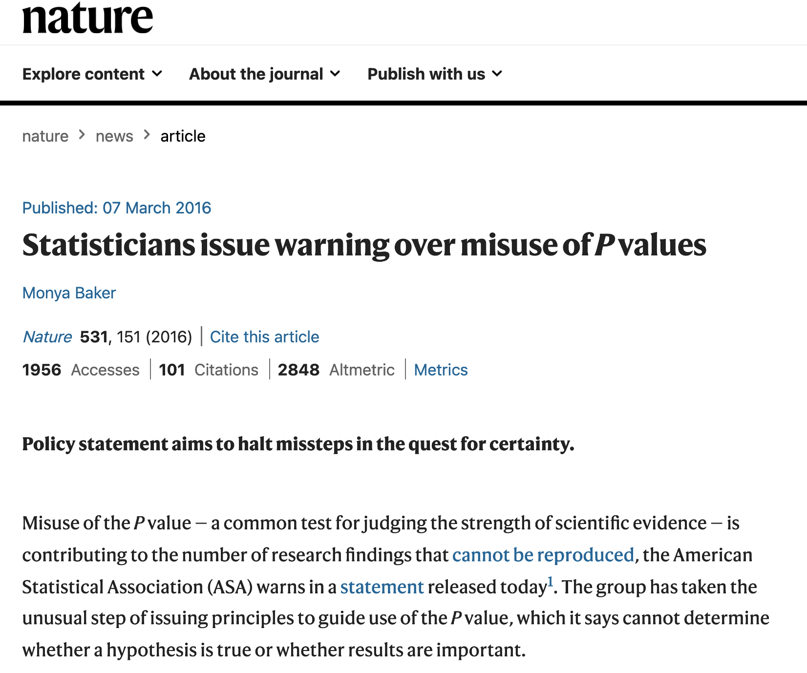
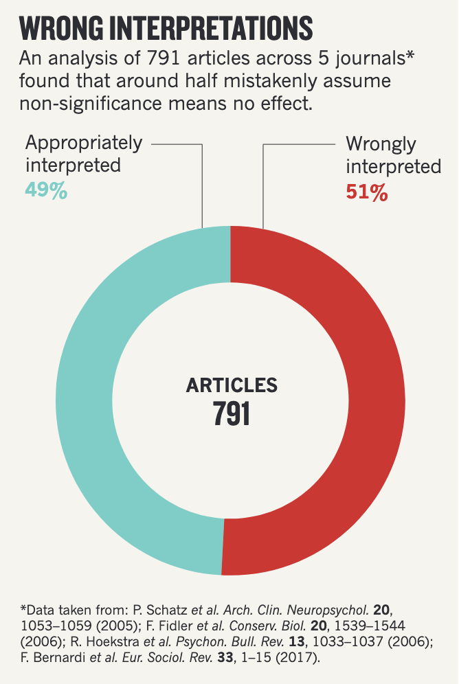

class: inverse, center, middle

#Tablas de Contingencia
## Medidas de asociación

---
##  Asociación en tablas de contingencia 

Las variables de una tabla de contingencia están asociadas si la distribución condicional de las variables es distinta de su distribución marginal. Formalmente, 

<br>

- $f_{Y \mid X}(Y \mid X) \neq f_{Y}(Y)$

y por tanto,

- $f_{X \mid Y}(X \mid Y) \neq f_{X}(X)$


---
##  Asociación en tablas de contingencia 

```{r,  include=TRUE, echo=FALSE, warning=FALSE, message=FALSE}
library("tidyverse")
library("Ecdat")
library("cowplot")
theme_set(theme_cowplot())

data(Fair)
affairsdata <- Fair %>% as_tibble()

# create a binary variable indicating wether persons has ever had an affair
affairsdata <- affairsdata %>% 
	mutate(everaffair = case_when(nbaffairs == 0 ~ "Never", nbaffairs > 0 ~ "At least once") )

ctable <- affairsdata %>% with(table(sex,everaffair))
```

Continuando con nuestro ejemplo,

.pull-left[
$f(\text{everaffair} \mid \text{sex})$
```{r, warning=F, message=F}
prop.table(ctable,1)
```


$f(\text{everaffair})$
```{r, warning=F, message=F}
prop.table(apply(ctable,2,sum))
```

]

--

.pull-right[
Al parece que los hombres tienen una mayor probabilidad que las mujeres de haber tenido un "affair".

En lo que sigue vamos a usar este ejemplo para estudiar:

- Diferentes formas de cuantificar la asociación (o la ausencia de la misma) entre variables de una tabla de contingencia

- Evaluar si las diferencias observadas son o no más sustanciales de lo se esperaría debido al mero azar.
]

---
class: inverse, center, middle

## Medidas de Asociación

---
## Diferencia de proporciones

- Supongamos que tenemos una tabla de contingencia 2-ways que cruza las variables binarias $X$ (independiente) y $Y$ (dependiente).  Éxito se codifica con valor 1 y el fracaso con el valor 0.

- Para detectar la asociación necesitamos medir diferencias en la distribución de $Y$ condicional en $X$

--
La diferencia de proporciones cuantifica estas diferencias de la siguiente manera:

$$\delta = \mathbb{P}(Y=1 \mid X=1) - \mathbb{P}(Y=1 \mid X=0)$$
--

Noten que $\delta \in [-1,1]$ donde $\delta=0$ indica proporciones iguales. 

--

Volviendo a nuestro ejemplo, $\hat{p}_{H}$, llamemos y a la proporción de hombres que han tenido una aventura y $\hat{p}_{M}$ a la proporción de mujeres que han tenido una aventura. La diferencia de proporciones se define simplemente como:

\begin{align}
  \hat{\delta} &= \hat{p}_{H} - \hat{p}_{M} \\ \\
  &= 0.273 - 0.229 \\ \\
  &= 0.044
\end{align}

---
## Diferencia de proporciones

Dos consideraciones importantes:

1) La diferencia de proporciones debe estar adecuadamente definida en términos de una variable dependiente y otra independiente. La razón es que, en general:

$$\mathbb{P}(Y=1 \mid X=1) - \mathbb{P}(Y=1 \mid X=0) \neq  \mathbb{P}(X=1 \mid Y=1) - \mathbb{P}(X=1 \mid Y=0)$$

--

En nuestro ejemplo:

```{r, warning=F, message=F}
prop.table(ctable,2)
```

Si tratamos género como variable dependiente y definimos "mujeres" como la categoría de éxito, la diferencia en las proporciones es $\delta = 0.48 - 0.54 = -0.06$. 

---
## Diferencia de proporciones

2) La diferencia de proporciones es una estadística intuitiva y fácil de interpretar, pero por sí sola puede ser engañosa cuando las proporciones son ambas cercanas a cero. Consideremos los dos casos hipotéticos siguientes:

\begin{align}
  \text{Caso 1: } p_{1a}=0.410 \text{ and } p_{1b}=0.401  \\ \\
  \text{aquí: } \delta_{1} = 0.009
\end{align}

--
y

\begin{align}
  \text{Caso 2: } p_{2a}=0.010 \text{ and } p_{2b}=0.001  \\ \\
  \text{aquí: } \delta_{2} = 0.009
\end{align}

--
¿Problemas? En el caso 1 ambas porciones son, según todos los indicios, casi idénticas. En el caso 2, sin embargo, ambas proporciones son similares en términos absolutos, por muy diferentes en términos relativos: $0.010$ es 10 veces mayor $0.001$.


---
## Odds Ratio

--
<br>

- Odds ratio ( $\theta$ ) es una medida fundamental de asociación. 

--

- Parámetro de interés en el modelo más importante de datos categóricos: regresión logística.

--

- $\theta$ está formulada para tablas de 2-por-2, pero también puede calcularse para tablas de mayor dimensión:

  - Toda tabla $n$-ways, $I \cdot J$, puede ser re-escrita como  $(I-1) \cdot (J-1) \cdot (n-1)$ tablas de 2-por-2.

---
### Odds

La Odds Ratio es el ratio de dos "odds", donde las "odds" una variable binaria $Y$ se definen como: 

<br>

\begin{align}
  \text{odds} &= \frac{\mathbb{P}(Y=1)}{1-\mathbb{P}(Y=1)} \\ \\
              &=  \frac{p}{1-p}
\end{align}

<br>
--

Por ejemplo, si $Y$ tiene una probabilidad de éxito $p=0.75$, las odds de éxito son $\text{odds}=\frac{0.75}{0.25} = 3$

- Esto significa que las "chances" de éxito son 3:1


---
### Odds

las Odds son funciones de probabilidades y, por lo tanto, las probabilidades también pueden expresarse en función de las odds. Formalmente:

$$p = \frac{\text{odds}}{1 + \text{odds}}$$

--

Siguiendo con ejemplo anterior, si sabemos que las odds de éxito son igual a 3, entonces la probabilidad ( $p$ ) de éxito es:

.pull-left[
\begin{align}
p &= \frac{3}{1 + 3} \\ \\
  &= 0.75
\end{align}
]

--

.pull-right[

.content-box-blue[
.tiny[.bold[Derivación]:
\begin{align}
  \text{odds} &= \frac{p}{1-p}  \text{  } \\ \\
  \text{odds} &= \frac{1}{\frac{1}{p} - 1}  \\ \\
  \frac{1}{p} &= \frac{1}{\text{odds}} + 1  \\  \\
  \frac{1}{p} &= \frac{1 + \text{odds}}{\text{odds}}  \\ \\
           p  &= \frac{\text{odds}}{1 + \text{odds}}
\end{align}
]

]
]

---
## Odds Ratio

Las .bold[odds] resumen la distribución de una sola variable binaria. Para medir la asociación entre dos de estas variables en una tabla podemos calcular la .bold[odds *ratio*]. 

--

Si $X$ e $Y$ son las variables binarias -- independiente y dependiente -- la distribución condicional $f(Y \mid X)$ se puede resumir con dos .bold[odds]:

\begin{align}
  \text{odds}_{0} &=  \frac{\mathbb{P}(Y=1 | X=0) }{1 - \mathbb{P}(Y=1 | X=0) } \quad \text{y} \\ \\
  \text{odds}_{1} &=  \frac{\mathbb{P}(Y=1 | X=1) }{1 - \mathbb{P}(Y=1 | X=1) } 
\end{align}

--

La .bold[odds *ratio*], por tanto, es:

\begin{align}
  \theta &= \frac{\text{odds}_{1}}{\text{odds}_{0}} \\ \\\
\end{align}


---
## Odds Ratio

Volviendo a nuestro ejemplo,

```{r,echo=FALSE}
prop.table(ctable,1)
```

Si $\hat{p}_{H}$ es la proporción de hombres que han tenido una aventura y $\hat{p}_{M}$ es la proporción de mujeres que han tenido una aventura. 


\begin{align}
  \hat{\theta} = \frac{\text{odds}_{H}}{\text{odds}_{M}} &= \\
         &= \frac{\hat{p}_{H}/(1 - \hat{p}_{H})}{\hat{p}_{M}/(1 - \hat{p}_{M})} \\ \\
         &= \frac{0.273/0.727}{0.229/0.771} \\ \\
         &= \frac{0.38}{0.30} = 1.27
\end{align}

---
## Odds Ratio

Dado que estas proporciones se *estiman* a partir de los recuentos de la tabla, $\hat{\theta}$ también puede expresarse de la siguiente manera, denominada .bold[cross-product ratio].

En nuestro ejemplo,

.pull-left[
```{r, echo=FALSE}
ctable
```
]

.pull-right[
\begin{align}
  \hat{\theta} &= \frac{\hat{p}_{H}/(1 - \hat{p}_{H})}{\hat{p}_{M}/(1 - \hat{p}_{M})} \\ \\
   &= \frac{\frac{n_{21}}{n_{2+}} / \frac{n_{22}}{n_{2+}}}{\frac{n_{11}}{n_{1+}}/ \frac{n_{12}}{n_{1+} }} = \frac{n_{21}/n_{22}}{n_{11}/n_{12}}  \\ \\
   &= \frac{n_{21} \cdot n_{12}}{n_{22} \cdot n_{11}} \\ \\
\end{align}
]

--

```{r, warning=F, message=F}
Theta = (ctable[2,1]*ctable[1,2])/(ctable[2,2]*ctable[1,1]); Theta
```

---
## Odds Ratio

```{r, warning=F, message=F}
Theta = (ctable[2,1]*ctable[1,2])/(ctable[2,2]*ctable[1,1]); Theta
```

.bold[Interpretación]: las odds de que un hombre tenga affair son 1,27 veces mayores que las de una mujer, es decir, 27% más altas. 

Notice that:

- $\theta \in [0,\infty+]$

--

- $\theta=1$ indica igualdad de odds y, por lo tanto, independencia

--

- $\theta > 1$ indica que el éxito es más probable para el grupo en el numerador (hombres en este caso)

--

- $\theta < 1$ indica que el éxito es más probable para el grupo en el denominador (mujeres en este caso)

--

- Valores lejos de 1, en cualquier dirección, representan una fuerte evidencia contra independencia

---
### Propiedades de la Odds Ratio

1) Invirtiendo el orden de las filas o columnas obtenemos el inverso la odds ratio original.

```{r,echo=FALSE}
prop.table(ctable,1)
```

Si $\hat{p}_{H}$ es la proporción de hombres que han tenido una aventura y $\hat{p}_{M}$ es la proporción de mujeres que han tenido una aventura. 

.pull-left[
\begin{align}
  \hat{\theta}_{HM} &= \frac{\hat{p}_{H}/(1 - \hat{p}_{H})}{\hat{p}_{M}/(1 - \hat{p}_{M})} \\ \\
         &= \frac{0.38}{0.30} \\ \\
         &= 1.27
\end{align}
]

.pull-right[
\begin{align}
  \hat{\theta}_{HM} &= \frac{\hat{p}_{M}/(1 - \hat{p}_{M})}{\hat{p}_{H}/(1 - \hat{p}_{H})} \\ \\
         &= \frac{0.30}{0.38} \\ \\
         &= 1/1.27 = 0.79
\end{align}
]

.full-width[
Tanto $\theta$ como $1/\theta$ expresan el .bold[mismo grado de asociación].
]

---
### Propiedades de la Odds Ratio

2) A diferencia de las otras medidas, la odds ratio no varia en función de que  variable actúa como dependiente e independiente. En otras palabras, no es necesario identificar una variable independiente para estimar correctamente $\theta$

--

En nuestro ejemplo, tomando género como variable dependiente, donde $\hat{p}_{A}$ es la probabilidad de ser hombre entre personar que han tenido un affair y $\hat{p}_{NA}$ es la misma probabilidad para personas que nunca han tenido un affair, la odd-ratio de ser hombre es:

.pull-left[
```{r, echo=FALSE}
prop.table(ctable,2)
```
]

.pull-right[
\begin{align}
  \hat{\theta} &= \frac{\hat{p}_{A}/(1 - \hat{p}_{A})}{\hat{p}_{NA}/(1 - \hat{p}_{NA})} \\ \\
         &= \frac{0.52/0.48}{0.46/0.54} \\ \\
         &= \frac{1.1}{0.85} \\ \\
         &= 1.27
\end{align}
]

---
### Propiedades de la Odds Ratio

3) La Odds Ratio es .bold[margins-free]: la odds ratio de una tabla de contingencia no se ven alteradas por el "escalamiento" (multiplicación por una constante) de filas o columnas.  

--

.pull-top[
.pull-left[
.bold[Movilidad educacional 1980]
```{r, echo=FALSE}
pais_1980 <- matrix(c(160,20,20,20),2,2)
colnames(pais_1980) <- c("Hij@:NU","Hij@:U")
rownames(pais_1980) <- c("Padre:NU","Padres:U")
pais_1980
```
]
.pull-right[
.bold[Movilidad educacional 2020]
```{r, echo=FALSE}
pais_2020 <- matrix(c(160,20,80,80),2,2)
colnames(pais_2020) <- c("Hij@:NU","Hij@:U")
rownames(pais_2020) <-  c("Padre:NU","Padres:U")
pais_2020
```
]
]

--

<br>

.pull-bottom[
.pull-left[
- El .bold[13%] de los hijos padres sin estudios universitarios obtenía un grado universitario
]
.pull-right[
- El .bold[33%] de los hijos padres sin estudios universitarios obtiene un grado universitario
]
]

<br>
--

- .bold[Diferencia de proporciones]: 0.33 - 0.13 = 0.2
- .bold[Riesgo relativo]: 0.33/0.13 = 2.5

--

.full-width[
.bold[Radio Duna:] _"En Chile practicamente se ha triplicado la movilidad educacional en los últimos 30 años, y aún así esta gente reclama..."_
]

--
.bold[Correcto?]


```{css, echo=FALSE}
.pull-right ~ * { clear: unset; }
.pull-right + * { clear: both; }
```
---
### Propiedades de la Odds Ratio


.bold[una verdad parcial:] el resultado refleja un .bold[cambio en la distribución marginal] de educación de los hijos, no un cambio en la asociación de las variables. 
--
 Concretamente, se cuaduplicó la cantidad de gente que termina la universidad, independiente de su origen. 

.pull-top[

.pull-left[
.bold[Movilidad educacional 1980]
```{r, echo=FALSE}
pais_1980 <- matrix(c(160,20,20,20),2,2)
colnames(pais_1980) <- c("Hij@:NU","Hij@:U")
rownames(pais_1980) <- c("Padre:NU","Padres:U")
pais_1980
```
]
.pull-right[
.bold[Movilidad educacional 2020]
```{r, echo=FALSE}
pais_2020 <- matrix(c(160,20,80,80),2,2)
colnames(pais_2020) <- c("Hij@:NU","Hij@:U")
rownames(pais_2020) <-  c("Padre:NU","Padres:U")
pais_2020
```
]

]

<br>
--

.pull-bottom[

.full-width[La odds ratio es "inmune a cambios" en la distribución marginal de las variables, capturando sólo la asociación neta entre ellas ("margin-free association")] 

.pull-left[
$\hat{\theta}_{1980} =  \frac{160 \cdot 20}{20 \cdot 20} = 8$
]
.pull-right[
$\hat{\theta}_{2020} =  \frac{160 \cdot 80}{20 \cdot 80} = \frac{160 \cdot (4 \cdot 20)}{20 \cdot (4 \cdot 20)} = 8$
]
]
 
---
### Log Odds Ratio

Como sabemos, $\theta \in [0,\infty+)$. Esto crea un problema tanto para la .bold[interpretación] como para la .bold[inferencia estadística]. Por ejemplo:

- Supongamos que la odds ratio (hombres a mujeres) de tener un affair es $\theta = 20$.
- Por ende, la odds ratio (mujeres a hombres) de tener un affair es $\theta^{*} = 1/ \theta = 0.05$. 
- Ambos resultados indican el .bold[mismo nivel de asociación], pero uno parece mucho más grande que el otro.

--

Transformando $\theta$ a escala logarítmica permite mapear  $[0,\infty+) \to (-\infty,\infty+)$, creando una medida de asociación  simétrica. 

\begin{align}
  \theta &=  \frac{1}{\theta^{*}}  \quad \text{entonces} \\ \\
  \log(\theta) &= -1 \cdot \log(\theta^{*})
\end{align}

--
En nuestro ejemplo:
.pull-left[
```{r, warning=F, message=F}
log(20)
```
]

.pull-right[
```{r, warning=F, message=F}
log(0.05)
```
]

---
### Log Odds Ratio

.pull-left[
-  $\log(\theta) \in (\infty-,\infty+)$ 

- $\theta=0$ indica igualdad de odds y, por lo tanto, independencia

- $\log(\theta) > 0$ indica que el éxito es más probable para el grupo en el numerador

- $\log(\theta) < 0$ indica que el éxito es más probable para el grupo en el denominador

- $\lvert \log(\theta) \rvert$ indica la fuerza de la asociación entre las variables

- Valores lejos de 0, en cualquier dirección, representan fuerte evidencia contra independencia

]

.pull-right[
```{r, echo=FALSE, fig.width= 6, warning=F}
units <- tibble(odds = seq(from=0, to=100, by=0.1)) %>% mutate(log_odds = log(odds))

odds_logodds <- units %>% ggplot(aes(x=odds, y=log_odds, colour="")) + geom_line(size=1.5) +
    scale_color_viridis_d() + guides(fill=FALSE, color=FALSE) +
    labs(x="Odds ratio", y="log Odds ratio", title = "Odds ratio to log Odds ratio") +
    theme(axis.text.y = element_text(size = 22), axis.text.x = element_text(size = 22),
    axis.title.y = element_text(size = 24), axis.title.x = element_text(size = 24), 
    legend.text = element_text(size = 18), legend.position="none") 

  print(odds_logodds)
```
]

---
class: inverse, center, middle

## Inferencia para Medidas de Asociación

---
class: middle
## Inferencia para medidas de Asociación: cuidado!

.pull-left[]


.pull-right[]

---
## Inferencia para medidas de Asociación

O, sobre como podemos saber si nuestros resultados no son, o no, producidos por el mero azar.

--

- Para responder esta pregunta debemos conocer la .bold[sampling distribution] de nuestro estimador, especialmente su _variabilidad_.

- Los parámetros que "generan" los datos no varían pero nuestra estimaciones si: de muestra en muestra.

--

<br>

.bold[Caso canónico] es el _promedio muestral_, para el cual sabemos que: $\bar{X} \sim \text{Normal}(\mu,\frac{\sigma}{\sqrt{n}})$
 - La desviación estándar del .bold[estimador] (en este caso, $\frac{\sigma}{\sqrt{n}}$ ) es lo que denominamos .bold[error estándar (SE)].

--

 - Por qué? Si $x_1, \dots, x_n$ son _iid_, entonces:
\begin{align}
\mathbb{Var}\big(\bar{X}\big) &= \mathbb{Var}\Big(\frac{x_{i} + ... + x_{n}}{n}\Big) = \frac{1}{n^2} \Big(\mathbb{Var}(x_{i}) + ... + \mathbb{Var}(x_{n})\Big) \\
 &= \frac{1}{n^2}( \sigma^2 + ... + \sigma^2 ) = \frac{n\sigma^2}{n^2} = \frac{\sigma^2}{n} 
\end{align}


---
### Inferencia para Diferencia de proporciones

Como recordarán de clases anteriores, asintóticamente, la "sampling distribution" de una proporción es:

$$\hat{p} \sim \text{Normal}(\mu,\sigma) \quad \quad \text{ donde }\mu = p \quad \text{ y }\quad \sigma^2 = p(1-p)/n$$

--

Por tanto, la "sampling distribution" de la diferencia entre dos proporciones _independientes_,  $\hat{\delta} = \hat{p}_{1} - \hat{p}_{2}$, es:


$$\text{Normal}\Big(\mu_{1} = p_{1}, \sigma_{1} = \sqrt{p_{1}(1-p_{1})/n_{1}}\Big) - \text{Normal}\Big(\mu_{2} = p_{2},  \sigma_{2} = \sqrt{p_{2}(1-p_{2})/n_{2}}\Big)$$
--

dado que para variables independiente X e Y: 
  - $\mathbb{E}(X - Y)  = E(X) -  E(Y)$ y $\mathbb{Var}(X - Y)  = \mathbb{Var}(X) + \mathbb{Var}(Y)$

--

  - $\text{Normal}() \pm \text{Normal}() \sim \text{Normal}()$,  entonces:

--

.content-box-blue[
$$\hat{p}_{1} - \hat{p}_{2} \sim \text{Normal}\Big(\mu_{\delta} = p_{1} - p_{2}, \sigma_{\delta} = \sqrt{p_{1}(1-p_{1})/n_{1} + p_{2}(1-p_{2})/n_{2}}\Big)$$
]

---
### Inferencia para Diferencia de proporciones

.bold[Intervalo de confianza]
Podemos usar este resultado para construir un intervalo de confianza para $\hat{\delta} = \hat{p_{1}} - \hat{p_{2}}$, al (1 - $\alpha$)% de confianza. Para un nivel de significación estadística de $\alpha=0.05$,

\begin{align}
  95\% \text{ CI}_{\hat{\delta}} &= \hat{\delta} \pm 2 \times SE \\ \\
          &= (\hat{p_{1}} - \hat{p_{2}}) \pm 2  \sqrt{p_{1}(1-p_{1})/n_{1} + p_{2}(1-p_{2})/n_{2}}
\end{align}

<br>
.bold[Nota importante]: cuando no conocemos los _verdaderos_ parámetros reemplazamos por sus valores estimados  (en este caso, $\hat{p_{1}}$ y $\hat{p_{2}}$ en vez de $p_{1}$ y $p_{2}$).


---
### Inferencia para Diferencia de proporciones

$$95\% \text{ CI}_{\hat{\delta}} = (\hat{p_{1}} - \hat{p_{2}}) \pm 2  \sqrt{p_{1}(1-p_{1})/n_{1} + p_{2}(1-p_{2})/n_{2}}$$

En nuestro ejemplo,

.pull-left[
```{r, warning=F, message=F}
print(ctable)
```
]

.pull-right[
```{r, warning=F, message=F}
n1 = sum(ctable[2,])
n2 = sum(ctable[1,])
p1_hat = ctable[2,1]/n1
p2_hat = ctable[1,1]/n2

```
]


```{r diff-prop, eval=FALSE}
delta_hat = p1_hat - p2_hat
se = sqrt((p1_hat*(1 - p1_hat))/n1 +  (p2_hat*(1 - p2_hat))/n2)
ci95_delta= c(ll=(delta_hat - 2*se), ul=(delta_hat + 2*se)); print(ci95_delta)
```

--

.pull-left[
Nuestro 95% CI:
```{r diff-prop-out, ref.label="diff-prop", echo=FALSE}
```
]

.pull-right[
Versión automática con `prop.test()` en `R`:
```{r, echo=FALSE}
test_props <- prop.test(rev(ctable[,1]), rev(apply(ctable,1,sum)), p = NULL, alternative = "two.sided", correct=FALSE)
print(test_props$conf.int[c(1,2)])
```
]

```{css, echo=FALSE}
.pull-right ~ * { clear: unset; }
.pull-right + * { clear: both; }
```


---
### Inferencia para Diferencia de proporciones

.bold[Test de hipótesis]

--

1) ¿Cuál es la distribución de $\hat{p}_{1} - \hat{p}_{2}$ si la hipótesis nula es verdadera?
  - $H_{0}: \tilde{\delta} = \hat{p}_{1} - \hat{p}_{2}=0$ 

--

.content-box-blue[
$$\tilde{\delta} =  \hat{p}_{1} - \hat{p}_{2} \sim \text{Normal}\Big(\mu_{\delta} = 0, \sigma_{\delta} = \sqrt{p(1-p)(1/n_{1}+1/n_{2})}\Big)$$
]


- Típicamente $p$ se reemplaza por el promedio ponderado de $\hat{p_{1}}$ y $\hat{p_{2}}$  

<br>
--

2) Calcular .bold[p-value] (1 colas)


.content-box-blue[
$$\mathbb{P}(\delta  > \hat{\delta} \mid H_{0})$$
]

```{css, echo=FALSE}
.pull-right ~ * { clear: unset; }
.pull-right + * { clear: both; }
```

---
### Inferencia para Diferencia de proporciones

.bold[Test de hipótesis]

1) ¿Cuál es la distribución de $\hat{p}_{1} - \hat{p}_{2}$ si la hipótesis nula es verdadera?
  - $H_{0}: \tilde{\delta} = \hat{p}_{1} - \hat{p}_{2}=0$ 


.content-box-blue[
$$\tilde{\delta} =  \hat{p}_{1} - \hat{p}_{2} \sim \text{Normal}\Big(\mu_{\delta} = 0, \sigma_{\delta} = \sqrt{p(1-p)(1/n_{1}+1/n_{2})}\Big)$$
]


- Típicamente $p$ se reemplaza por el promedio ponderado de $\hat{p_{1}}$ y $\hat{p_{2}}$  

<br>

2) Calcular .bold[p-value] (1 colas)


.content-box-blue[
$$\mathbb{P}(\delta  > \hat{\delta} \mid H_{0}): \mathbb{P}(\text{Normal}(\mu_{\delta} = 0, \sigma_{\delta} = \sqrt{p(1-p)(1/n_{1}+1/n_{2})}) > \hat{\delta} )$$
]

---

### Inferencia para Diferencia de proporciones

.bold[Test de hipótesis]


.pull-left[

```{r, warning=F, message=F}
p_null = p1_hat*(n1/(n1+n2)) + p2_hat*(n2/(n1+n2))
se_null = sqrt(p_null*(1 - p_null)*(1/n1 + 1/n2))
```

```{r, warning=F, message=F}
1 - pnorm(delta_hat,mean=0,sd=se_null)
```
]


.pull-right[
```{r, echo=FALSE, message=FALSE, warning=FALSE, fig.height=6, fig.width=8.5}
library("tidyverse")

p_null = p1_hat*(n1/(n1+n2)) + p2_hat*(n2/(n1+n2))
se_null = sqrt(p_null*(1 - p_null)*(1/n1 + 1/n2))

mydata <- data_frame(x = seq(from = -0.2, to = 0.2, by =0.01), delta_undernull = dnorm(x,mean=0,sd=se_null))

plot <- ggplot(data = mydata, mapping = aes(x = x)) +
    ## Entire curve
    geom_path(aes(y=delta_undernull,color=""), size=1.5, alpha=0.8) +
  labs(y="f(y)", x="y", title="Normal(mu=0,sigma=p(1-p)(1/n1 + 1/n2)") +
     scale_color_viridis_d() +
      theme(axis.text.y = element_text(size = 22), axis.text.x = element_text(size = 22),
      axis.title.y = element_text(size = 24), axis.title.x = element_text(size = 24), 
      legend.text = element_text(size = 18), legend.position="none") +
      geom_vline(xintercept = delta_hat, color = "blue", size=1.5) +
      annotate(geom="text", x=delta_hat+ 0.09, y=9, label='bold("nuestra dif. p: 0.044")', color="black", parse=TRUE, size=8) 

print(plot)
```
]

.bold[p-value] (1 cola):

$$\mathbb{P}( \delta \geq 0.044 \mid H_{0})  = 0.106$$


---
### Inferencia para la Odds Ratio

- Cual es la .bold[sampling distribucion] de $\hat{\theta}$? 

--

  - Si para un proporción sabemos que $\hat{p} \sim \text{Normal}(\mu,\sigma) \quad \quad \text{ donde }\mu = p \quad \text{ y }\quad \sigma^2 = p(1-p)/n$
  

<br>
La sampling distribution de $\hat{\theta}$ debe ser ...

--


.pull-left[
$$\hat{\theta} = \frac{\hat{p}_{1}/(1 - \hat{p}_{1})}{\hat{p}_{2}/(1 - \hat{p}_{2})}  \sim \frac{\frac{\text{Normal}(\mu_{1},\sigma_{1})}{1 - \text{Normal}(\mu_{1},\sigma_{1})}}{\frac{\text{Normal}(\mu_{2},\sigma_{2})}{1 - \text{Normal}(\mu_{2},\sigma_{2})}}$$  
]

--
.pull-right[


Complicado ...
]


  
  
---
### Inferencia para la Odds Ratio

- Más conveniente hacer inferencia sobre $\log \hat{\theta}$

- Usando la definición de $\hat{\theta}$ como cross-product, obtenemos:


  $$\log \hat{\theta} = \log \frac{n_{11}n_{22}}{n_{12}n_{21}} = \log n_{11} + \log n_{22} - \log n_{12} - \log n_{21}$$

<br>
--

Importante resultado teórico: la sampling distribution de $\log \hat{\theta}$ es _asintóticamente_ normal:

$$\log(\hat{\theta}) \sim \text{Normal}(\mu,\sigma)$$
con parámetros _estimados_ por:

 - $\hat{\mu} = \log \hat{\theta}$ 
 
 - $\hat{\sigma} = \sqrt{ \frac{1}{n_{11}} + \frac{1}{n_{12}} + \frac{1}{n_{21}} + \frac{1}{n_{22}}}$

---
### Inferencia para la Odds Ratio

#### Intervalo de confianza para log Odds ratio

Podemos usar este resultado para construir un intervalo de confianza para el log Odds ratio, al (1 - $\alpha$) de confianza. Para un nivel de significación estadística de $\alpha=0.05$,

\begin{align}
  95\% \text{ CI}_{\log \hat{\theta}} &= \log \hat{\theta} \pm 2 \cdot SE \\ \\
          &= \log \hat{\theta} \pm 2 \cdot \sqrt{ \frac{1}{n_{11}} + \frac{1}{n_{12}} + \frac{1}{n_{21}} + \frac{1}{n_{22}} } 
\end{align}

--

#### Intervalo de confianza para Odds ratio

Podemos obtener un intervalo de confianza estándar para la Odds ratio, al (1 - $\alpha$) de confianza tomando el exponencial del intervalo obtenido para $\log \hat{\theta}$.

\begin{align}
  95\% \text{ CI}_{\hat{\theta}} &= e^{\log \hat{\theta} \pm 2 \cdot \sqrt{ \frac{1}{n_{11}} + \frac{1}{n_{12}} + \frac{1}{n_{21}} + \frac{1}{n_{22}}} } 
\end{align}

---
### Inferencia para la Odds Ratio
#### Ilustración via Monte Carlo simulation

Escenario:
- Conocemos las verdaderas probabilidad $Y \mid X$ (ambas binarias).
- A partir de ellas calculamos  $\theta$ y $\log \theta$.
- Estos son los parámetros "verdaderos", no estimaciones. 


```{r, echo=FALSE}
probs <- matrix(c(0.6, 0.4, 0.4000000,0.6000000),2,2)
print(round(probs,2))

theta     = (probs[1,1]/probs[2,1])/(probs[1,2]/probs[2,2])
log_theta = log(theta)

paste0("Theta= ",round(theta,2),"; log Theta = ",round(log_theta,2))
```


---
class: inverse, center, middle

.huge[
**Hasta la próxima clase. Gracias!**
]

<br>
Mauricio Bucca <br>
https://mebucca.github.io/ <br>
github.com/mebucca


