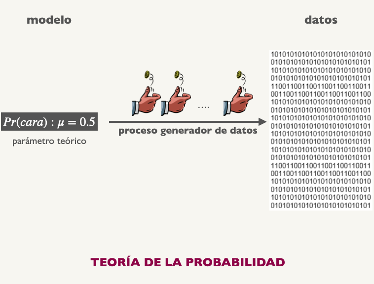
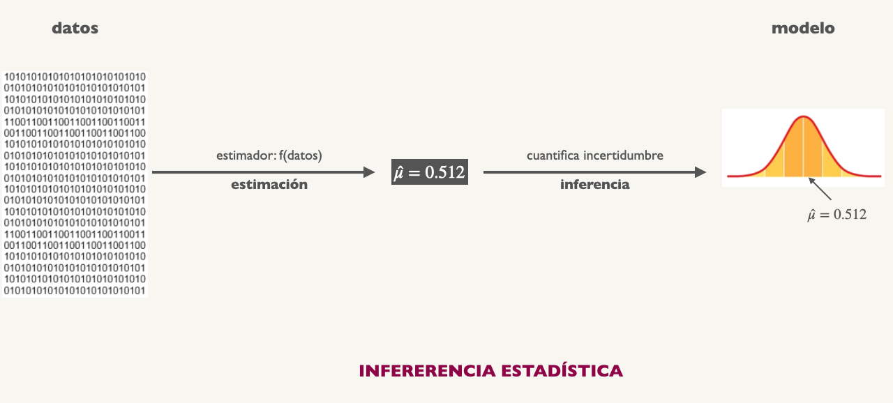

## Probabilidad


--

.center[]


---
## Estadística

--
.center[]

---
##Estimación 

Un sociólogo toma una encuesta a 1000 personas mayores de 40 años y les pregunta si tienen educación universitaria (1) o no (0). Registra los resultados en una base de datos y grafica dichos datos:  

<br>
--

.pull-left[
```{r, echo=FALSE, fig.height=5, fig.width=6,  message=FALSE, warning=FALSE}
library("tidyverse")
set.seed(481)

data_univ <- data.frame(X = rbinom(n=1000, size=1, prob=0.25))

knitr::kable(head(data_univ,10), col.names="Educación Superior", align="c")

```
]

--

.pull-right[
```{r, echo=FALSE, fig.height=5, fig.width=6,  message=FALSE, warning=FALSE}
library("tidyverse")
set.seed(481)

plot <- data_univ %>% 
  ggplot(aes(x=factor(X))) + 
    geom_bar(aes(fill=factor(X)), width = 1, color = "black") + 
    geom_text(aes(label=..count.., y = ..count..), stat='count', vjust=-0.5, size = 5) + 
    scale_fill_manual(values = c("#D32F2F", "#D32F2F")) + 
    labs(y="Recuentos", x="", title="") +
    guides(fill=FALSE) + 
    ylim(0,900) +
    theme_minimal() +
    theme(
      axis.text.y = element_text(size = 22),
      axis.text.x = element_text(size = 22),
      axis.title.y = element_text(size = 24),
      axis.title.x = element_text(size = 24),
      panel.border = element_rect(color = "black", fill = NA, linewidth = 1)
    )

print(plot)
```

]

---
##Estimación 

Un sociólogo toma una encuesta a 1000 personas mayores de 40 años y les pregunta si tienen educación universitaria (1) o no (0). Registra los resultados en una base de datos y grafica dichos datos:  

<br>

.pull-left[
```{r, echo=FALSE, fig.height=5, fig.width=6,  message=FALSE, warning=FALSE}

knitr::kable(head(data_univ,10), col.names="Educación Superior", align="c")

```
]

--

.pull-right[

- Lo que vemos en la izquierda son .bold[datos]

- .bold[Datos]: realización de $n$ variables aleatorias 

- Normalmente *no conocemos* la distribución de las variables

- Datos nos dan una pista sobre cuál podría ser esa distribución

- .bold[Estadística]: aprender de los datos para .bold[estimar] los parámetros que los generan

]


---
class: inverse, center, middle

#Estimador y Estimado

---
##Estimador y Estimado

<br>
--

- Un .bold[estimador] es una función - una formula - que aplicamos a los datos para obtener una aproximación (.bold[estimado]) del parámetro teórico/poblacional que queremos conocer, $\beta$.

<br>
--

.content-box-primary[
$$\color{white}{\text{Estimador}(\beta): f(\text{datos}) = \hat{\beta}}$$
]

---
##Estimador y Estimado

.center[]

---
##Estimador y Estimado

<br>


- Un .bold[estimador] es una función - una formula - que aplicamos a los datos para obtener una aproximación (.bold[estimado]) del parámetro teórico/poblacional que queremos conocer, $\beta$.

<br>


.content-box-primary[
$$\color{white}{\text{Estimador}(\beta): f(\text{datos}) = \hat{\beta}}$$
]

<br>
--

- ¿Cómo obtenemos la fórmula $f(\cdot)$ que aplicaremos a los datos para obtener $\hat{\beta}$?.

--

- Diversos métodos: Método de momentos (MM), Maximum Likelihood (MLE), Mínimos Cuadrados (MICO), Estimación Bayesiana, etc.


---
##Estimación via Maximum Likelihood

.pull-left[
```{r, echo=FALSE, fig.height=5, fig.width=6,  message=FALSE, warning=FALSE}

print(plot)

```
]

.pull-right[


.bold[Ejemplo: Estimación de una proporción]

<br>

- Observamos 1000 individuos, de los cuales 258 tienen educación universitaria.

- ¿Qué valor de $p$ es más plausible ("likely") que genere estos datos?

- MLE es la formalización de esta pregunta

]


---
##Estimación via Maximum Likelihood, pasos:

--

1) Decidir sobre la distribución subyacente que genera los datos. En este caso:

  - Educación de cada individuos $X_{1}, X_{2}, \dots X_{1000} \sim \text{Bernoulli}(p)$, donde X's son .bold[iid]. 

--

2)  Escribir una función que cuantifique la plausibilidad de diferentes valores del parámetro. Dicha función se denomina .bold[likelihood function]: 

$$\mathcal{L}(p \mid \text{datos}) = \mathbb{P}(\text{datos : \{1,0,1,1,....0,1\}}  \mid \text{ } p)$$

<br>
--

  * $\mathcal{L}(p \mid \text{datos}) = \mathbb{P}(x_{1})\mathbb{P}(x_{2}) \dots \mathbb{P}(x_{100}) = p^{258}(1-p)^{742}$


---
##Estimación via Maximum Likelihood

Podemos inspeccionar visualmente la "likelihood" de diferentes valores $p$.

.center[
```{r, echo=FALSE, fig.height=5, fig.width=9,  message=FALSE, warning=FALSE}
library("tidyverse")

plot <- ggplot(data = data.frame(p = 0), mapping = aes(x = p))

binom_distrib <- function(p,n,k) (p^(k))*((1-p)^(n-k))

plot + 
  stat_function(fun = binom_distrib, args = list(n= 1000, k= 258), size=1.5, color = "#D32F2F") + 
  xlim(0,1) + 
  labs(title="Likelihood of p", x="p", y=expression(paste(p^{258}, (1-p)^{742}))) +
  guides(fill=FALSE, color=FALSE) +
  theme_minimal() +
  theme(
    axis.text.y = element_text(size = 22),
    axis.text.x = element_text(size = 22),
    axis.title.y = element_text(size = 24),
    axis.title.x = element_text(size = 24),
    panel.border = element_rect(color = "black", fill = NA, linewidth = 1)
  )

```
]

.bold[Intuitivamente]: observando 258 personas con educación universitaria entre 1000, $p=258/1000=$ `r 258/1000` es el valor más plausible de $p$


---

##Estimación via Maximum Likelihood

3) Encontrar matemáticamente el valor de $p$ que maximiza $\mathcal{L}(p \mid \text{ Datos})$.


- $\mathcal{L}(p \mid \text{ Datos}) = \mathbb{P}(x_{1})\mathbb{P}(x_{2}) \dots \mathbb{P}(x_{n}) =  p^{k}(1-p)^{n-k} \quad \text{   donde  } k= \sum x_{i}$

--

- Para facilitar el cálculo tomamos logaritmo natural en ambos lados (.bold[log-likelihood])

  - $\ell\ell(p) = \ln \mathcal{L}(p \mid \text{ Datos})  = k \ln(p) + (n - k) \ln(1-p)$ 

--
-  Calcular la primera* derivada de $\ell\ell(p)$ con respecto a $p$: pendiente de la curva en cada valor de $p$.

  - $\ell\ell^{\text{ '}}(p) = \frac{k}{p} -  \frac{n-k}{1-p}$

--

- Encontrar el máximo de la función $\ell\ell(p)$: valor de $p$ en el cual la curva no cambia, es decir cuando $\ell\ell^{\text{ '}}(p)=0$ 

  - $\frac{k}{p} -  \frac{n-k}{1-p} = 0$
  
--

- Después de resolver por $p$ obtenemos:
  
   $$p = \frac{k}{n} = \frac{\sum x_{i}}{n}$$


---
##Estimación via Maximum Likelihood

<br>

- El estimador ML de $p$ es ....


- $\hat{p} = \frac{\sum x_{i}}{n}$


- Es decir, el porcentaje de 1's en la muestra!

--

- Intuitivo y elegante


---
##Estimación via Maximum Likelihood

.pull-left[
```{r loglik_density,  include=TRUE, echo=FALSE, warning=FALSE,  message=FALSE, warning=FALSE, fig.height=10, fig.width=12}

# función de log-likelihood
ll <- function(p, n, k) {
  ell = k * log(p) + (n - k) * log(1-p)
  return(ll = ell)
}

espacio_parametros <- tibble(p=seq(0,1,by=0.01)) %>%
  mutate(loglik = ll(p, n=1000, k=258))

espacio_parametros %>%
  as.data.frame() %>%
  ggplot(aes(x=p, y=loglik)) + 
  geom_line(aes(color=loglik), size=1.5) + 
  geom_point(aes(x=0.258, y=ll(0.258, n=1000, k=258)), size=3.5, color="#D32F2F") +
  scale_color_gradient(low = "#FAD9A1", high = "#D32F2F") + 
  guides(fill=FALSE, color=FALSE) + 
  labs(title="Log-likelihood function", x="p", y="258*log(p) + (742)*log(1-p)") +
  annotate(geom="text", x=0.29, y=-480, label='bold("0.258")', color="black", parse=TRUE, size=8) +
    theme_minimal() +
  theme(
    axis.text.y = element_text(size = 22),
    axis.text.x = element_text(size = 22),
    axis.title.y = element_text(size = 24),
    axis.title.x = element_text(size = 24),
    panel.border = element_rect(color = "black", fill = NA, linewidth = 1)
  )

```
]

.pull-right[

<br>
<br>

- $\hat{p} =   \frac{\sum x_{i}}{n} = 0.258$

<br>

- Este número lo llamamos .bold[estimado puntual]

<br>

- ¿Que tanto podemos confiar en nuestro .bold[estimado puntual] basado en esta muestra en particular?

<br>
- .bold[Respuesta:] Inferencia Estadística

]

---
class: inverse, center, middle


##Hasta la próxima clase. Gracias!


<br>
Mauricio Bucca <br>
https://mebucca.github.io/ <br>
github.com/mebucca


