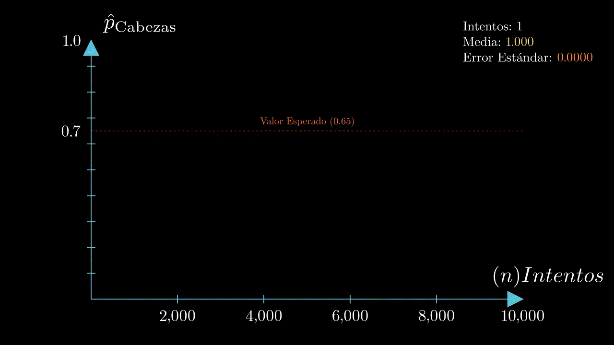

## Parte 1: Probabilidades Conjuntas y Condicionales

Primero, debemos entender correctamente cómo funcionan las probabilidades conjuntas y condicionales.

. . .

Sabemos que:

$$P(\text{ocurra un evento } A) = P(A)$$

. . .

Segundo:

$$P(A \text{ y } B) = P(A \cap B)$$

. . .

Y si es que sabemos que $A$ y $B$ son independientes entre sí ($A \perp B$), entonces:

$$P(A \cap B) = P(A) \times P(B)$$

## Ejemplo: Prueba I 2025-2

En una ciudad se estudian los hábitos de fumar y hacer deporte. La probabilidad de que una persona **fume** es 0.30, la probabilidad de que haga deporte es 0.40 y la probabilidad de que **fume y haga deporte** al mismo tiempo es 0.12.

. . .

Con esta información, responde lo siguiente:

. . .

**a) ¿Son fumar y hacer deporte eventos independientes? Explica usando la definición de independencia.**

. . .

Sabemos que dos eventos son independientes entre sí si se cumple que:

$$P(\text{Fume} \cap \text{Deporte} ) = P(\text{Fume}) \times P(\text{Deporte})$$

. . .

Sabemos que:

- $P(\text{Fume}) = 0.30$
- $P(\text{Deporte}) = 0.40$
- $P(\text{Fume} \cap \text{Deporte} ) = 0.12$

## ¡Comprobemos!

$$P(\text{Fume}) \times P(\text{Deporte}) = 0.30 \times 0.40 = 0.12$$

. . .

Como el producto de las probabilidades individuales ($0.12$) es exactamente igual a la probabilidad conjunta, podemos concluir de forma segura que ambos eventos son independientes.

. . .

::: panel-tabset
### R

```{r}
#| echo: true
check_ind <- function(evento_1, evento_2, prob_conjunta){
    if (evento_1 * evento_2 == prob_conjunta) print("Independientes")
    else print("Dependientes")
}

fume <- 0.3
haga_deporte <- 0.4
ambos <- 0.12

check_ind(fume, haga_deporte, ambos)
```

### Python

```{python}
#| echo: true
def check_ind(evento_1, evento_2, prob_conjunta):
    if evento_1 * evento_2 == prob_conjunta:
        print("Independientes")
    else:
        print("Dependientes")

fume = 0.3
haga_deporte = 0.4
ambos = 0.12

check_ind(fume, haga_deporte, ambos)
```
:::

## Probabilidades Condicionales

Por definición, la probabilidad de que ocurra un evento $A$ luego de saber que un evento $B$ ocurrió, se denota como:

$$P(A\mid B)$$

. . .

Y se puede calcular así:

$$P(A\mid B)=\frac{P(A \cap B)}{P(B)}$$

. . .

Para poder calcular $P(A \mid B)$ si solo tenemos la información de $P(B \mid A)$, utilizamos el **Teorema de Bayes**:

$$P(A\mid B)=\frac{P(B\mid A)\,P(A)}{P(B)}$$

------------------------------------------------------------------------

Y por último, la **Ley de Probabilidad Total**:

$$P(A) = \sum_{i=1}^{n} P(A \mid B_i) P(B_i)$$

. . .

O en términos más simples:

$$P(A) = P(A \mid B) \cdot P(B) + P(A \mid \neg B) \cdot P(\neg B)$$

## Ejemplo Teorema de Bayes

Un comerciante sabe que el 30% de sus clientes entran a la tienda después de ver un anuncio. De estos, el 10% realiza una compra. De los clientes que no vieron el anuncio, el 5% realiza una compra.

. . .

Si un cliente realiza una compra, ¿cuál es la probabilidad de que haya visto el anuncio?

. . .

Tenemos:

- $P(\text{Compra} \mid \text{Vio el anuncio}) = 0.10$
- $P( \text{Vio el anuncio}) = 0.30$
- $P(\text{Compra} \mid \text{No vio el anuncio}) = 0.05$

. . .

Sabemos que debemos calcular $P(\text{Vio el anuncio} \mid \text{Compra})$, y para ello utilizamos Bayes:

$$P(\text{Vio el Anuncio} \mid \text{Compra}) = \frac{P(\text{Compra} \mid \text{Vio el anuncio}) \cdot P(\text{Vio el anuncio})}{P(\text{Compra})}$$

------------------------------------------------------------------------

Sin embargo, sabemos que nos falta $P(\text{Compra})$ para poder completar la ecuación.

. . .

La calculamos utilizando la Ley de Probabilidad Total:

$$P(\text{Compra}) = P(\text{Compra} \mid \text{Vio}) \cdot P( \text{Vio}) + P(\text{Compra} \mid \text{Vio}) \cdot P(\text{No vio})$$

. . .

$$P(\text{Compra}) = (0.10 \cdot 0.30) + (0.05 \cdot 0.70)$$ $$P(\text{Compra}) = 0.03 + 0.035 = 0.065$$

. . .

Ya teniendo las tres variables, calculamos $P(\text{Vio el anuncio} \mid \text{Compra})$:

$$P(\text{Vio el anuncio} \mid \text{Compra}) = \frac{0.10 \cdot 0.30}{0.065} \approx 0.4615$$

## Solución en R

```{r}
#| echo: true
VEA <- 0.3 # Vio el Anuncio
NVEA <- 1 - VEA # No vio el anuncio

CA <- 0.1 # Compró luego de ver el anuncio
CNA <- 0.05 # Compró pero no ha visto el anuncio

# Probabilidad de que compre
COMP <- (VEA * CA) + (CNA * NVEA) 

# Comprador que vio el anuncio
AC <- (CA * VEA) / COMP 

print(paste("La prob. de que haya visto el anuncio es de", round(AC, 4) * 100,"%"))
```

# Parte 2: Distribuciones Discretas

## Ensayo de Bernoulli

Un experimento aleatorio que posee exactamente dos resultados posibles: éxito ($1$) y fracaso ($0$).

. . .

Sea $X$ una variable aleatoria de Bernoulli, su función de probabilidad está definida por:

$$P(X = x) = \begin{cases} 
      p & \text{si } x = 1 \\
      1 - p  & \text{si } x = 0 
   \end{cases}$$

. . .

Su función de masa de probabilidad (PMF) es:

$$f(x) = p^{x}(1-p)^{1-x}$$

## Ejemplo: Ensayo de Bernoulli

Simulemos el lanzamiento de una moneda, donde consideramos como "éxito" obtener cara ($p$).

. . .

Sin embargo, como es una moneda desigual, la probabilidad de obtener ese lado de la moneda es igual a 0.65:

. . .

```{r}
#| echo: true
set.seed(123)
sim <- rbinom(n=1, size=1, p=0.65)
print(sim)
```

. . .

*(Obtuvimos el valor 1, o sea cara)*

## Distribución Binomial

Se utiliza para obtener el número de éxitos ($1$) en una secuencia de ensayos independientes.

. . .

Corresponde a la suma de ensayos de Bernoulli $(Y = X_1 + X_2 + \dots + X_n)$ independientes y con distribución idéntica.

. . .

Su PMF es:

$$P(Y=y) = f(y) = \frac{n!}{y! (n-y)!} \cdot p^{y} (1-p)^{n-y}$$

## Ejemplo: Distribución Binomial

Volvamos al mismo ejemplo de antes, pero ahora con 1000 intentos:

::: panel-tabset
### R

```{r}
#| echo: true
set.seed(123)
N = 1000
sim <- rbinom(n=1, size=N, p=0.65)

print(sim) # Total de éxitos
print(sim/N) # Proporción de éxito
```

### Python

```{python}
#| echo: true
import numpy as np
np.random.seed(123)

N = 1000
sim = np.random.binomial(n=1, p=0.65, size=N)

print(sum(sim))
print(sum(sim)/N)
```
:::

. . .

## ¿Cómo se verían 10000 intentos en un gráfico?

. . .

{fig-align="center"}

## Ejemplo

**Sea** $X$ el número de caras obtenidas cuando se lanza una moneda 3 veces. Encuentra $P(X = 2)$

. . .

La probabilidad de obtener $k$ éxitos en $n$ intentos está dada por:

$$P(X=k) = \frac{n!}{k! (n-k)!} \cdot p^{k} (1-p)^{n-k}$$

. . .

Como sabemos que $n = 3$, $k = 2$ y $p = 0.5$:

$$P(X=2) = \frac{3!}{2! (3-2)!} \cdot 0.5^{2} (1-0.5)^{3-2}$$

. . .

$$P(X = 2) = 3 \cdot 0.25 \cdot 0.5 = 0.375$$

. . .

La probabilidad de obtener **exactamente** 2 caras en 3 lanzamientos es de $0.375$.

## Solución Binomial en R

La solución en código sería:

```{r}
#| echo: true
x <- 2
n <- 3
p <- 0.5

var <- dbinom(x, size = n, prob = p) # P(X = x)
print(var)
```

. . .

¿Y qué pasa si queremos calcular $P(X > x)$ o $P(X \le x)$?

. . .

```{r}
#| echo: true
# P(X > x): Más de 2 éxitos (es decir, sacar 3 caras)
var_mayor <- pbinom(x, size = n, prob = p, lower.tail = FALSE) 
print(var_mayor)

# P(X <= x): 2 o menos éxitos (0, 1 o 2 caras)
var_menor <- pbinom(x, size = n, prob = p) 
print(var_menor)
```

. . .

*(Nota: con el argumento `lower.tail = FALSE` pueden calcular $P(X > x)$. Si no lo incluyen, la función calcula por defecto $P(X \le x)$)*

# Parte 3: Ejercicios

*(Los pueden encontrar en la carpeta como `ejercicios.pdf`)*

## Tarea #2 2025-2

Imagina una enfermedad *muy* rara y una prueba para detectarla:

- Prevalencia $E$: $P(E)=0.001$
- Sensibilidad: $P(T\mid E)=0.99$
- Falso positivo: $P(T\mid \neg E)=0.05$

. . .

**Pregunta 1.** ¿Cuál es $P(E\mid T)$? Usa el Teorema de Bayes.

. . .

**Pregunta 2.** Si elegimos 3 personas al azar, ¿cuál es la probabilidad de que **exactamente 2** tengan la enfermedad?

## Prueba I 2024-2 (Problema II)

Una empresa está considerando lanzar un nuevo producto al mercado. Realizan una encuesta entre sus consumidores potenciales.

. . .

Cada encuestado puede dar una respuesta “Positiva” o “Negativa”. La probabilidad de dar una respuesta “Positiva” es $r$.

. . .

**Parte i.** Describe el espacio muestral.

. . .

**Parte ii.** Indica qué distribución de probabilidad describe adecuadamente cada respuesta individual. Especifica su PMF.

------------------------------------------------------------------------

**Parte iii.** Expresa la probabilidad de que, al observar las respuestas de 4 encuestados seleccionados al azar, exactamente 2 den una respuesta “Positiva” y los otros 2 den una respuesta “Negativa”. Explica cada componente.

. . .

**Parte iv.** Supongamos que las respuestas no están influenciadas por el género del encuestado, y que el 60% son mujeres. Determina la probabilidad $P(\text{Mujer}\mid \text{Positiva})$.